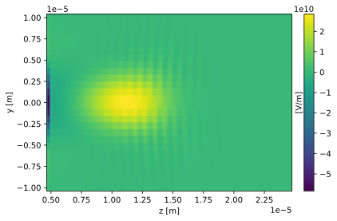
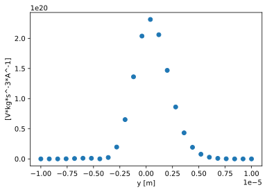
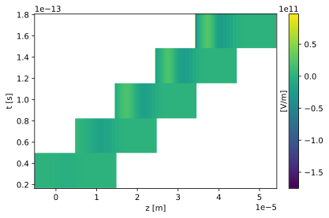

# openpmd-scipp
Load openpmd datasets to `scipp` `DataArrays`.

## Description
### What is this good for?
`scipp` is an alternative to `xarray` and provides basically numpy arrays with axes description and units.
* Automatically load axes and units with openPMD data.
* Axes information  is automatically updated when slicing, indexing, or filtering your data.
* With `scipp`'s plotting library `plopp` it becomes an alternative to `openpmd-viewer`.
* Many numpy and some scipy functions including all the basic algebraic operations on arrays are supported by `scipp`. When using these, the units and coordinates are automatically taken care of. 

### Limitations
* `scipp` currently handles units with a library, that does not support non-integer exponents for units. This can become problematic in some calculations. 


## Installation
It can be easily installed with pip.
```bash
git clone ...
cd openpmd-scipp
pip install .
```

## Example use
Get example data sets from the `openPMD-example-datasets` repository.
```bash
git clone https://github.com/openPMD/openPMD-example-datasets.git
cd openPMD-example-datasets
tar -zxvf example-2d.tar.gz
tar -zxvf example-3d.tar.gz
```

### Opening series


```python
import openpmd_scipp as pmdsc
import scipp as sc

path = 'openPMD-example-datasets/example-3d/hdf5/data%T.h5'
data_loader = pmdsc.DataLoader(path)
```


```python
data_loader.iterations
```


<div><!-- Original source from -->
<!-- https://github.com/jsignell/xarray/blob/1d960933ab252e0f79f7e050e6c9261d55568057/xarray/static/html/icons-svg-inline.html -->
<svg style="position: absolute; width: 0; height: 0; overflow: hidden">
<defs>
<symbol id="icon-database" viewBox="0 0 32 32">
<title>Show/Hide data repr</title>
<path d="M16 0c-8.837 0-16 2.239-16 5v4c0 2.761 7.163 5 16 5s16-2.239 16-5v-4c0-2.761-7.163-5-16-5z"></path>
<path d="M16 17c-8.837 0-16-2.239-16-5v6c0 2.761 7.163 5 16 5s16-2.239 16-5v-6c0 2.761-7.163 5-16 5z"></path>
<path d="M16 26c-8.837 0-16-2.239-16-5v6c0 2.761 7.163 5 16 5s16-2.239 16-5v-6c0 2.761-7.163 5-16 5z"></path>
</symbol>
<symbol id="icon-file-text2" viewBox="0 0 32 32">
<title>Show/Hide attributes</title>
<path d="M28.681 7.159c-0.694-0.947-1.662-2.053-2.724-3.116s-2.169-2.030-3.116-2.724c-1.612-1.182-2.393-1.319-2.841-1.319h-15.5c-1.378 0-2.5 1.121-2.5 2.5v27c0 1.378 1.122 2.5 2.5 2.5h23c1.378 0 2.5-1.122 2.5-2.5v-19.5c0-0.448-0.137-1.23-1.319-2.841zM24.543 5.457c0.959 0.959 1.712 1.825 2.268 2.543h-4.811v-4.811c0.718 0.556 1.584 1.309 2.543 2.268zM28 29.5c0 0.271-0.229 0.5-0.5 0.5h-23c-0.271 0-0.5-0.229-0.5-0.5v-27c0-0.271 0.229-0.5 0.5-0.5 0 0 15.499-0 15.5 0v7c0 0.552 0.448 1 1 1h7v19.5z"></path>
<path d="M23 26h-14c-0.552 0-1-0.448-1-1s0.448-1 1-1h14c0.552 0 1 0.448 1 1s-0.448 1-1 1z"></path>
<path d="M23 22h-14c-0.552 0-1-0.448-1-1s0.448-1 1-1h14c0.552 0 1 0.448 1 1s-0.448 1-1 1z"></path>
<path d="M23 18h-14c-0.552 0-1-0.448-1-1s0.448-1 1-1h14c0.552 0 1 0.448 1 1s-0.448 1-1 1z"></path>
</symbol>
</defs>
</svg><style id="scipp-style-sheet">.sc-root{--sc-background-color0:var(--jp-layout-color0,#fff);--sc-background-color1:var(--jp-layout-color1,#fcfcfc);--sc-background-color2:var(--jp-layout-color2,#efefef);--sc-inverse-background-color0:var(--jp-inverse-layout-color4,#111);--sc-font-color0:var(--jp-content-font-color0,#000);--sc-font-color1:var(--jp-content-font-color1,#555);--sc-font-color2:var(--jp-content-font-color2,#888);--sc-font-color3:var(--jp-content-font-color3,#ccc);}body.vscode-dark .sc-root{--sc-font-color0:rgba(255,255,255,1);--sc-font-color1:rgba(255,255,255,0.70);--sc-font-color2:rgba(255,255,255,0.54);--sc-font-color3:rgba(255,255,255,0.38);--sc-border-color:#1F1F1F;--sc-disabled-color:#515151;--sc-background-color0:#111111;--sc-background-color1:#111111;--sc-background-color2:#313131;}.sc-wrap{font-size:14px;min-width:300px;max-width:800px;}.sc-var-attrs .sc-wrap{padding-left:3em;}.sc-header{padding-top:6px;padding-bottom:6px;margin-bottom:4px;border-bottom:solid 1px #ddd;}.sc-header > div,.sc-header > ul{display:inline;margin-top:0;margin-bottom:0;}.sc-obj-type,.sc-array-name{margin-left:2px;margin-right:10px;}.sc-obj-type{color:var(--sc-font-color1);}.sc-underlying-size{color:var(--sc-font-color2);}.sc-sections,.reveal .sc-sections{padding-left:0 !important;display:grid;grid-template-columns:150px auto auto auto 1fr 20px 20px;}.sc-section-item{display:contents;}.sc-section-item input{display:none;}.sc-section-item input:enabled + label{cursor:pointer;color:var(--sc-font-color1);}.sc-section-item input:enabled + label:hover{color:var(--sc-font-color0);}.sc-section-summary{grid-column:1;font-weight:500;}.sc-section-summary > span{display:inline-block;padding-left:0.5em;}.sc-section-summary-in:disabled + label{color:var(--sc-font-color1);}.sc-section-summary-in + label:before{display:inline-block;content:'►';font-size:11px;width:15px;text-align:center;}.sc-section-summary-in:disabled + label:before{color:var(--sc-font-color3);}.sc-section-summary-in:checked + label:before{content:'▼';}.sc-section-summary-in:checked + label > span{display:none;}.sc-section-summary,.sc-section-inline-details{padding-top:4px;padding-bottom:4px;}.sc-section-inline-details{grid-column:2 / 6;}.sc-section-details{display:none;grid-column:1 / -1;margin-bottom:5px;}.sc-section-summary-in:checked ~ .sc-section-details{display:contents;}.sc-array-wrap{grid-column:1 / -1;display:grid;grid-template-columns:20px auto;}.sc-array-wrap > label{grid-column:1;vertical-align:top;}.sc-preview{color:var(--sc-font-color2);}.sc-array-preview,.sc-array-data{padding:0 5px !important;grid-column:2;}.sc-array-data,.sc-array-in:checked ~ .sc-array-preview{display:none;}.sc-array-in:checked ~ .sc-array-data,.sc-array-preview{display:inline-block;}.sc-dim-list{display:inline-block !important;list-style:none;padding:0 !important;margin:0;}.sc-dim-list li{display:inline-block;padding:0;margin:0!important;}.sc-dim-list:before{content:'(';}.sc-dim-list:after{content:')';}.sc-dim-list li:not(:last-child):after{content:',';padding-right:5px;}.sc-dim-list li span,.sc-standalone-var-name > span span,.sc-var-name > span span{padding:0 !important;}.sc-aligned{font-weight:bold;}.sc-var-list,.sc-var-item,.reveal .sc-var-list,.reveal .sc-var-item{display:contents;}.sc-var-item > div,.sc-var-item label,.sc-var-item > .sc-var-name span{background-color:var(--sc-background-color1);margin-bottom:0;}.sc-var-item > .sc-var-name:hover span{padding-right:5px;}.sc-var-list > li:nth-child(odd) > div,.sc-var-list > li:nth-child(odd) > label,.sc-var-list > li:nth-child(odd) > .sc-var-name span{background-color:var(--sc-background-color2);}.sc-var-name{grid-column:1;}.sc-var-dims{grid-column:2;}.sc-var-dtype{grid-column:3;text-align:right;color:var(--sc-font-color2);}.sc-var-unit{grid-column:4;text-align:left;color:var(--sc-font-color1);max-width:50pt;text-overflow:ellipsis;}.sc-value-preview{grid-column:5;}.sc-var-preview-variances{text-align:right;}.sc-sections .sc-section-item .sc-section-summary,.sc-sections .sc-section-item .sc-section-inline-details,.sc-section-item .sc-var-list .sc-var-item > div,.sc-section-item .sc-var-list .sc-var-item > label,.sc-section-details .sc-var-list .sc-var-item > div,.sc-section-details .sc-var-list .sc-var-item > label{margin-top:0;margin-bottom:0;}.sc-var-name,.sc-var-dims,.sc-var-dtype,.sc-var-unit,.sc-preview,.sc-attrs dt{white-space:nowrap;overflow:hidden;text-overflow:ellipsis;padding-right:10px;}.sc-var-name:hover,.sc-var-dims:hover,.sc-var-dtype:hover,.sc-var-unit:hover,.sc-attrs dt:hover{overflow:visible;width:auto;z-index:1;}.sc-var-attrs{display:block;}.sc-var-data,.reveal .sc-var-data{display:none;}.sc-var-attrs,.sc-var-data{background-color:var(--sc-background-color0) !important;padding-bottom:5px !important;}.sc-var-attrs-in:checked ~ .sc-var-attrs{display:none;}.sc-var-data-in:checked ~ .sc-var-data{display:block;}.sc-var-data > table{float:right;}.sc-var-name span,.sc-var-data{padding-left:25px !important;}.sc-var-attrs,.sc-var-data{grid-column:1 / -1;}dl.sc-attrs{padding:0;margin:0;display:grid;grid-template-columns:125px auto;}.sc-attrs dt,dd{padding:0;margin:0;float:left;padding-right:10px;width:auto;}.sc-attrs dt{font-weight:normal;grid-column:1;}.sc-attrs dt:hover span{display:inline-block;padding-right:10px;}.sc-attrs dd{grid-column:2;white-space:pre-wrap;word-break:break-all;}.sc-icon-database,.sc-icon-file-text2{display:inline-block;vertical-align:middle;width:1em;height:1.5em !important;stroke-width:0;stroke:currentColor;fill:currentColor;}label.sc-hide-icon svg{opacity:0;}.sc-standalone-var-name{grid-column:1/3;}.sc-standalone-var-name span{padding-left:25px;padding-right:10px;}.sc-title{font-weight:bold;font-size:1.5em;}.sc-subtitle{font-weight:normal;font-style:italic;text-align:left;font-size:1.2em;padding:1px;}.sc-label{fill:var(--sc-font-color0,#444444);text-anchor:middle;}.sc-name{fill:var(--sc-font-color0,#111111);}.sc-inset-line{stroke:var(--sc-font-color1);stroke-width:0.05;stroke-dasharray:0.2,0.2;}.sc-log-wrap{height:25ex;resize:vertical;overflow-y:scroll;display:flex;flex-direction:column-reverse;border:1px solid;border-color:var(--jp-border-color2);background-color:var(--sc-background-color1);}div.sc-log{line-height:2.5ex;}table.sc-log{table-layout:auto;border-collapse:collapse;}tr.sc-log:nth-child(even){background-color:var(--sc-background-color0);}tr.sc-log > td{vertical-align:top;padding-bottom:0.5ex;}.sc-log-time-stamp{min-width:22ch;font-family:var(--jp-code-font-family);color:var(--sc-font-color2);}.sc-log-level{min-width:10ch;}tr.sc-log-debug td.sc-log-level{color:var(--jp-accent-color1);}tr.sc-log-info td.sc-log-level{color:var(--jp-info-color1);}tr.sc-log-warning td.sc-log-level{color:var(--jp-warn-color1);}tr.sc-log-error td.sc-log-level{font-weight:bold;color:var(--jp-error-color2);}tr.sc-log-critical td.sc-log-level{font-weight:bold;color:var(--sc-background-color0);background-color:var(--jp-error-color1);}.sc-log-message{white-space:pre-wrap;width:100%;}.sc-log-html-payload{white-space:normal;}.sc-log-name{padding-right:0.5em;text-align:right;white-space:pre-wrap;color:var(--sc-font-color3);}</style><div class='sc-wrap sc-root'><div class='sc-header'><div class='sc-obj-type'>scipp.Dataset (1.28 KB)</div></div><ul class='sc-sections'><li class='sc-section-item'><input id='section-52101df5-1930-4cec-9c6d-4af9d36c87e3' class='sc-section-summary-in' type='checkbox' disabled ><label for='section-52101df5-1930-4cec-9c6d-4af9d36c87e3' class='sc-section-summary' >Dimensions:</label><div class='sc-section-inline-details'><ul class='sc-dim-list'><li><span class='sc-has-index'>t</span>: 5</li></ul></div><div class='sc-section-details'></div></li><li class='sc-section-item'><input id='section-ec224591-f288-4874-a022-e7932db13578' class='sc-section-summary-in' type='checkbox'  checked><label for='section-ec224591-f288-4874-a022-e7932db13578' class='sc-section-summary'  title='Expand/collapse section'>Coordinates: <span>(1)</span></label><div class='sc-section-inline-details'></div><div class='sc-section-details'><ul class='sc-var-list'><li class='sc-var-item'><div class='sc-var-name'><span class='sc-aligned'>t</span></div><div class='sc-var-dims'>(t)</div><div class='sc-var-dtype'>float64</div><div class='sc-var-unit'>s</div><div class='sc-value-preview sc-preview'><span><div>3.285e-14, 6.569e-14, 9.854e-14, 1.314e-13, 1.642e-13</div></span></div><input id='attrs-62a7ba70-0020-4a32-bcbb-a792d284498d' class='sc-var-attrs-in' type='checkbox' disabled><label for='attrs-62a7ba70-0020-4a32-bcbb-a792d284498d' class='sc-hide-icon' title='Show/Hide attributes'><svg class='icon sc-icon-file-text2'><use xlink:href='#icon-file-text2'></use></svg></label><input id='data-dbb2e36e-ce9b-427a-91d4-2c99d1552bec' class='sc-var-data-in' type='checkbox'><label for='data-dbb2e36e-ce9b-427a-91d4-2c99d1552bec' title='Show/Hide data repr'><svg class='icon sc-icon-database'><use xlink:href='#icon-database'></use></svg></label><pre class='sc-var-data'>Values:<br>array([3.28471215e-14, 6.56942429e-14, 9.85413644e-14, 1.31388486e-13,
       1.64235607e-13])</pre></span></li></ul></div></li><li class='sc-section-item'><input id='section-a2dd8957-7eec-4cf2-9935-1e3b53a7bd03' class='sc-section-summary-in' type='checkbox'  checked><label for='section-a2dd8957-7eec-4cf2-9935-1e3b53a7bd03' class='sc-section-summary'  title='Expand/collapse section'>Data: <span>(1)</span></label><div class='sc-section-inline-details'></div><div class='sc-section-details'><ul class='sc-var-list'><li class='sc-var-item'><div class='sc-var-name'><span>iteration_id</span></div><div class='sc-var-dims'>(t)</div><div class='sc-var-dtype'>int64</div><div class='sc-var-unit'>𝟙</div><div class='sc-value-preview sc-preview'><span><div>100, 200, 300, 400, 500</div></span></div><input id='attrs-09c9eef3-e821-41a8-818a-2f2ab28fc21e' class='sc-var-attrs-in' type='checkbox' disabled><label for='attrs-09c9eef3-e821-41a8-818a-2f2ab28fc21e' class='' title='Show/Hide attributes'><svg class='icon sc-icon-file-text2'><use xlink:href='#icon-file-text2'></use></svg></label><input id='data-b7b49ee6-77f6-4823-b8cb-a3d816f5f3d0' class='sc-var-data-in' type='checkbox'><label for='data-b7b49ee6-77f6-4823-b8cb-a3d816f5f3d0' title='Show/Hide data repr'><svg class='icon sc-icon-database'><use xlink:href='#icon-database'></use></svg></label><pre class='sc-var-data'>Values:<br>array([100, 200, 300, 400, 500])</pre></li></ul></div></li></ul></div></div>


### Working with meshes (fields)
Let us plot electric field's x component at 65 fs. 


```python
Ex = data_loader.get_field('E', 'x', time=65 * sc.Unit('fs'))
Ex
```

    Series does not contain iteration at the exact time. Using closest iteration instead.


<div><!-- Original source from -->
<!-- https://github.com/jsignell/xarray/blob/1d960933ab252e0f79f7e050e6c9261d55568057/xarray/static/html/icons-svg-inline.html -->
<svg style="position: absolute; width: 0; height: 0; overflow: hidden">
<defs>
<symbol id="icon-database" viewBox="0 0 32 32">
<title>Show/Hide data repr</title>
<path d="M16 0c-8.837 0-16 2.239-16 5v4c0 2.761 7.163 5 16 5s16-2.239 16-5v-4c0-2.761-7.163-5-16-5z"></path>
<path d="M16 17c-8.837 0-16-2.239-16-5v6c0 2.761 7.163 5 16 5s16-2.239 16-5v-6c0 2.761-7.163 5-16 5z"></path>
<path d="M16 26c-8.837 0-16-2.239-16-5v6c0 2.761 7.163 5 16 5s16-2.239 16-5v-6c0 2.761-7.163 5-16 5z"></path>
</symbol>
<symbol id="icon-file-text2" viewBox="0 0 32 32">
<title>Show/Hide attributes</title>
<path d="M28.681 7.159c-0.694-0.947-1.662-2.053-2.724-3.116s-2.169-2.030-3.116-2.724c-1.612-1.182-2.393-1.319-2.841-1.319h-15.5c-1.378 0-2.5 1.121-2.5 2.5v27c0 1.378 1.122 2.5 2.5 2.5h23c1.378 0 2.5-1.122 2.5-2.5v-19.5c0-0.448-0.137-1.23-1.319-2.841zM24.543 5.457c0.959 0.959 1.712 1.825 2.268 2.543h-4.811v-4.811c0.718 0.556 1.584 1.309 2.543 2.268zM28 29.5c0 0.271-0.229 0.5-0.5 0.5h-23c-0.271 0-0.5-0.229-0.5-0.5v-27c0-0.271 0.229-0.5 0.5-0.5 0 0 15.499-0 15.5 0v7c0 0.552 0.448 1 1 1h7v19.5z"></path>
<path d="M23 26h-14c-0.552 0-1-0.448-1-1s0.448-1 1-1h14c0.552 0 1 0.448 1 1s-0.448 1-1 1z"></path>
<path d="M23 22h-14c-0.552 0-1-0.448-1-1s0.448-1 1-1h14c0.552 0 1 0.448 1 1s-0.448 1-1 1z"></path>
<path d="M23 18h-14c-0.552 0-1-0.448-1-1s0.448-1 1-1h14c0.552 0 1 0.448 1 1s-0.448 1-1 1z"></path>
</symbol>
</defs>
</svg><style id="scipp-style-sheet">.sc-root{--sc-background-color0:var(--jp-layout-color0,#fff);--sc-background-color1:var(--jp-layout-color1,#fcfcfc);--sc-background-color2:var(--jp-layout-color2,#efefef);--sc-inverse-background-color0:var(--jp-inverse-layout-color4,#111);--sc-font-color0:var(--jp-content-font-color0,#000);--sc-font-color1:var(--jp-content-font-color1,#555);--sc-font-color2:var(--jp-content-font-color2,#888);--sc-font-color3:var(--jp-content-font-color3,#ccc);}body.vscode-dark .sc-root{--sc-font-color0:rgba(255,255,255,1);--sc-font-color1:rgba(255,255,255,0.70);--sc-font-color2:rgba(255,255,255,0.54);--sc-font-color3:rgba(255,255,255,0.38);--sc-border-color:#1F1F1F;--sc-disabled-color:#515151;--sc-background-color0:#111111;--sc-background-color1:#111111;--sc-background-color2:#313131;}.sc-wrap{font-size:14px;min-width:300px;max-width:800px;}.sc-var-attrs .sc-wrap{padding-left:3em;}.sc-header{padding-top:6px;padding-bottom:6px;margin-bottom:4px;border-bottom:solid 1px #ddd;}.sc-header > div,.sc-header > ul{display:inline;margin-top:0;margin-bottom:0;}.sc-obj-type,.sc-array-name{margin-left:2px;margin-right:10px;}.sc-obj-type{color:var(--sc-font-color1);}.sc-underlying-size{color:var(--sc-font-color2);}.sc-sections,.reveal .sc-sections{padding-left:0 !important;display:grid;grid-template-columns:150px auto auto auto 1fr 20px 20px;}.sc-section-item{display:contents;}.sc-section-item input{display:none;}.sc-section-item input:enabled + label{cursor:pointer;color:var(--sc-font-color1);}.sc-section-item input:enabled + label:hover{color:var(--sc-font-color0);}.sc-section-summary{grid-column:1;font-weight:500;}.sc-section-summary > span{display:inline-block;padding-left:0.5em;}.sc-section-summary-in:disabled + label{color:var(--sc-font-color1);}.sc-section-summary-in + label:before{display:inline-block;content:'►';font-size:11px;width:15px;text-align:center;}.sc-section-summary-in:disabled + label:before{color:var(--sc-font-color3);}.sc-section-summary-in:checked + label:before{content:'▼';}.sc-section-summary-in:checked + label > span{display:none;}.sc-section-summary,.sc-section-inline-details{padding-top:4px;padding-bottom:4px;}.sc-section-inline-details{grid-column:2 / 6;}.sc-section-details{display:none;grid-column:1 / -1;margin-bottom:5px;}.sc-section-summary-in:checked ~ .sc-section-details{display:contents;}.sc-array-wrap{grid-column:1 / -1;display:grid;grid-template-columns:20px auto;}.sc-array-wrap > label{grid-column:1;vertical-align:top;}.sc-preview{color:var(--sc-font-color2);}.sc-array-preview,.sc-array-data{padding:0 5px !important;grid-column:2;}.sc-array-data,.sc-array-in:checked ~ .sc-array-preview{display:none;}.sc-array-in:checked ~ .sc-array-data,.sc-array-preview{display:inline-block;}.sc-dim-list{display:inline-block !important;list-style:none;padding:0 !important;margin:0;}.sc-dim-list li{display:inline-block;padding:0;margin:0!important;}.sc-dim-list:before{content:'(';}.sc-dim-list:after{content:')';}.sc-dim-list li:not(:last-child):after{content:',';padding-right:5px;}.sc-dim-list li span,.sc-standalone-var-name > span span,.sc-var-name > span span{padding:0 !important;}.sc-aligned{font-weight:bold;}.sc-var-list,.sc-var-item,.reveal .sc-var-list,.reveal .sc-var-item{display:contents;}.sc-var-item > div,.sc-var-item label,.sc-var-item > .sc-var-name span{background-color:var(--sc-background-color1);margin-bottom:0;}.sc-var-item > .sc-var-name:hover span{padding-right:5px;}.sc-var-list > li:nth-child(odd) > div,.sc-var-list > li:nth-child(odd) > label,.sc-var-list > li:nth-child(odd) > .sc-var-name span{background-color:var(--sc-background-color2);}.sc-var-name{grid-column:1;}.sc-var-dims{grid-column:2;}.sc-var-dtype{grid-column:3;text-align:right;color:var(--sc-font-color2);}.sc-var-unit{grid-column:4;text-align:left;color:var(--sc-font-color1);max-width:50pt;text-overflow:ellipsis;}.sc-value-preview{grid-column:5;}.sc-var-preview-variances{text-align:right;}.sc-sections .sc-section-item .sc-section-summary,.sc-sections .sc-section-item .sc-section-inline-details,.sc-section-item .sc-var-list .sc-var-item > div,.sc-section-item .sc-var-list .sc-var-item > label,.sc-section-details .sc-var-list .sc-var-item > div,.sc-section-details .sc-var-list .sc-var-item > label{margin-top:0;margin-bottom:0;}.sc-var-name,.sc-var-dims,.sc-var-dtype,.sc-var-unit,.sc-preview,.sc-attrs dt{white-space:nowrap;overflow:hidden;text-overflow:ellipsis;padding-right:10px;}.sc-var-name:hover,.sc-var-dims:hover,.sc-var-dtype:hover,.sc-var-unit:hover,.sc-attrs dt:hover{overflow:visible;width:auto;z-index:1;}.sc-var-attrs{display:block;}.sc-var-data,.reveal .sc-var-data{display:none;}.sc-var-attrs,.sc-var-data{background-color:var(--sc-background-color0) !important;padding-bottom:5px !important;}.sc-var-attrs-in:checked ~ .sc-var-attrs{display:none;}.sc-var-data-in:checked ~ .sc-var-data{display:block;}.sc-var-data > table{float:right;}.sc-var-name span,.sc-var-data{padding-left:25px !important;}.sc-var-attrs,.sc-var-data{grid-column:1 / -1;}dl.sc-attrs{padding:0;margin:0;display:grid;grid-template-columns:125px auto;}.sc-attrs dt,dd{padding:0;margin:0;float:left;padding-right:10px;width:auto;}.sc-attrs dt{font-weight:normal;grid-column:1;}.sc-attrs dt:hover span{display:inline-block;padding-right:10px;}.sc-attrs dd{grid-column:2;white-space:pre-wrap;word-break:break-all;}.sc-icon-database,.sc-icon-file-text2{display:inline-block;vertical-align:middle;width:1em;height:1.5em !important;stroke-width:0;stroke:currentColor;fill:currentColor;}label.sc-hide-icon svg{opacity:0;}.sc-standalone-var-name{grid-column:1/3;}.sc-standalone-var-name span{padding-left:25px;padding-right:10px;}.sc-title{font-weight:bold;font-size:1.5em;}.sc-subtitle{font-weight:normal;font-style:italic;text-align:left;font-size:1.2em;padding:1px;}.sc-label{fill:var(--sc-font-color0,#444444);text-anchor:middle;}.sc-name{fill:var(--sc-font-color0,#111111);}.sc-inset-line{stroke:var(--sc-font-color1);stroke-width:0.05;stroke-dasharray:0.2,0.2;}.sc-log-wrap{height:25ex;resize:vertical;overflow-y:scroll;display:flex;flex-direction:column-reverse;border:1px solid;border-color:var(--jp-border-color2);background-color:var(--sc-background-color1);}div.sc-log{line-height:2.5ex;}table.sc-log{table-layout:auto;border-collapse:collapse;}tr.sc-log:nth-child(even){background-color:var(--sc-background-color0);}tr.sc-log > td{vertical-align:top;padding-bottom:0.5ex;}.sc-log-time-stamp{min-width:22ch;font-family:var(--jp-code-font-family);color:var(--sc-font-color2);}.sc-log-level{min-width:10ch;}tr.sc-log-debug td.sc-log-level{color:var(--jp-accent-color1);}tr.sc-log-info td.sc-log-level{color:var(--jp-info-color1);}tr.sc-log-warning td.sc-log-level{color:var(--jp-warn-color1);}tr.sc-log-error td.sc-log-level{font-weight:bold;color:var(--jp-error-color2);}tr.sc-log-critical td.sc-log-level{font-weight:bold;color:var(--sc-background-color0);background-color:var(--jp-error-color1);}.sc-log-message{white-space:pre-wrap;width:100%;}.sc-log-html-payload{white-space:normal;}.sc-log-name{padding-right:0.5em;text-align:right;white-space:pre-wrap;color:var(--sc-font-color3);}</style><div class='sc-wrap sc-root'><div class='sc-header'><div class='sc-obj-type'>scipp.DataArray (1.04 MB)</div></div><ul class='sc-sections'><li class='sc-section-item'><input id='section-8e27dfaf-d233-474e-9cf0-89795803d07c' class='sc-section-summary-in' type='checkbox' disabled ><label for='section-8e27dfaf-d233-474e-9cf0-89795803d07c' class='sc-section-summary' >Dimensions:</label><div class='sc-section-inline-details'><ul class='sc-dim-list'><li><span class='sc-has-index'>x</span>: 26</li><li><span class='sc-has-index'>y</span>: 26</li><li><span class='sc-has-index'>z</span>: 201</li></ul></div><div class='sc-section-details'></div></li><li class='sc-section-item'><input id='section-b1391310-1a37-4645-b0e8-f6c932b5b58c' class='sc-section-summary-in' type='checkbox'  checked><label for='section-b1391310-1a37-4645-b0e8-f6c932b5b58c' class='sc-section-summary'  title='Expand/collapse section'>Coordinates: <span>(4)</span></label><div class='sc-section-inline-details'></div><div class='sc-section-details'><ul class='sc-var-list'><li class='sc-var-item'><div class='sc-var-name'><span class='sc-aligned'>t</span></div><div class='sc-var-dims'>()</div><div class='sc-var-dtype'>float64</div><div class='sc-var-unit'>s</div><div class='sc-value-preview sc-preview'><span><div>6.569424290418005e-14</div></span></div><input id='attrs-d643747e-46b8-436b-8c30-34eb8c03e507' class='sc-var-attrs-in' type='checkbox' disabled><label for='attrs-d643747e-46b8-436b-8c30-34eb8c03e507' class='sc-hide-icon' title='Show/Hide attributes'><svg class='icon sc-icon-file-text2'><use xlink:href='#icon-file-text2'></use></svg></label><input id='data-a887bebd-b61d-40b2-a817-ee987a5e76e5' class='sc-var-data-in' type='checkbox'><label for='data-a887bebd-b61d-40b2-a817-ee987a5e76e5' title='Show/Hide data repr'><svg class='icon sc-icon-database'><use xlink:href='#icon-database'></use></svg></label><pre class='sc-var-data'>Values:<br>array(6.56942429e-14)</pre></span></li><li class='sc-var-item'><div class='sc-var-name'><span class='sc-aligned'>x</span></div><div class='sc-var-dims'>(x)</div><div class='sc-var-dtype'>float64</div><div class='sc-var-unit'>m</div><div class='sc-value-preview sc-preview'><span><div>-9.600e-06, -8.800e-06, ..., 9.600e-06, 1.040e-05</div></span></div><input id='attrs-0646bff2-2e3b-42b5-a694-82072c99d0f8' class='sc-var-attrs-in' type='checkbox' disabled><label for='attrs-0646bff2-2e3b-42b5-a694-82072c99d0f8' class='sc-hide-icon' title='Show/Hide attributes'><svg class='icon sc-icon-file-text2'><use xlink:href='#icon-file-text2'></use></svg></label><input id='data-683856b4-3143-48da-84bf-87e6e7fdbbc5' class='sc-var-data-in' type='checkbox'><label for='data-683856b4-3143-48da-84bf-87e6e7fdbbc5' title='Show/Hide data repr'><svg class='icon sc-icon-database'><use xlink:href='#icon-database'></use></svg></label><pre class='sc-var-data'>Values:<br>array([-9.60e-06, -8.80e-06, -8.00e-06, -7.20e-06, -6.40e-06, -5.60e-06,
       -4.80e-06, -4.00e-06, -3.20e-06, -2.40e-06, -1.60e-06, -8.00e-07,
        0.00e+00,  8.00e-07,  1.60e-06,  2.40e-06,  3.20e-06,  4.00e-06,
        4.80e-06,  5.60e-06,  6.40e-06,  7.20e-06,  8.00e-06,  8.80e-06,
        9.60e-06,  1.04e-05])</pre></span></li><li class='sc-var-item'><div class='sc-var-name'><span class='sc-aligned'>y</span></div><div class='sc-var-dims'>(y)</div><div class='sc-var-dtype'>float64</div><div class='sc-var-unit'>m</div><div class='sc-value-preview sc-preview'><span><div>-1.000e-05, -9.200e-06, ..., 9.200e-06, 1.000e-05</div></span></div><input id='attrs-26a4a46d-da3f-48e9-9cab-0fdb84f01389' class='sc-var-attrs-in' type='checkbox' disabled><label for='attrs-26a4a46d-da3f-48e9-9cab-0fdb84f01389' class='sc-hide-icon' title='Show/Hide attributes'><svg class='icon sc-icon-file-text2'><use xlink:href='#icon-file-text2'></use></svg></label><input id='data-a6b89471-a646-4383-b03b-2b357e9bfcce' class='sc-var-data-in' type='checkbox'><label for='data-a6b89471-a646-4383-b03b-2b357e9bfcce' title='Show/Hide data repr'><svg class='icon sc-icon-database'><use xlink:href='#icon-database'></use></svg></label><pre class='sc-var-data'>Values:<br>array([-1.0e-05, -9.2e-06, -8.4e-06, -7.6e-06, -6.8e-06, -6.0e-06,
       -5.2e-06, -4.4e-06, -3.6e-06, -2.8e-06, -2.0e-06, -1.2e-06,
       -4.0e-07,  4.0e-07,  1.2e-06,  2.0e-06,  2.8e-06,  3.6e-06,
        4.4e-06,  5.2e-06,  6.0e-06,  6.8e-06,  7.6e-06,  8.4e-06,
        9.2e-06,  1.0e-05])</pre></span></li><li class='sc-var-item'><div class='sc-var-name'><span class='sc-aligned'>z</span></div><div class='sc-var-dims'>(z)</div><div class='sc-var-dtype'>float64</div><div class='sc-var-unit'>m</div><div class='sc-value-preview sc-preview'><span><div>4.700e-06, 4.800e-06, ..., 2.460e-05, 2.470e-05</div></span></div><input id='attrs-8a6fd614-33d8-49ec-8fca-9bf4ac5e19f7' class='sc-var-attrs-in' type='checkbox' disabled><label for='attrs-8a6fd614-33d8-49ec-8fca-9bf4ac5e19f7' class='sc-hide-icon' title='Show/Hide attributes'><svg class='icon sc-icon-file-text2'><use xlink:href='#icon-file-text2'></use></svg></label><input id='data-3c81e011-eecf-48f5-a106-6e3429cca19e' class='sc-var-data-in' type='checkbox'><label for='data-3c81e011-eecf-48f5-a106-6e3429cca19e' title='Show/Hide data repr'><svg class='icon sc-icon-database'><use xlink:href='#icon-database'></use></svg></label><pre class='sc-var-data'>Values:<br>array([4.70e-06, 4.80e-06, 4.90e-06, 5.00e-06, 5.10e-06, 5.20e-06,
       5.30e-06, 5.40e-06, 5.50e-06, 5.60e-06, 5.70e-06, 5.80e-06,
       5.90e-06, 6.00e-06, 6.10e-06, 6.20e-06, 6.30e-06, 6.40e-06,
       6.50e-06, 6.60e-06, 6.70e-06, 6.80e-06, 6.90e-06, 7.00e-06,
       7.10e-06, 7.20e-06, 7.30e-06, 7.40e-06, 7.50e-06, 7.60e-06,
       7.70e-06, 7.80e-06, 7.90e-06, 8.00e-06, 8.10e-06, 8.20e-06,
       8.30e-06, 8.40e-06, 8.50e-06, 8.60e-06, 8.70e-06, 8.80e-06,
       8.90e-06, 9.00e-06, 9.10e-06, 9.20e-06, 9.30e-06, 9.40e-06,
       9.50e-06, 9.60e-06, 9.70e-06, 9.80e-06, 9.90e-06, 1.00e-05,
       1.01e-05, 1.02e-05, 1.03e-05, 1.04e-05, 1.05e-05, 1.06e-05,
       1.07e-05, 1.08e-05, 1.09e-05, 1.10e-05, 1.11e-05, 1.12e-05,
       1.13e-05, 1.14e-05, 1.15e-05, 1.16e-05, 1.17e-05, 1.18e-05,
       1.19e-05, 1.20e-05, 1.21e-05, 1.22e-05, 1.23e-05, 1.24e-05,
       1.25e-05, 1.26e-05, 1.27e-05, 1.28e-05, 1.29e-05, 1.30e-05,
       1.31e-05, 1.32e-05, 1.33e-05, 1.34e-05, 1.35e-05, 1.36e-05,
       1.37e-05, 1.38e-05, 1.39e-05, 1.40e-05, 1.41e-05, 1.42e-05,
       1.43e-05, 1.44e-05, 1.45e-05, 1.46e-05, 1.47e-05, 1.48e-05,
       1.49e-05, 1.50e-05, 1.51e-05, 1.52e-05, 1.53e-05, 1.54e-05,
       1.55e-05, 1.56e-05, 1.57e-05, 1.58e-05, 1.59e-05, 1.60e-05,
       1.61e-05, 1.62e-05, 1.63e-05, 1.64e-05, 1.65e-05, 1.66e-05,
       1.67e-05, 1.68e-05, 1.69e-05, 1.70e-05, 1.71e-05, 1.72e-05,
       1.73e-05, 1.74e-05, 1.75e-05, 1.76e-05, 1.77e-05, 1.78e-05,
       1.79e-05, 1.80e-05, 1.81e-05, 1.82e-05, 1.83e-05, 1.84e-05,
       1.85e-05, 1.86e-05, 1.87e-05, 1.88e-05, 1.89e-05, 1.90e-05,
       1.91e-05, 1.92e-05, 1.93e-05, 1.94e-05, 1.95e-05, 1.96e-05,
       1.97e-05, 1.98e-05, 1.99e-05, 2.00e-05, 2.01e-05, 2.02e-05,
       2.03e-05, 2.04e-05, 2.05e-05, 2.06e-05, 2.07e-05, 2.08e-05,
       2.09e-05, 2.10e-05, 2.11e-05, 2.12e-05, 2.13e-05, 2.14e-05,
       2.15e-05, 2.16e-05, 2.17e-05, 2.18e-05, 2.19e-05, 2.20e-05,
       2.21e-05, 2.22e-05, 2.23e-05, 2.24e-05, 2.25e-05, 2.26e-05,
       2.27e-05, 2.28e-05, 2.29e-05, 2.30e-05, 2.31e-05, 2.32e-05,
       2.33e-05, 2.34e-05, 2.35e-05, 2.36e-05, 2.37e-05, 2.38e-05,
       2.39e-05, 2.40e-05, 2.41e-05, 2.42e-05, 2.43e-05, 2.44e-05,
       2.45e-05, 2.46e-05, 2.47e-05])</pre></span></li></ul></div></li><li class='sc-section-item'><input id='section-bb3f6406-b725-480d-b20a-daa93666cfac' class='sc-section-summary-in' type='checkbox'  checked><label for='section-bb3f6406-b725-480d-b20a-daa93666cfac' class='sc-section-summary'  title='Expand/collapse section'>Data: <span>(1)</span></label><div class='sc-section-inline-details'></div><div class='sc-section-details'><ul class='sc-var-list'><li class='sc-var-item'><div class='sc-var-name'><span></span></div><div class='sc-var-dims'>(x, y, z)</div><div class='sc-var-dtype'>float64</div><div class='sc-var-unit'>V/m</div><div class='sc-value-preview sc-preview'><span><div>-1.087e+08, -1.976e+08, ..., 0.0, 0.0</div></span></div><input id='attrs-2095488a-c1ac-4c01-b874-46af2dac5480' class='sc-var-attrs-in' type='checkbox' disabled><label for='attrs-2095488a-c1ac-4c01-b874-46af2dac5480' class='sc-hide-icon' title='Show/Hide attributes'><svg class='icon sc-icon-file-text2'><use xlink:href='#icon-file-text2'></use></svg></label><input id='data-5b04f7db-3157-49a7-942a-c355eec05b8c' class='sc-var-data-in' type='checkbox'><label for='data-5b04f7db-3157-49a7-942a-c355eec05b8c' title='Show/Hide data repr'><svg class='icon sc-icon-database'><use xlink:href='#icon-database'></use></svg></label><pre class='sc-var-data'>Values:<br>array([[[-1.08651759e+08, -1.97580072e+08, -1.61722912e+07, ...,
          0.00000000e+00,  0.00000000e+00,  0.00000000e+00],
        [-2.11123348e+08, -4.66425228e+08, -1.11987794e+08, ...,
          0.00000000e+00,  0.00000000e+00,  0.00000000e+00],
        [-3.03533317e+08, -6.06440924e+08, -1.54850719e+08, ...,
          0.00000000e+00,  0.00000000e+00,  0.00000000e+00],
        ...,
        [-2.65746204e+08, -5.85938490e+08, -1.27059328e+08, ...,
          0.00000000e+00,  0.00000000e+00,  0.00000000e+00],
        [-1.40615373e+08, -3.95040388e+08, -4.67488149e+07, ...,
          0.00000000e+00,  0.00000000e+00,  0.00000000e+00],
        [-3.85502806e+06, -9.57238136e+07,  7.53578867e+07, ...,
          0.00000000e+00,  0.00000000e+00,  0.00000000e+00]],

       [[-1.89818627e+08, -2.85534544e+08, -3.97216633e+07, ...,
          0.00000000e+00,  0.00000000e+00,  0.00000000e+00],
        [-3.44239556e+08, -6.38857468e+08, -1.63696345e+08, ...,
          0.00000000e+00,  0.00000000e+00,  0.00000000e+00],
        [-4.86784757e+08, -8.23302568e+08, -2.24172605e+08, ...,
          0.00000000e+00,  0.00000000e+00,  0.00000000e+00],
        ...,
        [-4.16587036e+08, -7.69652466e+08, -1.74690022e+08, ...,
          0.00000000e+00,  0.00000000e+00,  0.00000000e+00],
        [-2.53624237e+08, -5.49243907e+08, -8.52787862e+07, ...,
          0.00000000e+00,  0.00000000e+00,  0.00000000e+00],
        [-7.36949000e+07, -1.75612859e+08,  5.83329592e+07, ...,
          0.00000000e+00,  0.00000000e+00,  0.00000000e+00]],

       [[-2.41160426e+08, -3.49284839e+08, -4.69590473e+07, ...,
          0.00000000e+00,  0.00000000e+00,  0.00000000e+00],
        [-4.36941444e+08, -7.83326385e+08, -2.00284173e+08, ...,
          0.00000000e+00,  0.00000000e+00,  0.00000000e+00],
        [-6.26579187e+08, -1.02404364e+09, -2.85090109e+08, ...,
          0.00000000e+00,  0.00000000e+00,  0.00000000e+00],
        ...,
        [-6.10879878e+08, -1.05945501e+09, -2.93831717e+08, ...,
          0.00000000e+00,  0.00000000e+00,  0.00000000e+00],
        [-3.92168474e+08, -7.75659551e+08, -1.72629062e+08, ...,
          0.00000000e+00,  0.00000000e+00,  0.00000000e+00],
        [-1.52136869e+08, -2.84491246e+08,  2.38830550e+07, ...,
          0.00000000e+00,  0.00000000e+00,  0.00000000e+00]],

       ...,

       [[ 1.89818627e+08,  2.85534544e+08,  3.97216633e+07, ...,
          0.00000000e+00,  0.00000000e+00,  0.00000000e+00],
        [ 3.44239556e+08,  6.38857468e+08,  1.63696345e+08, ...,
          0.00000000e+00,  0.00000000e+00,  0.00000000e+00],
        [ 4.86784757e+08,  8.23302568e+08,  2.24172605e+08, ...,
          0.00000000e+00,  0.00000000e+00,  0.00000000e+00],
        ...,
        [ 4.16587036e+08,  7.69652466e+08,  1.74690022e+08, ...,
          0.00000000e+00,  0.00000000e+00,  0.00000000e+00],
        [ 2.53624237e+08,  5.49243907e+08,  8.52787862e+07, ...,
          0.00000000e+00,  0.00000000e+00,  0.00000000e+00],
        [ 7.36949000e+07,  1.75612859e+08, -5.83329592e+07, ...,
          0.00000000e+00,  0.00000000e+00,  0.00000000e+00]],

       [[ 1.08651759e+08,  1.97580072e+08,  1.61722912e+07, ...,
          0.00000000e+00,  0.00000000e+00,  0.00000000e+00],
        [ 2.11123348e+08,  4.66425228e+08,  1.11987794e+08, ...,
          0.00000000e+00,  0.00000000e+00,  0.00000000e+00],
        [ 3.03533317e+08,  6.06440924e+08,  1.54850719e+08, ...,
          0.00000000e+00,  0.00000000e+00,  0.00000000e+00],
        ...,
        [ 2.65746204e+08,  5.85938490e+08,  1.27059328e+08, ...,
          0.00000000e+00,  0.00000000e+00,  0.00000000e+00],
        [ 1.40615373e+08,  3.95040388e+08,  4.67488149e+07, ...,
          0.00000000e+00,  0.00000000e+00,  0.00000000e+00],
        [ 3.85502806e+06,  9.57238136e+07, -7.53578867e+07, ...,
          0.00000000e+00,  0.00000000e+00,  0.00000000e+00]],

       [[-1.12295349e+08, -1.31912781e+08, -1.40895980e+08, ...,
          0.00000000e+00,  0.00000000e+00,  0.00000000e+00],
        [-1.43002900e+08, -1.79670947e+08, -2.03289608e+08, ...,
          0.00000000e+00,  0.00000000e+00,  0.00000000e+00],
        [-1.83838143e+08, -2.33699336e+08, -2.64372957e+08, ...,
          0.00000000e+00,  0.00000000e+00,  0.00000000e+00],
        ...,
        [-2.98826638e+08, -3.41310282e+08, -3.67730499e+08, ...,
          0.00000000e+00,  0.00000000e+00,  0.00000000e+00],
        [-2.55679033e+08, -2.85122794e+08, -3.04210438e+08, ...,
          0.00000000e+00,  0.00000000e+00,  0.00000000e+00],
        [-2.08331975e+08, -2.22543278e+08, -2.29626071e+08, ...,
          0.00000000e+00,  0.00000000e+00,  0.00000000e+00]]])</pre></li></ul></div></li></ul></div></div>


You may have noticed, that the time requested does not have to match exactly any iteration. By default, if there is an iteration within 10 fs distance it will be used instead. This 10 fs tolerance can be adjusted by setting `time_tolerance`. The check can be also disabled by setting `time_tolerance=None`, with that the method will return the closest iteration regardless of the difference. So that this will also work:


```python
data_loader.get_field('E', 'x', time=20 * sc.Unit('fs'), time_tolerance=20 * sc.Unit('fs'))
```

    Series does not contain iteration at the exact time. Using closest iteration instead.


<div><!-- Original source from -->
<!-- https://github.com/jsignell/xarray/blob/1d960933ab252e0f79f7e050e6c9261d55568057/xarray/static/html/icons-svg-inline.html -->
<svg style="position: absolute; width: 0; height: 0; overflow: hidden">
<defs>
<symbol id="icon-database" viewBox="0 0 32 32">
<title>Show/Hide data repr</title>
<path d="M16 0c-8.837 0-16 2.239-16 5v4c0 2.761 7.163 5 16 5s16-2.239 16-5v-4c0-2.761-7.163-5-16-5z"></path>
<path d="M16 17c-8.837 0-16-2.239-16-5v6c0 2.761 7.163 5 16 5s16-2.239 16-5v-6c0 2.761-7.163 5-16 5z"></path>
<path d="M16 26c-8.837 0-16-2.239-16-5v6c0 2.761 7.163 5 16 5s16-2.239 16-5v-6c0 2.761-7.163 5-16 5z"></path>
</symbol>
<symbol id="icon-file-text2" viewBox="0 0 32 32">
<title>Show/Hide attributes</title>
<path d="M28.681 7.159c-0.694-0.947-1.662-2.053-2.724-3.116s-2.169-2.030-3.116-2.724c-1.612-1.182-2.393-1.319-2.841-1.319h-15.5c-1.378 0-2.5 1.121-2.5 2.5v27c0 1.378 1.122 2.5 2.5 2.5h23c1.378 0 2.5-1.122 2.5-2.5v-19.5c0-0.448-0.137-1.23-1.319-2.841zM24.543 5.457c0.959 0.959 1.712 1.825 2.268 2.543h-4.811v-4.811c0.718 0.556 1.584 1.309 2.543 2.268zM28 29.5c0 0.271-0.229 0.5-0.5 0.5h-23c-0.271 0-0.5-0.229-0.5-0.5v-27c0-0.271 0.229-0.5 0.5-0.5 0 0 15.499-0 15.5 0v7c0 0.552 0.448 1 1 1h7v19.5z"></path>
<path d="M23 26h-14c-0.552 0-1-0.448-1-1s0.448-1 1-1h14c0.552 0 1 0.448 1 1s-0.448 1-1 1z"></path>
<path d="M23 22h-14c-0.552 0-1-0.448-1-1s0.448-1 1-1h14c0.552 0 1 0.448 1 1s-0.448 1-1 1z"></path>
<path d="M23 18h-14c-0.552 0-1-0.448-1-1s0.448-1 1-1h14c0.552 0 1 0.448 1 1s-0.448 1-1 1z"></path>
</symbol>
</defs>
</svg><style id="scipp-style-sheet">.sc-root{--sc-background-color0:var(--jp-layout-color0,#fff);--sc-background-color1:var(--jp-layout-color1,#fcfcfc);--sc-background-color2:var(--jp-layout-color2,#efefef);--sc-inverse-background-color0:var(--jp-inverse-layout-color4,#111);--sc-font-color0:var(--jp-content-font-color0,#000);--sc-font-color1:var(--jp-content-font-color1,#555);--sc-font-color2:var(--jp-content-font-color2,#888);--sc-font-color3:var(--jp-content-font-color3,#ccc);}body.vscode-dark .sc-root{--sc-font-color0:rgba(255,255,255,1);--sc-font-color1:rgba(255,255,255,0.70);--sc-font-color2:rgba(255,255,255,0.54);--sc-font-color3:rgba(255,255,255,0.38);--sc-border-color:#1F1F1F;--sc-disabled-color:#515151;--sc-background-color0:#111111;--sc-background-color1:#111111;--sc-background-color2:#313131;}.sc-wrap{font-size:14px;min-width:300px;max-width:800px;}.sc-var-attrs .sc-wrap{padding-left:3em;}.sc-header{padding-top:6px;padding-bottom:6px;margin-bottom:4px;border-bottom:solid 1px #ddd;}.sc-header > div,.sc-header > ul{display:inline;margin-top:0;margin-bottom:0;}.sc-obj-type,.sc-array-name{margin-left:2px;margin-right:10px;}.sc-obj-type{color:var(--sc-font-color1);}.sc-underlying-size{color:var(--sc-font-color2);}.sc-sections,.reveal .sc-sections{padding-left:0 !important;display:grid;grid-template-columns:150px auto auto auto 1fr 20px 20px;}.sc-section-item{display:contents;}.sc-section-item input{display:none;}.sc-section-item input:enabled + label{cursor:pointer;color:var(--sc-font-color1);}.sc-section-item input:enabled + label:hover{color:var(--sc-font-color0);}.sc-section-summary{grid-column:1;font-weight:500;}.sc-section-summary > span{display:inline-block;padding-left:0.5em;}.sc-section-summary-in:disabled + label{color:var(--sc-font-color1);}.sc-section-summary-in + label:before{display:inline-block;content:'►';font-size:11px;width:15px;text-align:center;}.sc-section-summary-in:disabled + label:before{color:var(--sc-font-color3);}.sc-section-summary-in:checked + label:before{content:'▼';}.sc-section-summary-in:checked + label > span{display:none;}.sc-section-summary,.sc-section-inline-details{padding-top:4px;padding-bottom:4px;}.sc-section-inline-details{grid-column:2 / 6;}.sc-section-details{display:none;grid-column:1 / -1;margin-bottom:5px;}.sc-section-summary-in:checked ~ .sc-section-details{display:contents;}.sc-array-wrap{grid-column:1 / -1;display:grid;grid-template-columns:20px auto;}.sc-array-wrap > label{grid-column:1;vertical-align:top;}.sc-preview{color:var(--sc-font-color2);}.sc-array-preview,.sc-array-data{padding:0 5px !important;grid-column:2;}.sc-array-data,.sc-array-in:checked ~ .sc-array-preview{display:none;}.sc-array-in:checked ~ .sc-array-data,.sc-array-preview{display:inline-block;}.sc-dim-list{display:inline-block !important;list-style:none;padding:0 !important;margin:0;}.sc-dim-list li{display:inline-block;padding:0;margin:0!important;}.sc-dim-list:before{content:'(';}.sc-dim-list:after{content:')';}.sc-dim-list li:not(:last-child):after{content:',';padding-right:5px;}.sc-dim-list li span,.sc-standalone-var-name > span span,.sc-var-name > span span{padding:0 !important;}.sc-aligned{font-weight:bold;}.sc-var-list,.sc-var-item,.reveal .sc-var-list,.reveal .sc-var-item{display:contents;}.sc-var-item > div,.sc-var-item label,.sc-var-item > .sc-var-name span{background-color:var(--sc-background-color1);margin-bottom:0;}.sc-var-item > .sc-var-name:hover span{padding-right:5px;}.sc-var-list > li:nth-child(odd) > div,.sc-var-list > li:nth-child(odd) > label,.sc-var-list > li:nth-child(odd) > .sc-var-name span{background-color:var(--sc-background-color2);}.sc-var-name{grid-column:1;}.sc-var-dims{grid-column:2;}.sc-var-dtype{grid-column:3;text-align:right;color:var(--sc-font-color2);}.sc-var-unit{grid-column:4;text-align:left;color:var(--sc-font-color1);max-width:50pt;text-overflow:ellipsis;}.sc-value-preview{grid-column:5;}.sc-var-preview-variances{text-align:right;}.sc-sections .sc-section-item .sc-section-summary,.sc-sections .sc-section-item .sc-section-inline-details,.sc-section-item .sc-var-list .sc-var-item > div,.sc-section-item .sc-var-list .sc-var-item > label,.sc-section-details .sc-var-list .sc-var-item > div,.sc-section-details .sc-var-list .sc-var-item > label{margin-top:0;margin-bottom:0;}.sc-var-name,.sc-var-dims,.sc-var-dtype,.sc-var-unit,.sc-preview,.sc-attrs dt{white-space:nowrap;overflow:hidden;text-overflow:ellipsis;padding-right:10px;}.sc-var-name:hover,.sc-var-dims:hover,.sc-var-dtype:hover,.sc-var-unit:hover,.sc-attrs dt:hover{overflow:visible;width:auto;z-index:1;}.sc-var-attrs{display:block;}.sc-var-data,.reveal .sc-var-data{display:none;}.sc-var-attrs,.sc-var-data{background-color:var(--sc-background-color0) !important;padding-bottom:5px !important;}.sc-var-attrs-in:checked ~ .sc-var-attrs{display:none;}.sc-var-data-in:checked ~ .sc-var-data{display:block;}.sc-var-data > table{float:right;}.sc-var-name span,.sc-var-data{padding-left:25px !important;}.sc-var-attrs,.sc-var-data{grid-column:1 / -1;}dl.sc-attrs{padding:0;margin:0;display:grid;grid-template-columns:125px auto;}.sc-attrs dt,dd{padding:0;margin:0;float:left;padding-right:10px;width:auto;}.sc-attrs dt{font-weight:normal;grid-column:1;}.sc-attrs dt:hover span{display:inline-block;padding-right:10px;}.sc-attrs dd{grid-column:2;white-space:pre-wrap;word-break:break-all;}.sc-icon-database,.sc-icon-file-text2{display:inline-block;vertical-align:middle;width:1em;height:1.5em !important;stroke-width:0;stroke:currentColor;fill:currentColor;}label.sc-hide-icon svg{opacity:0;}.sc-standalone-var-name{grid-column:1/3;}.sc-standalone-var-name span{padding-left:25px;padding-right:10px;}.sc-title{font-weight:bold;font-size:1.5em;}.sc-subtitle{font-weight:normal;font-style:italic;text-align:left;font-size:1.2em;padding:1px;}.sc-label{fill:var(--sc-font-color0,#444444);text-anchor:middle;}.sc-name{fill:var(--sc-font-color0,#111111);}.sc-inset-line{stroke:var(--sc-font-color1);stroke-width:0.05;stroke-dasharray:0.2,0.2;}.sc-log-wrap{height:25ex;resize:vertical;overflow-y:scroll;display:flex;flex-direction:column-reverse;border:1px solid;border-color:var(--jp-border-color2);background-color:var(--sc-background-color1);}div.sc-log{line-height:2.5ex;}table.sc-log{table-layout:auto;border-collapse:collapse;}tr.sc-log:nth-child(even){background-color:var(--sc-background-color0);}tr.sc-log > td{vertical-align:top;padding-bottom:0.5ex;}.sc-log-time-stamp{min-width:22ch;font-family:var(--jp-code-font-family);color:var(--sc-font-color2);}.sc-log-level{min-width:10ch;}tr.sc-log-debug td.sc-log-level{color:var(--jp-accent-color1);}tr.sc-log-info td.sc-log-level{color:var(--jp-info-color1);}tr.sc-log-warning td.sc-log-level{color:var(--jp-warn-color1);}tr.sc-log-error td.sc-log-level{font-weight:bold;color:var(--jp-error-color2);}tr.sc-log-critical td.sc-log-level{font-weight:bold;color:var(--sc-background-color0);background-color:var(--jp-error-color1);}.sc-log-message{white-space:pre-wrap;width:100%;}.sc-log-html-payload{white-space:normal;}.sc-log-name{padding-right:0.5em;text-align:right;white-space:pre-wrap;color:var(--sc-font-color3);}</style><div class='sc-wrap sc-root'><div class='sc-header'><div class='sc-obj-type'>scipp.DataArray (1.04 MB)</div></div><ul class='sc-sections'><li class='sc-section-item'><input id='section-285c6663-4373-47f7-a14c-b180645c01ed' class='sc-section-summary-in' type='checkbox' disabled ><label for='section-285c6663-4373-47f7-a14c-b180645c01ed' class='sc-section-summary' >Dimensions:</label><div class='sc-section-inline-details'><ul class='sc-dim-list'><li><span class='sc-has-index'>x</span>: 26</li><li><span class='sc-has-index'>y</span>: 26</li><li><span class='sc-has-index'>z</span>: 201</li></ul></div><div class='sc-section-details'></div></li><li class='sc-section-item'><input id='section-6e6dfae6-65f9-4697-aeb2-ef5270a678e9' class='sc-section-summary-in' type='checkbox'  checked><label for='section-6e6dfae6-65f9-4697-aeb2-ef5270a678e9' class='sc-section-summary'  title='Expand/collapse section'>Coordinates: <span>(4)</span></label><div class='sc-section-inline-details'></div><div class='sc-section-details'><ul class='sc-var-list'><li class='sc-var-item'><div class='sc-var-name'><span class='sc-aligned'>t</span></div><div class='sc-var-dims'>()</div><div class='sc-var-dtype'>float64</div><div class='sc-var-unit'>s</div><div class='sc-value-preview sc-preview'><span><div>3.2847121452090077e-14</div></span></div><input id='attrs-8a27fc66-07f5-488f-b4ff-dfc5d445faf4' class='sc-var-attrs-in' type='checkbox' disabled><label for='attrs-8a27fc66-07f5-488f-b4ff-dfc5d445faf4' class='sc-hide-icon' title='Show/Hide attributes'><svg class='icon sc-icon-file-text2'><use xlink:href='#icon-file-text2'></use></svg></label><input id='data-4eb1a19b-6c80-4541-b9b2-7465a86a332d' class='sc-var-data-in' type='checkbox'><label for='data-4eb1a19b-6c80-4541-b9b2-7465a86a332d' title='Show/Hide data repr'><svg class='icon sc-icon-database'><use xlink:href='#icon-database'></use></svg></label><pre class='sc-var-data'>Values:<br>array(3.28471215e-14)</pre></span></li><li class='sc-var-item'><div class='sc-var-name'><span class='sc-aligned'>x</span></div><div class='sc-var-dims'>(x)</div><div class='sc-var-dtype'>float64</div><div class='sc-var-unit'>m</div><div class='sc-value-preview sc-preview'><span><div>-9.600e-06, -8.800e-06, ..., 9.600e-06, 1.040e-05</div></span></div><input id='attrs-f52dd94a-f53b-49e2-a9cd-9adcf7ffc43c' class='sc-var-attrs-in' type='checkbox' disabled><label for='attrs-f52dd94a-f53b-49e2-a9cd-9adcf7ffc43c' class='sc-hide-icon' title='Show/Hide attributes'><svg class='icon sc-icon-file-text2'><use xlink:href='#icon-file-text2'></use></svg></label><input id='data-06b69afb-0864-48ea-89ed-69af67f7981f' class='sc-var-data-in' type='checkbox'><label for='data-06b69afb-0864-48ea-89ed-69af67f7981f' title='Show/Hide data repr'><svg class='icon sc-icon-database'><use xlink:href='#icon-database'></use></svg></label><pre class='sc-var-data'>Values:<br>array([-9.60e-06, -8.80e-06, -8.00e-06, -7.20e-06, -6.40e-06, -5.60e-06,
       -4.80e-06, -4.00e-06, -3.20e-06, -2.40e-06, -1.60e-06, -8.00e-07,
        0.00e+00,  8.00e-07,  1.60e-06,  2.40e-06,  3.20e-06,  4.00e-06,
        4.80e-06,  5.60e-06,  6.40e-06,  7.20e-06,  8.00e-06,  8.80e-06,
        9.60e-06,  1.04e-05])</pre></span></li><li class='sc-var-item'><div class='sc-var-name'><span class='sc-aligned'>y</span></div><div class='sc-var-dims'>(y)</div><div class='sc-var-dtype'>float64</div><div class='sc-var-unit'>m</div><div class='sc-value-preview sc-preview'><span><div>-1.000e-05, -9.200e-06, ..., 9.200e-06, 1.000e-05</div></span></div><input id='attrs-3ca83abb-0180-42ca-8146-b05e8f6c56da' class='sc-var-attrs-in' type='checkbox' disabled><label for='attrs-3ca83abb-0180-42ca-8146-b05e8f6c56da' class='sc-hide-icon' title='Show/Hide attributes'><svg class='icon sc-icon-file-text2'><use xlink:href='#icon-file-text2'></use></svg></label><input id='data-30b5ced2-52a8-48c4-83e7-61bfd5883cd4' class='sc-var-data-in' type='checkbox'><label for='data-30b5ced2-52a8-48c4-83e7-61bfd5883cd4' title='Show/Hide data repr'><svg class='icon sc-icon-database'><use xlink:href='#icon-database'></use></svg></label><pre class='sc-var-data'>Values:<br>array([-1.0e-05, -9.2e-06, -8.4e-06, -7.6e-06, -6.8e-06, -6.0e-06,
       -5.2e-06, -4.4e-06, -3.6e-06, -2.8e-06, -2.0e-06, -1.2e-06,
       -4.0e-07,  4.0e-07,  1.2e-06,  2.0e-06,  2.8e-06,  3.6e-06,
        4.4e-06,  5.2e-06,  6.0e-06,  6.8e-06,  7.6e-06,  8.4e-06,
        9.2e-06,  1.0e-05])</pre></span></li><li class='sc-var-item'><div class='sc-var-name'><span class='sc-aligned'>z</span></div><div class='sc-var-dims'>(z)</div><div class='sc-var-dtype'>float64</div><div class='sc-var-unit'>m</div><div class='sc-value-preview sc-preview'><span><div>-5.200e-06, -5.100e-06, ..., 1.470e-05, 1.480e-05</div></span></div><input id='attrs-dc4a2903-2891-409e-9282-b66a37b16c68' class='sc-var-attrs-in' type='checkbox' disabled><label for='attrs-dc4a2903-2891-409e-9282-b66a37b16c68' class='sc-hide-icon' title='Show/Hide attributes'><svg class='icon sc-icon-file-text2'><use xlink:href='#icon-file-text2'></use></svg></label><input id='data-4f1cca3a-acbb-4ddc-8e34-eb8418c71211' class='sc-var-data-in' type='checkbox'><label for='data-4f1cca3a-acbb-4ddc-8e34-eb8418c71211' title='Show/Hide data repr'><svg class='icon sc-icon-database'><use xlink:href='#icon-database'></use></svg></label><pre class='sc-var-data'>Values:<br>array([-5.20000000e-06, -5.10000000e-06, -5.00000000e-06, -4.90000000e-06,
       -4.80000000e-06, -4.70000000e-06, -4.60000000e-06, -4.50000000e-06,
       -4.40000000e-06, -4.30000000e-06, -4.20000000e-06, -4.10000000e-06,
       -4.00000000e-06, -3.90000000e-06, -3.80000000e-06, -3.70000000e-06,
       -3.60000000e-06, -3.50000000e-06, -3.40000000e-06, -3.30000000e-06,
       -3.20000000e-06, -3.10000000e-06, -3.00000000e-06, -2.90000000e-06,
       -2.80000000e-06, -2.70000000e-06, -2.60000000e-06, -2.50000000e-06,
       -2.40000000e-06, -2.30000000e-06, -2.20000000e-06, -2.10000000e-06,
       -2.00000000e-06, -1.90000000e-06, -1.80000000e-06, -1.70000000e-06,
       -1.60000000e-06, -1.50000000e-06, -1.40000000e-06, -1.30000000e-06,
       -1.20000000e-06, -1.10000000e-06, -1.00000000e-06, -9.00000000e-07,
       -8.00000000e-07, -7.00000000e-07, -6.00000000e-07, -5.00000000e-07,
       -4.00000000e-07, -3.00000000e-07, -2.00000000e-07, -1.00000000e-07,
        8.47032947e-22,  1.00000000e-07,  2.00000000e-07,  3.00000000e-07,
        4.00000000e-07,  5.00000000e-07,  6.00000000e-07,  7.00000000e-07,
        8.00000000e-07,  9.00000000e-07,  1.00000000e-06,  1.10000000e-06,
        1.20000000e-06,  1.30000000e-06,  1.40000000e-06,  1.50000000e-06,
        1.60000000e-06,  1.70000000e-06,  1.80000000e-06,  1.90000000e-06,
        2.00000000e-06,  2.10000000e-06,  2.20000000e-06,  2.30000000e-06,
        2.40000000e-06,  2.50000000e-06,  2.60000000e-06,  2.70000000e-06,
        2.80000000e-06,  2.90000000e-06,  3.00000000e-06,  3.10000000e-06,
        3.20000000e-06,  3.30000000e-06,  3.40000000e-06,  3.50000000e-06,
        3.60000000e-06,  3.70000000e-06,  3.80000000e-06,  3.90000000e-06,
        4.00000000e-06,  4.10000000e-06,  4.20000000e-06,  4.30000000e-06,
        4.40000000e-06,  4.50000000e-06,  4.60000000e-06,  4.70000000e-06,
        4.80000000e-06,  4.90000000e-06,  5.00000000e-06,  5.10000000e-06,
        5.20000000e-06,  5.30000000e-06,  5.40000000e-06,  5.50000000e-06,
        5.60000000e-06,  5.70000000e-06,  5.80000000e-06,  5.90000000e-06,
        6.00000000e-06,  6.10000000e-06,  6.20000000e-06,  6.30000000e-06,
        6.40000000e-06,  6.50000000e-06,  6.60000000e-06,  6.70000000e-06,
        6.80000000e-06,  6.90000000e-06,  7.00000000e-06,  7.10000000e-06,
        7.20000000e-06,  7.30000000e-06,  7.40000000e-06,  7.50000000e-06,
        7.60000000e-06,  7.70000000e-06,  7.80000000e-06,  7.90000000e-06,
        8.00000000e-06,  8.10000000e-06,  8.20000000e-06,  8.30000000e-06,
        8.40000000e-06,  8.50000000e-06,  8.60000000e-06,  8.70000000e-06,
        8.80000000e-06,  8.90000000e-06,  9.00000000e-06,  9.10000000e-06,
        9.20000000e-06,  9.30000000e-06,  9.40000000e-06,  9.50000000e-06,
        9.60000000e-06,  9.70000000e-06,  9.80000000e-06,  9.90000000e-06,
        1.00000000e-05,  1.01000000e-05,  1.02000000e-05,  1.03000000e-05,
        1.04000000e-05,  1.05000000e-05,  1.06000000e-05,  1.07000000e-05,
        1.08000000e-05,  1.09000000e-05,  1.10000000e-05,  1.11000000e-05,
        1.12000000e-05,  1.13000000e-05,  1.14000000e-05,  1.15000000e-05,
        1.16000000e-05,  1.17000000e-05,  1.18000000e-05,  1.19000000e-05,
        1.20000000e-05,  1.21000000e-05,  1.22000000e-05,  1.23000000e-05,
        1.24000000e-05,  1.25000000e-05,  1.26000000e-05,  1.27000000e-05,
        1.28000000e-05,  1.29000000e-05,  1.30000000e-05,  1.31000000e-05,
        1.32000000e-05,  1.33000000e-05,  1.34000000e-05,  1.35000000e-05,
        1.36000000e-05,  1.37000000e-05,  1.38000000e-05,  1.39000000e-05,
        1.40000000e-05,  1.41000000e-05,  1.42000000e-05,  1.43000000e-05,
        1.44000000e-05,  1.45000000e-05,  1.46000000e-05,  1.47000000e-05,
        1.48000000e-05])</pre></span></li></ul></div></li><li class='sc-section-item'><input id='section-8cc59923-4fd8-48b7-85b4-f55ec87fcd3f' class='sc-section-summary-in' type='checkbox'  checked><label for='section-8cc59923-4fd8-48b7-85b4-f55ec87fcd3f' class='sc-section-summary'  title='Expand/collapse section'>Data: <span>(1)</span></label><div class='sc-section-inline-details'></div><div class='sc-section-details'><ul class='sc-var-list'><li class='sc-var-item'><div class='sc-var-name'><span></span></div><div class='sc-var-dims'>(x, y, z)</div><div class='sc-var-dtype'>float64</div><div class='sc-var-unit'>V/m</div><div class='sc-value-preview sc-preview'><span><div>-1.085e+07, -1.397e+07, ..., 0.0, 0.0</div></span></div><input id='attrs-7a4dc0a5-dd4c-4863-a641-231697f24697' class='sc-var-attrs-in' type='checkbox' disabled><label for='attrs-7a4dc0a5-dd4c-4863-a641-231697f24697' class='sc-hide-icon' title='Show/Hide attributes'><svg class='icon sc-icon-file-text2'><use xlink:href='#icon-file-text2'></use></svg></label><input id='data-9d5e13d9-80d0-443c-aa11-db14eb22e063' class='sc-var-data-in' type='checkbox'><label for='data-9d5e13d9-80d0-443c-aa11-db14eb22e063' title='Show/Hide data repr'><svg class='icon sc-icon-database'><use xlink:href='#icon-database'></use></svg></label><pre class='sc-var-data'>Values:<br>array([[[-1.08549391e+07, -1.39670324e+07, -1.23195312e+07, ...,
          0.00000000e+00,  0.00000000e+00,  0.00000000e+00],
        [-3.31465593e+07, -3.86799405e+07, -3.75429824e+07, ...,
          0.00000000e+00,  0.00000000e+00,  0.00000000e+00],
        [-4.95177177e+07, -5.71478241e+07, -6.26332160e+07, ...,
          0.00000000e+00,  0.00000000e+00,  0.00000000e+00],
        ...,
        [ 4.95122508e+07,  5.71405678e+07,  6.26243735e+07, ...,
          0.00000000e+00,  0.00000000e+00,  0.00000000e+00],
        [ 3.31440636e+07,  3.86766290e+07,  3.75389459e+07, ...,
          0.00000000e+00,  0.00000000e+00,  0.00000000e+00],
        [ 1.08538990e+07,  1.39656532e+07,  1.23178485e+07, ...,
          0.00000000e+00,  0.00000000e+00,  0.00000000e+00]],

       [[-3.26782253e+07, -3.71958429e+07, -2.99006850e+07, ...,
          0.00000000e+00,  0.00000000e+00,  0.00000000e+00],
        [-6.48515286e+07, -7.58741830e+07, -8.81559611e+07, ...,
          0.00000000e+00,  0.00000000e+00,  0.00000000e+00],
        [-6.25480609e+07, -7.59566065e+07, -1.17442538e+08, ...,
          0.00000000e+00,  0.00000000e+00,  0.00000000e+00],
        ...,
        [ 6.25368456e+07,  7.59417065e+07,  1.17424374e+08, ...,
          0.00000000e+00,  0.00000000e+00,  0.00000000e+00],
        [ 6.48463821e+07,  7.58673459e+07,  8.81476229e+07, ...,
          0.00000000e+00,  0.00000000e+00,  0.00000000e+00],
        [ 3.26760607e+07,  3.71929669e+07,  2.98971725e+07, ...,
          0.00000000e+00,  0.00000000e+00,  0.00000000e+00]],

       [[-5.63233424e+07, -6.32637857e+07, -5.64932008e+07, ...,
          0.00000000e+00,  0.00000000e+00,  0.00000000e+00],
        [-6.98044322e+07, -8.42345482e+07, -1.24513112e+08, ...,
          0.00000000e+00,  0.00000000e+00,  0.00000000e+00],
        [-3.46152400e+07, -4.81058502e+07, -1.27399942e+08, ...,
          0.00000000e+00,  0.00000000e+00,  0.00000000e+00],
        ...,
        [ 3.45939237e+07,  4.80775203e+07,  1.27365404e+08, ...,
          0.00000000e+00,  0.00000000e+00,  0.00000000e+00],
        [ 6.97946094e+07,  8.42214900e+07,  1.24497184e+08, ...,
          0.00000000e+00,  0.00000000e+00,  0.00000000e+00],
        [ 5.63191734e+07,  6.32582396e+07,  5.64864243e+07, ...,
          0.00000000e+00,  0.00000000e+00,  0.00000000e+00]],

       ...,

       [[ 3.26782253e+07,  3.71958429e+07,  2.99006850e+07, ...,
          0.00000000e+00,  0.00000000e+00,  0.00000000e+00],
        [ 6.48515286e+07,  7.58741830e+07,  8.81559611e+07, ...,
          0.00000000e+00,  0.00000000e+00,  0.00000000e+00],
        [ 6.25480609e+07,  7.59566065e+07,  1.17442538e+08, ...,
          0.00000000e+00,  0.00000000e+00,  0.00000000e+00],
        ...,
        [-6.25368456e+07, -7.59417065e+07, -1.17424374e+08, ...,
          0.00000000e+00,  0.00000000e+00,  0.00000000e+00],
        [-6.48463821e+07, -7.58673459e+07, -8.81476229e+07, ...,
          0.00000000e+00,  0.00000000e+00,  0.00000000e+00],
        [-3.26760607e+07, -3.71929669e+07, -2.98971725e+07, ...,
          0.00000000e+00,  0.00000000e+00,  0.00000000e+00]],

       [[ 1.08549391e+07,  1.39670324e+07,  1.23195312e+07, ...,
          0.00000000e+00,  0.00000000e+00,  0.00000000e+00],
        [ 3.31465593e+07,  3.86799405e+07,  3.75429824e+07, ...,
          0.00000000e+00,  0.00000000e+00,  0.00000000e+00],
        [ 4.95177177e+07,  5.71478241e+07,  6.26332160e+07, ...,
          0.00000000e+00,  0.00000000e+00,  0.00000000e+00],
        ...,
        [-4.95122508e+07, -5.71405678e+07, -6.26243735e+07, ...,
          0.00000000e+00,  0.00000000e+00,  0.00000000e+00],
        [-3.31440636e+07, -3.86766290e+07, -3.75389459e+07, ...,
          0.00000000e+00,  0.00000000e+00,  0.00000000e+00],
        [-1.08538990e+07, -1.39656532e+07, -1.23178485e+07, ...,
          0.00000000e+00,  0.00000000e+00,  0.00000000e+00]],

       [[ 1.79851803e+06,  4.50024921e+06,  3.34386374e+06, ...,
          0.00000000e+00,  0.00000000e+00,  0.00000000e+00],
        [ 1.52384862e+07,  2.03848938e+07,  2.59596291e+07, ...,
          0.00000000e+00,  0.00000000e+00,  0.00000000e+00],
        [ 2.07448837e+07,  2.69209735e+07,  4.07327136e+07, ...,
          0.00000000e+00,  0.00000000e+00,  0.00000000e+00],
        ...,
        [-2.07424162e+07, -2.69177013e+07, -4.07287270e+07, ...,
          0.00000000e+00,  0.00000000e+00,  0.00000000e+00],
        [-1.52373680e+07, -2.03834116e+07, -2.59578228e+07, ...,
          0.00000000e+00,  0.00000000e+00,  0.00000000e+00],
        [-1.79805648e+06, -4.49963816e+06, -3.34311864e+06, ...,
          0.00000000e+00,  0.00000000e+00,  0.00000000e+00]]])</pre></li></ul></div></li></ul></div></div>


, but `data_loader.get_field('E', 'x', time=20 * sc.Unit('fs'))` not.


```python
# It is also possible to use iteration number instead:
data_loader.get_field('E', 'x', iteration=200)
```


<div><!-- Original source from -->
<!-- https://github.com/jsignell/xarray/blob/1d960933ab252e0f79f7e050e6c9261d55568057/xarray/static/html/icons-svg-inline.html -->
<svg style="position: absolute; width: 0; height: 0; overflow: hidden">
<defs>
<symbol id="icon-database" viewBox="0 0 32 32">
<title>Show/Hide data repr</title>
<path d="M16 0c-8.837 0-16 2.239-16 5v4c0 2.761 7.163 5 16 5s16-2.239 16-5v-4c0-2.761-7.163-5-16-5z"></path>
<path d="M16 17c-8.837 0-16-2.239-16-5v6c0 2.761 7.163 5 16 5s16-2.239 16-5v-6c0 2.761-7.163 5-16 5z"></path>
<path d="M16 26c-8.837 0-16-2.239-16-5v6c0 2.761 7.163 5 16 5s16-2.239 16-5v-6c0 2.761-7.163 5-16 5z"></path>
</symbol>
<symbol id="icon-file-text2" viewBox="0 0 32 32">
<title>Show/Hide attributes</title>
<path d="M28.681 7.159c-0.694-0.947-1.662-2.053-2.724-3.116s-2.169-2.030-3.116-2.724c-1.612-1.182-2.393-1.319-2.841-1.319h-15.5c-1.378 0-2.5 1.121-2.5 2.5v27c0 1.378 1.122 2.5 2.5 2.5h23c1.378 0 2.5-1.122 2.5-2.5v-19.5c0-0.448-0.137-1.23-1.319-2.841zM24.543 5.457c0.959 0.959 1.712 1.825 2.268 2.543h-4.811v-4.811c0.718 0.556 1.584 1.309 2.543 2.268zM28 29.5c0 0.271-0.229 0.5-0.5 0.5h-23c-0.271 0-0.5-0.229-0.5-0.5v-27c0-0.271 0.229-0.5 0.5-0.5 0 0 15.499-0 15.5 0v7c0 0.552 0.448 1 1 1h7v19.5z"></path>
<path d="M23 26h-14c-0.552 0-1-0.448-1-1s0.448-1 1-1h14c0.552 0 1 0.448 1 1s-0.448 1-1 1z"></path>
<path d="M23 22h-14c-0.552 0-1-0.448-1-1s0.448-1 1-1h14c0.552 0 1 0.448 1 1s-0.448 1-1 1z"></path>
<path d="M23 18h-14c-0.552 0-1-0.448-1-1s0.448-1 1-1h14c0.552 0 1 0.448 1 1s-0.448 1-1 1z"></path>
</symbol>
</defs>
</svg><style id="scipp-style-sheet">.sc-root{--sc-background-color0:var(--jp-layout-color0,#fff);--sc-background-color1:var(--jp-layout-color1,#fcfcfc);--sc-background-color2:var(--jp-layout-color2,#efefef);--sc-inverse-background-color0:var(--jp-inverse-layout-color4,#111);--sc-font-color0:var(--jp-content-font-color0,#000);--sc-font-color1:var(--jp-content-font-color1,#555);--sc-font-color2:var(--jp-content-font-color2,#888);--sc-font-color3:var(--jp-content-font-color3,#ccc);}body.vscode-dark .sc-root{--sc-font-color0:rgba(255,255,255,1);--sc-font-color1:rgba(255,255,255,0.70);--sc-font-color2:rgba(255,255,255,0.54);--sc-font-color3:rgba(255,255,255,0.38);--sc-border-color:#1F1F1F;--sc-disabled-color:#515151;--sc-background-color0:#111111;--sc-background-color1:#111111;--sc-background-color2:#313131;}.sc-wrap{font-size:14px;min-width:300px;max-width:800px;}.sc-var-attrs .sc-wrap{padding-left:3em;}.sc-header{padding-top:6px;padding-bottom:6px;margin-bottom:4px;border-bottom:solid 1px #ddd;}.sc-header > div,.sc-header > ul{display:inline;margin-top:0;margin-bottom:0;}.sc-obj-type,.sc-array-name{margin-left:2px;margin-right:10px;}.sc-obj-type{color:var(--sc-font-color1);}.sc-underlying-size{color:var(--sc-font-color2);}.sc-sections,.reveal .sc-sections{padding-left:0 !important;display:grid;grid-template-columns:150px auto auto auto 1fr 20px 20px;}.sc-section-item{display:contents;}.sc-section-item input{display:none;}.sc-section-item input:enabled + label{cursor:pointer;color:var(--sc-font-color1);}.sc-section-item input:enabled + label:hover{color:var(--sc-font-color0);}.sc-section-summary{grid-column:1;font-weight:500;}.sc-section-summary > span{display:inline-block;padding-left:0.5em;}.sc-section-summary-in:disabled + label{color:var(--sc-font-color1);}.sc-section-summary-in + label:before{display:inline-block;content:'►';font-size:11px;width:15px;text-align:center;}.sc-section-summary-in:disabled + label:before{color:var(--sc-font-color3);}.sc-section-summary-in:checked + label:before{content:'▼';}.sc-section-summary-in:checked + label > span{display:none;}.sc-section-summary,.sc-section-inline-details{padding-top:4px;padding-bottom:4px;}.sc-section-inline-details{grid-column:2 / 6;}.sc-section-details{display:none;grid-column:1 / -1;margin-bottom:5px;}.sc-section-summary-in:checked ~ .sc-section-details{display:contents;}.sc-array-wrap{grid-column:1 / -1;display:grid;grid-template-columns:20px auto;}.sc-array-wrap > label{grid-column:1;vertical-align:top;}.sc-preview{color:var(--sc-font-color2);}.sc-array-preview,.sc-array-data{padding:0 5px !important;grid-column:2;}.sc-array-data,.sc-array-in:checked ~ .sc-array-preview{display:none;}.sc-array-in:checked ~ .sc-array-data,.sc-array-preview{display:inline-block;}.sc-dim-list{display:inline-block !important;list-style:none;padding:0 !important;margin:0;}.sc-dim-list li{display:inline-block;padding:0;margin:0!important;}.sc-dim-list:before{content:'(';}.sc-dim-list:after{content:')';}.sc-dim-list li:not(:last-child):after{content:',';padding-right:5px;}.sc-dim-list li span,.sc-standalone-var-name > span span,.sc-var-name > span span{padding:0 !important;}.sc-aligned{font-weight:bold;}.sc-var-list,.sc-var-item,.reveal .sc-var-list,.reveal .sc-var-item{display:contents;}.sc-var-item > div,.sc-var-item label,.sc-var-item > .sc-var-name span{background-color:var(--sc-background-color1);margin-bottom:0;}.sc-var-item > .sc-var-name:hover span{padding-right:5px;}.sc-var-list > li:nth-child(odd) > div,.sc-var-list > li:nth-child(odd) > label,.sc-var-list > li:nth-child(odd) > .sc-var-name span{background-color:var(--sc-background-color2);}.sc-var-name{grid-column:1;}.sc-var-dims{grid-column:2;}.sc-var-dtype{grid-column:3;text-align:right;color:var(--sc-font-color2);}.sc-var-unit{grid-column:4;text-align:left;color:var(--sc-font-color1);max-width:50pt;text-overflow:ellipsis;}.sc-value-preview{grid-column:5;}.sc-var-preview-variances{text-align:right;}.sc-sections .sc-section-item .sc-section-summary,.sc-sections .sc-section-item .sc-section-inline-details,.sc-section-item .sc-var-list .sc-var-item > div,.sc-section-item .sc-var-list .sc-var-item > label,.sc-section-details .sc-var-list .sc-var-item > div,.sc-section-details .sc-var-list .sc-var-item > label{margin-top:0;margin-bottom:0;}.sc-var-name,.sc-var-dims,.sc-var-dtype,.sc-var-unit,.sc-preview,.sc-attrs dt{white-space:nowrap;overflow:hidden;text-overflow:ellipsis;padding-right:10px;}.sc-var-name:hover,.sc-var-dims:hover,.sc-var-dtype:hover,.sc-var-unit:hover,.sc-attrs dt:hover{overflow:visible;width:auto;z-index:1;}.sc-var-attrs{display:block;}.sc-var-data,.reveal .sc-var-data{display:none;}.sc-var-attrs,.sc-var-data{background-color:var(--sc-background-color0) !important;padding-bottom:5px !important;}.sc-var-attrs-in:checked ~ .sc-var-attrs{display:none;}.sc-var-data-in:checked ~ .sc-var-data{display:block;}.sc-var-data > table{float:right;}.sc-var-name span,.sc-var-data{padding-left:25px !important;}.sc-var-attrs,.sc-var-data{grid-column:1 / -1;}dl.sc-attrs{padding:0;margin:0;display:grid;grid-template-columns:125px auto;}.sc-attrs dt,dd{padding:0;margin:0;float:left;padding-right:10px;width:auto;}.sc-attrs dt{font-weight:normal;grid-column:1;}.sc-attrs dt:hover span{display:inline-block;padding-right:10px;}.sc-attrs dd{grid-column:2;white-space:pre-wrap;word-break:break-all;}.sc-icon-database,.sc-icon-file-text2{display:inline-block;vertical-align:middle;width:1em;height:1.5em !important;stroke-width:0;stroke:currentColor;fill:currentColor;}label.sc-hide-icon svg{opacity:0;}.sc-standalone-var-name{grid-column:1/3;}.sc-standalone-var-name span{padding-left:25px;padding-right:10px;}.sc-title{font-weight:bold;font-size:1.5em;}.sc-subtitle{font-weight:normal;font-style:italic;text-align:left;font-size:1.2em;padding:1px;}.sc-label{fill:var(--sc-font-color0,#444444);text-anchor:middle;}.sc-name{fill:var(--sc-font-color0,#111111);}.sc-inset-line{stroke:var(--sc-font-color1);stroke-width:0.05;stroke-dasharray:0.2,0.2;}.sc-log-wrap{height:25ex;resize:vertical;overflow-y:scroll;display:flex;flex-direction:column-reverse;border:1px solid;border-color:var(--jp-border-color2);background-color:var(--sc-background-color1);}div.sc-log{line-height:2.5ex;}table.sc-log{table-layout:auto;border-collapse:collapse;}tr.sc-log:nth-child(even){background-color:var(--sc-background-color0);}tr.sc-log > td{vertical-align:top;padding-bottom:0.5ex;}.sc-log-time-stamp{min-width:22ch;font-family:var(--jp-code-font-family);color:var(--sc-font-color2);}.sc-log-level{min-width:10ch;}tr.sc-log-debug td.sc-log-level{color:var(--jp-accent-color1);}tr.sc-log-info td.sc-log-level{color:var(--jp-info-color1);}tr.sc-log-warning td.sc-log-level{color:var(--jp-warn-color1);}tr.sc-log-error td.sc-log-level{font-weight:bold;color:var(--jp-error-color2);}tr.sc-log-critical td.sc-log-level{font-weight:bold;color:var(--sc-background-color0);background-color:var(--jp-error-color1);}.sc-log-message{white-space:pre-wrap;width:100%;}.sc-log-html-payload{white-space:normal;}.sc-log-name{padding-right:0.5em;text-align:right;white-space:pre-wrap;color:var(--sc-font-color3);}</style><div class='sc-wrap sc-root'><div class='sc-header'><div class='sc-obj-type'>scipp.DataArray (1.04 MB)</div></div><ul class='sc-sections'><li class='sc-section-item'><input id='section-9d7eaf57-6592-4978-88fd-d1e5c0f8a088' class='sc-section-summary-in' type='checkbox' disabled ><label for='section-9d7eaf57-6592-4978-88fd-d1e5c0f8a088' class='sc-section-summary' >Dimensions:</label><div class='sc-section-inline-details'><ul class='sc-dim-list'><li><span class='sc-has-index'>x</span>: 26</li><li><span class='sc-has-index'>y</span>: 26</li><li><span class='sc-has-index'>z</span>: 201</li></ul></div><div class='sc-section-details'></div></li><li class='sc-section-item'><input id='section-382727b1-5029-4ccb-a8b8-ac5f6e058ec8' class='sc-section-summary-in' type='checkbox'  checked><label for='section-382727b1-5029-4ccb-a8b8-ac5f6e058ec8' class='sc-section-summary'  title='Expand/collapse section'>Coordinates: <span>(4)</span></label><div class='sc-section-inline-details'></div><div class='sc-section-details'><ul class='sc-var-list'><li class='sc-var-item'><div class='sc-var-name'><span class='sc-aligned'>t</span></div><div class='sc-var-dims'>()</div><div class='sc-var-dtype'>float64</div><div class='sc-var-unit'>s</div><div class='sc-value-preview sc-preview'><span><div>6.569424290418005e-14</div></span></div><input id='attrs-eabc1e4e-207d-46c7-ac44-cfaa58a19c29' class='sc-var-attrs-in' type='checkbox' disabled><label for='attrs-eabc1e4e-207d-46c7-ac44-cfaa58a19c29' class='sc-hide-icon' title='Show/Hide attributes'><svg class='icon sc-icon-file-text2'><use xlink:href='#icon-file-text2'></use></svg></label><input id='data-1e688dad-eabc-49a5-ba17-d5b317b018d6' class='sc-var-data-in' type='checkbox'><label for='data-1e688dad-eabc-49a5-ba17-d5b317b018d6' title='Show/Hide data repr'><svg class='icon sc-icon-database'><use xlink:href='#icon-database'></use></svg></label><pre class='sc-var-data'>Values:<br>array(6.56942429e-14)</pre></span></li><li class='sc-var-item'><div class='sc-var-name'><span class='sc-aligned'>x</span></div><div class='sc-var-dims'>(x)</div><div class='sc-var-dtype'>float64</div><div class='sc-var-unit'>m</div><div class='sc-value-preview sc-preview'><span><div>-9.600e-06, -8.800e-06, ..., 9.600e-06, 1.040e-05</div></span></div><input id='attrs-a29fa9af-bf90-4635-9243-57eb54eb5e67' class='sc-var-attrs-in' type='checkbox' disabled><label for='attrs-a29fa9af-bf90-4635-9243-57eb54eb5e67' class='sc-hide-icon' title='Show/Hide attributes'><svg class='icon sc-icon-file-text2'><use xlink:href='#icon-file-text2'></use></svg></label><input id='data-ae9a06b2-bd2e-4533-acb4-247880a4fb65' class='sc-var-data-in' type='checkbox'><label for='data-ae9a06b2-bd2e-4533-acb4-247880a4fb65' title='Show/Hide data repr'><svg class='icon sc-icon-database'><use xlink:href='#icon-database'></use></svg></label><pre class='sc-var-data'>Values:<br>array([-9.60e-06, -8.80e-06, -8.00e-06, -7.20e-06, -6.40e-06, -5.60e-06,
       -4.80e-06, -4.00e-06, -3.20e-06, -2.40e-06, -1.60e-06, -8.00e-07,
        0.00e+00,  8.00e-07,  1.60e-06,  2.40e-06,  3.20e-06,  4.00e-06,
        4.80e-06,  5.60e-06,  6.40e-06,  7.20e-06,  8.00e-06,  8.80e-06,
        9.60e-06,  1.04e-05])</pre></span></li><li class='sc-var-item'><div class='sc-var-name'><span class='sc-aligned'>y</span></div><div class='sc-var-dims'>(y)</div><div class='sc-var-dtype'>float64</div><div class='sc-var-unit'>m</div><div class='sc-value-preview sc-preview'><span><div>-1.000e-05, -9.200e-06, ..., 9.200e-06, 1.000e-05</div></span></div><input id='attrs-494b6925-d956-4c03-9943-0fee348040be' class='sc-var-attrs-in' type='checkbox' disabled><label for='attrs-494b6925-d956-4c03-9943-0fee348040be' class='sc-hide-icon' title='Show/Hide attributes'><svg class='icon sc-icon-file-text2'><use xlink:href='#icon-file-text2'></use></svg></label><input id='data-90da134a-ed8e-41e1-9b5f-31fb308b8181' class='sc-var-data-in' type='checkbox'><label for='data-90da134a-ed8e-41e1-9b5f-31fb308b8181' title='Show/Hide data repr'><svg class='icon sc-icon-database'><use xlink:href='#icon-database'></use></svg></label><pre class='sc-var-data'>Values:<br>array([-1.0e-05, -9.2e-06, -8.4e-06, -7.6e-06, -6.8e-06, -6.0e-06,
       -5.2e-06, -4.4e-06, -3.6e-06, -2.8e-06, -2.0e-06, -1.2e-06,
       -4.0e-07,  4.0e-07,  1.2e-06,  2.0e-06,  2.8e-06,  3.6e-06,
        4.4e-06,  5.2e-06,  6.0e-06,  6.8e-06,  7.6e-06,  8.4e-06,
        9.2e-06,  1.0e-05])</pre></span></li><li class='sc-var-item'><div class='sc-var-name'><span class='sc-aligned'>z</span></div><div class='sc-var-dims'>(z)</div><div class='sc-var-dtype'>float64</div><div class='sc-var-unit'>m</div><div class='sc-value-preview sc-preview'><span><div>4.700e-06, 4.800e-06, ..., 2.460e-05, 2.470e-05</div></span></div><input id='attrs-4ebf92b1-5902-4d53-8da4-5b5f51cf81fe' class='sc-var-attrs-in' type='checkbox' disabled><label for='attrs-4ebf92b1-5902-4d53-8da4-5b5f51cf81fe' class='sc-hide-icon' title='Show/Hide attributes'><svg class='icon sc-icon-file-text2'><use xlink:href='#icon-file-text2'></use></svg></label><input id='data-ec8a15d7-35fd-4dbb-a8d2-69d60a74d85d' class='sc-var-data-in' type='checkbox'><label for='data-ec8a15d7-35fd-4dbb-a8d2-69d60a74d85d' title='Show/Hide data repr'><svg class='icon sc-icon-database'><use xlink:href='#icon-database'></use></svg></label><pre class='sc-var-data'>Values:<br>array([4.70e-06, 4.80e-06, 4.90e-06, 5.00e-06, 5.10e-06, 5.20e-06,
       5.30e-06, 5.40e-06, 5.50e-06, 5.60e-06, 5.70e-06, 5.80e-06,
       5.90e-06, 6.00e-06, 6.10e-06, 6.20e-06, 6.30e-06, 6.40e-06,
       6.50e-06, 6.60e-06, 6.70e-06, 6.80e-06, 6.90e-06, 7.00e-06,
       7.10e-06, 7.20e-06, 7.30e-06, 7.40e-06, 7.50e-06, 7.60e-06,
       7.70e-06, 7.80e-06, 7.90e-06, 8.00e-06, 8.10e-06, 8.20e-06,
       8.30e-06, 8.40e-06, 8.50e-06, 8.60e-06, 8.70e-06, 8.80e-06,
       8.90e-06, 9.00e-06, 9.10e-06, 9.20e-06, 9.30e-06, 9.40e-06,
       9.50e-06, 9.60e-06, 9.70e-06, 9.80e-06, 9.90e-06, 1.00e-05,
       1.01e-05, 1.02e-05, 1.03e-05, 1.04e-05, 1.05e-05, 1.06e-05,
       1.07e-05, 1.08e-05, 1.09e-05, 1.10e-05, 1.11e-05, 1.12e-05,
       1.13e-05, 1.14e-05, 1.15e-05, 1.16e-05, 1.17e-05, 1.18e-05,
       1.19e-05, 1.20e-05, 1.21e-05, 1.22e-05, 1.23e-05, 1.24e-05,
       1.25e-05, 1.26e-05, 1.27e-05, 1.28e-05, 1.29e-05, 1.30e-05,
       1.31e-05, 1.32e-05, 1.33e-05, 1.34e-05, 1.35e-05, 1.36e-05,
       1.37e-05, 1.38e-05, 1.39e-05, 1.40e-05, 1.41e-05, 1.42e-05,
       1.43e-05, 1.44e-05, 1.45e-05, 1.46e-05, 1.47e-05, 1.48e-05,
       1.49e-05, 1.50e-05, 1.51e-05, 1.52e-05, 1.53e-05, 1.54e-05,
       1.55e-05, 1.56e-05, 1.57e-05, 1.58e-05, 1.59e-05, 1.60e-05,
       1.61e-05, 1.62e-05, 1.63e-05, 1.64e-05, 1.65e-05, 1.66e-05,
       1.67e-05, 1.68e-05, 1.69e-05, 1.70e-05, 1.71e-05, 1.72e-05,
       1.73e-05, 1.74e-05, 1.75e-05, 1.76e-05, 1.77e-05, 1.78e-05,
       1.79e-05, 1.80e-05, 1.81e-05, 1.82e-05, 1.83e-05, 1.84e-05,
       1.85e-05, 1.86e-05, 1.87e-05, 1.88e-05, 1.89e-05, 1.90e-05,
       1.91e-05, 1.92e-05, 1.93e-05, 1.94e-05, 1.95e-05, 1.96e-05,
       1.97e-05, 1.98e-05, 1.99e-05, 2.00e-05, 2.01e-05, 2.02e-05,
       2.03e-05, 2.04e-05, 2.05e-05, 2.06e-05, 2.07e-05, 2.08e-05,
       2.09e-05, 2.10e-05, 2.11e-05, 2.12e-05, 2.13e-05, 2.14e-05,
       2.15e-05, 2.16e-05, 2.17e-05, 2.18e-05, 2.19e-05, 2.20e-05,
       2.21e-05, 2.22e-05, 2.23e-05, 2.24e-05, 2.25e-05, 2.26e-05,
       2.27e-05, 2.28e-05, 2.29e-05, 2.30e-05, 2.31e-05, 2.32e-05,
       2.33e-05, 2.34e-05, 2.35e-05, 2.36e-05, 2.37e-05, 2.38e-05,
       2.39e-05, 2.40e-05, 2.41e-05, 2.42e-05, 2.43e-05, 2.44e-05,
       2.45e-05, 2.46e-05, 2.47e-05])</pre></span></li></ul></div></li><li class='sc-section-item'><input id='section-ff7104bb-e3cf-41d6-97dc-e5b3aca0300a' class='sc-section-summary-in' type='checkbox'  checked><label for='section-ff7104bb-e3cf-41d6-97dc-e5b3aca0300a' class='sc-section-summary'  title='Expand/collapse section'>Data: <span>(1)</span></label><div class='sc-section-inline-details'></div><div class='sc-section-details'><ul class='sc-var-list'><li class='sc-var-item'><div class='sc-var-name'><span></span></div><div class='sc-var-dims'>(x, y, z)</div><div class='sc-var-dtype'>float64</div><div class='sc-var-unit'>V/m</div><div class='sc-value-preview sc-preview'><span><div>-1.087e+08, -1.976e+08, ..., 0.0, 0.0</div></span></div><input id='attrs-baabeee3-273d-43e0-b701-f1055124b1a1' class='sc-var-attrs-in' type='checkbox' disabled><label for='attrs-baabeee3-273d-43e0-b701-f1055124b1a1' class='sc-hide-icon' title='Show/Hide attributes'><svg class='icon sc-icon-file-text2'><use xlink:href='#icon-file-text2'></use></svg></label><input id='data-32c7404a-e846-43a8-bbac-80ac4e49583a' class='sc-var-data-in' type='checkbox'><label for='data-32c7404a-e846-43a8-bbac-80ac4e49583a' title='Show/Hide data repr'><svg class='icon sc-icon-database'><use xlink:href='#icon-database'></use></svg></label><pre class='sc-var-data'>Values:<br>array([[[-1.08651759e+08, -1.97580072e+08, -1.61722912e+07, ...,
          0.00000000e+00,  0.00000000e+00,  0.00000000e+00],
        [-2.11123348e+08, -4.66425228e+08, -1.11987794e+08, ...,
          0.00000000e+00,  0.00000000e+00,  0.00000000e+00],
        [-3.03533317e+08, -6.06440924e+08, -1.54850719e+08, ...,
          0.00000000e+00,  0.00000000e+00,  0.00000000e+00],
        ...,
        [-2.65746204e+08, -5.85938490e+08, -1.27059328e+08, ...,
          0.00000000e+00,  0.00000000e+00,  0.00000000e+00],
        [-1.40615373e+08, -3.95040388e+08, -4.67488149e+07, ...,
          0.00000000e+00,  0.00000000e+00,  0.00000000e+00],
        [-3.85502806e+06, -9.57238136e+07,  7.53578867e+07, ...,
          0.00000000e+00,  0.00000000e+00,  0.00000000e+00]],

       [[-1.89818627e+08, -2.85534544e+08, -3.97216633e+07, ...,
          0.00000000e+00,  0.00000000e+00,  0.00000000e+00],
        [-3.44239556e+08, -6.38857468e+08, -1.63696345e+08, ...,
          0.00000000e+00,  0.00000000e+00,  0.00000000e+00],
        [-4.86784757e+08, -8.23302568e+08, -2.24172605e+08, ...,
          0.00000000e+00,  0.00000000e+00,  0.00000000e+00],
        ...,
        [-4.16587036e+08, -7.69652466e+08, -1.74690022e+08, ...,
          0.00000000e+00,  0.00000000e+00,  0.00000000e+00],
        [-2.53624237e+08, -5.49243907e+08, -8.52787862e+07, ...,
          0.00000000e+00,  0.00000000e+00,  0.00000000e+00],
        [-7.36949000e+07, -1.75612859e+08,  5.83329592e+07, ...,
          0.00000000e+00,  0.00000000e+00,  0.00000000e+00]],

       [[-2.41160426e+08, -3.49284839e+08, -4.69590473e+07, ...,
          0.00000000e+00,  0.00000000e+00,  0.00000000e+00],
        [-4.36941444e+08, -7.83326385e+08, -2.00284173e+08, ...,
          0.00000000e+00,  0.00000000e+00,  0.00000000e+00],
        [-6.26579187e+08, -1.02404364e+09, -2.85090109e+08, ...,
          0.00000000e+00,  0.00000000e+00,  0.00000000e+00],
        ...,
        [-6.10879878e+08, -1.05945501e+09, -2.93831717e+08, ...,
          0.00000000e+00,  0.00000000e+00,  0.00000000e+00],
        [-3.92168474e+08, -7.75659551e+08, -1.72629062e+08, ...,
          0.00000000e+00,  0.00000000e+00,  0.00000000e+00],
        [-1.52136869e+08, -2.84491246e+08,  2.38830550e+07, ...,
          0.00000000e+00,  0.00000000e+00,  0.00000000e+00]],

       ...,

       [[ 1.89818627e+08,  2.85534544e+08,  3.97216633e+07, ...,
          0.00000000e+00,  0.00000000e+00,  0.00000000e+00],
        [ 3.44239556e+08,  6.38857468e+08,  1.63696345e+08, ...,
          0.00000000e+00,  0.00000000e+00,  0.00000000e+00],
        [ 4.86784757e+08,  8.23302568e+08,  2.24172605e+08, ...,
          0.00000000e+00,  0.00000000e+00,  0.00000000e+00],
        ...,
        [ 4.16587036e+08,  7.69652466e+08,  1.74690022e+08, ...,
          0.00000000e+00,  0.00000000e+00,  0.00000000e+00],
        [ 2.53624237e+08,  5.49243907e+08,  8.52787862e+07, ...,
          0.00000000e+00,  0.00000000e+00,  0.00000000e+00],
        [ 7.36949000e+07,  1.75612859e+08, -5.83329592e+07, ...,
          0.00000000e+00,  0.00000000e+00,  0.00000000e+00]],

       [[ 1.08651759e+08,  1.97580072e+08,  1.61722912e+07, ...,
          0.00000000e+00,  0.00000000e+00,  0.00000000e+00],
        [ 2.11123348e+08,  4.66425228e+08,  1.11987794e+08, ...,
          0.00000000e+00,  0.00000000e+00,  0.00000000e+00],
        [ 3.03533317e+08,  6.06440924e+08,  1.54850719e+08, ...,
          0.00000000e+00,  0.00000000e+00,  0.00000000e+00],
        ...,
        [ 2.65746204e+08,  5.85938490e+08,  1.27059328e+08, ...,
          0.00000000e+00,  0.00000000e+00,  0.00000000e+00],
        [ 1.40615373e+08,  3.95040388e+08,  4.67488149e+07, ...,
          0.00000000e+00,  0.00000000e+00,  0.00000000e+00],
        [ 3.85502806e+06,  9.57238136e+07, -7.53578867e+07, ...,
          0.00000000e+00,  0.00000000e+00,  0.00000000e+00]],

       [[-1.12295349e+08, -1.31912781e+08, -1.40895980e+08, ...,
          0.00000000e+00,  0.00000000e+00,  0.00000000e+00],
        [-1.43002900e+08, -1.79670947e+08, -2.03289608e+08, ...,
          0.00000000e+00,  0.00000000e+00,  0.00000000e+00],
        [-1.83838143e+08, -2.33699336e+08, -2.64372957e+08, ...,
          0.00000000e+00,  0.00000000e+00,  0.00000000e+00],
        ...,
        [-2.98826638e+08, -3.41310282e+08, -3.67730499e+08, ...,
          0.00000000e+00,  0.00000000e+00,  0.00000000e+00],
        [-2.55679033e+08, -2.85122794e+08, -3.04210438e+08, ...,
          0.00000000e+00,  0.00000000e+00,  0.00000000e+00],
        [-2.08331975e+08, -2.22543278e+08, -2.29626071e+08, ...,
          0.00000000e+00,  0.00000000e+00,  0.00000000e+00]]])</pre></li></ul></div></li></ul></div></div>


```python
# For scalar fields just omit the second argument:
data_loader.get_field('rho', iteration=200)
```


<div><!-- Original source from -->
<!-- https://github.com/jsignell/xarray/blob/1d960933ab252e0f79f7e050e6c9261d55568057/xarray/static/html/icons-svg-inline.html -->
<svg style="position: absolute; width: 0; height: 0; overflow: hidden">
<defs>
<symbol id="icon-database" viewBox="0 0 32 32">
<title>Show/Hide data repr</title>
<path d="M16 0c-8.837 0-16 2.239-16 5v4c0 2.761 7.163 5 16 5s16-2.239 16-5v-4c0-2.761-7.163-5-16-5z"></path>
<path d="M16 17c-8.837 0-16-2.239-16-5v6c0 2.761 7.163 5 16 5s16-2.239 16-5v-6c0 2.761-7.163 5-16 5z"></path>
<path d="M16 26c-8.837 0-16-2.239-16-5v6c0 2.761 7.163 5 16 5s16-2.239 16-5v-6c0 2.761-7.163 5-16 5z"></path>
</symbol>
<symbol id="icon-file-text2" viewBox="0 0 32 32">
<title>Show/Hide attributes</title>
<path d="M28.681 7.159c-0.694-0.947-1.662-2.053-2.724-3.116s-2.169-2.030-3.116-2.724c-1.612-1.182-2.393-1.319-2.841-1.319h-15.5c-1.378 0-2.5 1.121-2.5 2.5v27c0 1.378 1.122 2.5 2.5 2.5h23c1.378 0 2.5-1.122 2.5-2.5v-19.5c0-0.448-0.137-1.23-1.319-2.841zM24.543 5.457c0.959 0.959 1.712 1.825 2.268 2.543h-4.811v-4.811c0.718 0.556 1.584 1.309 2.543 2.268zM28 29.5c0 0.271-0.229 0.5-0.5 0.5h-23c-0.271 0-0.5-0.229-0.5-0.5v-27c0-0.271 0.229-0.5 0.5-0.5 0 0 15.499-0 15.5 0v7c0 0.552 0.448 1 1 1h7v19.5z"></path>
<path d="M23 26h-14c-0.552 0-1-0.448-1-1s0.448-1 1-1h14c0.552 0 1 0.448 1 1s-0.448 1-1 1z"></path>
<path d="M23 22h-14c-0.552 0-1-0.448-1-1s0.448-1 1-1h14c0.552 0 1 0.448 1 1s-0.448 1-1 1z"></path>
<path d="M23 18h-14c-0.552 0-1-0.448-1-1s0.448-1 1-1h14c0.552 0 1 0.448 1 1s-0.448 1-1 1z"></path>
</symbol>
</defs>
</svg><style id="scipp-style-sheet">.sc-root{--sc-background-color0:var(--jp-layout-color0,#fff);--sc-background-color1:var(--jp-layout-color1,#fcfcfc);--sc-background-color2:var(--jp-layout-color2,#efefef);--sc-inverse-background-color0:var(--jp-inverse-layout-color4,#111);--sc-font-color0:var(--jp-content-font-color0,#000);--sc-font-color1:var(--jp-content-font-color1,#555);--sc-font-color2:var(--jp-content-font-color2,#888);--sc-font-color3:var(--jp-content-font-color3,#ccc);}body.vscode-dark .sc-root{--sc-font-color0:rgba(255,255,255,1);--sc-font-color1:rgba(255,255,255,0.70);--sc-font-color2:rgba(255,255,255,0.54);--sc-font-color3:rgba(255,255,255,0.38);--sc-border-color:#1F1F1F;--sc-disabled-color:#515151;--sc-background-color0:#111111;--sc-background-color1:#111111;--sc-background-color2:#313131;}.sc-wrap{font-size:14px;min-width:300px;max-width:800px;}.sc-var-attrs .sc-wrap{padding-left:3em;}.sc-header{padding-top:6px;padding-bottom:6px;margin-bottom:4px;border-bottom:solid 1px #ddd;}.sc-header > div,.sc-header > ul{display:inline;margin-top:0;margin-bottom:0;}.sc-obj-type,.sc-array-name{margin-left:2px;margin-right:10px;}.sc-obj-type{color:var(--sc-font-color1);}.sc-underlying-size{color:var(--sc-font-color2);}.sc-sections,.reveal .sc-sections{padding-left:0 !important;display:grid;grid-template-columns:150px auto auto auto 1fr 20px 20px;}.sc-section-item{display:contents;}.sc-section-item input{display:none;}.sc-section-item input:enabled + label{cursor:pointer;color:var(--sc-font-color1);}.sc-section-item input:enabled + label:hover{color:var(--sc-font-color0);}.sc-section-summary{grid-column:1;font-weight:500;}.sc-section-summary > span{display:inline-block;padding-left:0.5em;}.sc-section-summary-in:disabled + label{color:var(--sc-font-color1);}.sc-section-summary-in + label:before{display:inline-block;content:'►';font-size:11px;width:15px;text-align:center;}.sc-section-summary-in:disabled + label:before{color:var(--sc-font-color3);}.sc-section-summary-in:checked + label:before{content:'▼';}.sc-section-summary-in:checked + label > span{display:none;}.sc-section-summary,.sc-section-inline-details{padding-top:4px;padding-bottom:4px;}.sc-section-inline-details{grid-column:2 / 6;}.sc-section-details{display:none;grid-column:1 / -1;margin-bottom:5px;}.sc-section-summary-in:checked ~ .sc-section-details{display:contents;}.sc-array-wrap{grid-column:1 / -1;display:grid;grid-template-columns:20px auto;}.sc-array-wrap > label{grid-column:1;vertical-align:top;}.sc-preview{color:var(--sc-font-color2);}.sc-array-preview,.sc-array-data{padding:0 5px !important;grid-column:2;}.sc-array-data,.sc-array-in:checked ~ .sc-array-preview{display:none;}.sc-array-in:checked ~ .sc-array-data,.sc-array-preview{display:inline-block;}.sc-dim-list{display:inline-block !important;list-style:none;padding:0 !important;margin:0;}.sc-dim-list li{display:inline-block;padding:0;margin:0!important;}.sc-dim-list:before{content:'(';}.sc-dim-list:after{content:')';}.sc-dim-list li:not(:last-child):after{content:',';padding-right:5px;}.sc-dim-list li span,.sc-standalone-var-name > span span,.sc-var-name > span span{padding:0 !important;}.sc-aligned{font-weight:bold;}.sc-var-list,.sc-var-item,.reveal .sc-var-list,.reveal .sc-var-item{display:contents;}.sc-var-item > div,.sc-var-item label,.sc-var-item > .sc-var-name span{background-color:var(--sc-background-color1);margin-bottom:0;}.sc-var-item > .sc-var-name:hover span{padding-right:5px;}.sc-var-list > li:nth-child(odd) > div,.sc-var-list > li:nth-child(odd) > label,.sc-var-list > li:nth-child(odd) > .sc-var-name span{background-color:var(--sc-background-color2);}.sc-var-name{grid-column:1;}.sc-var-dims{grid-column:2;}.sc-var-dtype{grid-column:3;text-align:right;color:var(--sc-font-color2);}.sc-var-unit{grid-column:4;text-align:left;color:var(--sc-font-color1);max-width:50pt;text-overflow:ellipsis;}.sc-value-preview{grid-column:5;}.sc-var-preview-variances{text-align:right;}.sc-sections .sc-section-item .sc-section-summary,.sc-sections .sc-section-item .sc-section-inline-details,.sc-section-item .sc-var-list .sc-var-item > div,.sc-section-item .sc-var-list .sc-var-item > label,.sc-section-details .sc-var-list .sc-var-item > div,.sc-section-details .sc-var-list .sc-var-item > label{margin-top:0;margin-bottom:0;}.sc-var-name,.sc-var-dims,.sc-var-dtype,.sc-var-unit,.sc-preview,.sc-attrs dt{white-space:nowrap;overflow:hidden;text-overflow:ellipsis;padding-right:10px;}.sc-var-name:hover,.sc-var-dims:hover,.sc-var-dtype:hover,.sc-var-unit:hover,.sc-attrs dt:hover{overflow:visible;width:auto;z-index:1;}.sc-var-attrs{display:block;}.sc-var-data,.reveal .sc-var-data{display:none;}.sc-var-attrs,.sc-var-data{background-color:var(--sc-background-color0) !important;padding-bottom:5px !important;}.sc-var-attrs-in:checked ~ .sc-var-attrs{display:none;}.sc-var-data-in:checked ~ .sc-var-data{display:block;}.sc-var-data > table{float:right;}.sc-var-name span,.sc-var-data{padding-left:25px !important;}.sc-var-attrs,.sc-var-data{grid-column:1 / -1;}dl.sc-attrs{padding:0;margin:0;display:grid;grid-template-columns:125px auto;}.sc-attrs dt,dd{padding:0;margin:0;float:left;padding-right:10px;width:auto;}.sc-attrs dt{font-weight:normal;grid-column:1;}.sc-attrs dt:hover span{display:inline-block;padding-right:10px;}.sc-attrs dd{grid-column:2;white-space:pre-wrap;word-break:break-all;}.sc-icon-database,.sc-icon-file-text2{display:inline-block;vertical-align:middle;width:1em;height:1.5em !important;stroke-width:0;stroke:currentColor;fill:currentColor;}label.sc-hide-icon svg{opacity:0;}.sc-standalone-var-name{grid-column:1/3;}.sc-standalone-var-name span{padding-left:25px;padding-right:10px;}.sc-title{font-weight:bold;font-size:1.5em;}.sc-subtitle{font-weight:normal;font-style:italic;text-align:left;font-size:1.2em;padding:1px;}.sc-label{fill:var(--sc-font-color0,#444444);text-anchor:middle;}.sc-name{fill:var(--sc-font-color0,#111111);}.sc-inset-line{stroke:var(--sc-font-color1);stroke-width:0.05;stroke-dasharray:0.2,0.2;}.sc-log-wrap{height:25ex;resize:vertical;overflow-y:scroll;display:flex;flex-direction:column-reverse;border:1px solid;border-color:var(--jp-border-color2);background-color:var(--sc-background-color1);}div.sc-log{line-height:2.5ex;}table.sc-log{table-layout:auto;border-collapse:collapse;}tr.sc-log:nth-child(even){background-color:var(--sc-background-color0);}tr.sc-log > td{vertical-align:top;padding-bottom:0.5ex;}.sc-log-time-stamp{min-width:22ch;font-family:var(--jp-code-font-family);color:var(--sc-font-color2);}.sc-log-level{min-width:10ch;}tr.sc-log-debug td.sc-log-level{color:var(--jp-accent-color1);}tr.sc-log-info td.sc-log-level{color:var(--jp-info-color1);}tr.sc-log-warning td.sc-log-level{color:var(--jp-warn-color1);}tr.sc-log-error td.sc-log-level{font-weight:bold;color:var(--jp-error-color2);}tr.sc-log-critical td.sc-log-level{font-weight:bold;color:var(--sc-background-color0);background-color:var(--jp-error-color1);}.sc-log-message{white-space:pre-wrap;width:100%;}.sc-log-html-payload{white-space:normal;}.sc-log-name{padding-right:0.5em;text-align:right;white-space:pre-wrap;color:var(--sc-font-color3);}</style><div class='sc-wrap sc-root'><div class='sc-header'><div class='sc-obj-type'>scipp.DataArray (1.04 MB)</div></div><ul class='sc-sections'><li class='sc-section-item'><input id='section-51dc8988-f44d-4761-b64b-1432783836e6' class='sc-section-summary-in' type='checkbox' disabled ><label for='section-51dc8988-f44d-4761-b64b-1432783836e6' class='sc-section-summary' >Dimensions:</label><div class='sc-section-inline-details'><ul class='sc-dim-list'><li><span class='sc-has-index'>x</span>: 26</li><li><span class='sc-has-index'>y</span>: 26</li><li><span class='sc-has-index'>z</span>: 201</li></ul></div><div class='sc-section-details'></div></li><li class='sc-section-item'><input id='section-04def547-d60d-439a-8028-481d32fabdc1' class='sc-section-summary-in' type='checkbox'  checked><label for='section-04def547-d60d-439a-8028-481d32fabdc1' class='sc-section-summary'  title='Expand/collapse section'>Coordinates: <span>(4)</span></label><div class='sc-section-inline-details'></div><div class='sc-section-details'><ul class='sc-var-list'><li class='sc-var-item'><div class='sc-var-name'><span class='sc-aligned'>t</span></div><div class='sc-var-dims'>()</div><div class='sc-var-dtype'>float64</div><div class='sc-var-unit'>s</div><div class='sc-value-preview sc-preview'><span><div>6.569424290418005e-14</div></span></div><input id='attrs-bc3ac65f-19b7-4b8c-a35e-376c3af613a7' class='sc-var-attrs-in' type='checkbox' disabled><label for='attrs-bc3ac65f-19b7-4b8c-a35e-376c3af613a7' class='sc-hide-icon' title='Show/Hide attributes'><svg class='icon sc-icon-file-text2'><use xlink:href='#icon-file-text2'></use></svg></label><input id='data-42dce625-a4a9-4e68-b968-b53351e1d629' class='sc-var-data-in' type='checkbox'><label for='data-42dce625-a4a9-4e68-b968-b53351e1d629' title='Show/Hide data repr'><svg class='icon sc-icon-database'><use xlink:href='#icon-database'></use></svg></label><pre class='sc-var-data'>Values:<br>array(6.56942429e-14)</pre></span></li><li class='sc-var-item'><div class='sc-var-name'><span class='sc-aligned'>x</span></div><div class='sc-var-dims'>(x)</div><div class='sc-var-dtype'>float64</div><div class='sc-var-unit'>m</div><div class='sc-value-preview sc-preview'><span><div>-1.000e-05, -9.200e-06, ..., 9.200e-06, 1.000e-05</div></span></div><input id='attrs-70e98e9a-d180-4b15-9baf-27f96b5c934a' class='sc-var-attrs-in' type='checkbox' disabled><label for='attrs-70e98e9a-d180-4b15-9baf-27f96b5c934a' class='sc-hide-icon' title='Show/Hide attributes'><svg class='icon sc-icon-file-text2'><use xlink:href='#icon-file-text2'></use></svg></label><input id='data-fd1959cf-6c74-4a27-8b17-31ae6832642b' class='sc-var-data-in' type='checkbox'><label for='data-fd1959cf-6c74-4a27-8b17-31ae6832642b' title='Show/Hide data repr'><svg class='icon sc-icon-database'><use xlink:href='#icon-database'></use></svg></label><pre class='sc-var-data'>Values:<br>array([-1.0e-05, -9.2e-06, -8.4e-06, -7.6e-06, -6.8e-06, -6.0e-06,
       -5.2e-06, -4.4e-06, -3.6e-06, -2.8e-06, -2.0e-06, -1.2e-06,
       -4.0e-07,  4.0e-07,  1.2e-06,  2.0e-06,  2.8e-06,  3.6e-06,
        4.4e-06,  5.2e-06,  6.0e-06,  6.8e-06,  7.6e-06,  8.4e-06,
        9.2e-06,  1.0e-05])</pre></span></li><li class='sc-var-item'><div class='sc-var-name'><span class='sc-aligned'>y</span></div><div class='sc-var-dims'>(y)</div><div class='sc-var-dtype'>float64</div><div class='sc-var-unit'>m</div><div class='sc-value-preview sc-preview'><span><div>-1.000e-05, -9.200e-06, ..., 9.200e-06, 1.000e-05</div></span></div><input id='attrs-46237c2c-4a54-466f-b22d-6055d4720bbc' class='sc-var-attrs-in' type='checkbox' disabled><label for='attrs-46237c2c-4a54-466f-b22d-6055d4720bbc' class='sc-hide-icon' title='Show/Hide attributes'><svg class='icon sc-icon-file-text2'><use xlink:href='#icon-file-text2'></use></svg></label><input id='data-b19b3ac4-a0ae-4697-a28c-263a0ba37234' class='sc-var-data-in' type='checkbox'><label for='data-b19b3ac4-a0ae-4697-a28c-263a0ba37234' title='Show/Hide data repr'><svg class='icon sc-icon-database'><use xlink:href='#icon-database'></use></svg></label><pre class='sc-var-data'>Values:<br>array([-1.0e-05, -9.2e-06, -8.4e-06, -7.6e-06, -6.8e-06, -6.0e-06,
       -5.2e-06, -4.4e-06, -3.6e-06, -2.8e-06, -2.0e-06, -1.2e-06,
       -4.0e-07,  4.0e-07,  1.2e-06,  2.0e-06,  2.8e-06,  3.6e-06,
        4.4e-06,  5.2e-06,  6.0e-06,  6.8e-06,  7.6e-06,  8.4e-06,
        9.2e-06,  1.0e-05])</pre></span></li><li class='sc-var-item'><div class='sc-var-name'><span class='sc-aligned'>z</span></div><div class='sc-var-dims'>(z)</div><div class='sc-var-dtype'>float64</div><div class='sc-var-unit'>m</div><div class='sc-value-preview sc-preview'><span><div>4.700e-06, 4.800e-06, ..., 2.460e-05, 2.470e-05</div></span></div><input id='attrs-e3d3838b-3179-4d7b-a69a-02e5d8d38f43' class='sc-var-attrs-in' type='checkbox' disabled><label for='attrs-e3d3838b-3179-4d7b-a69a-02e5d8d38f43' class='sc-hide-icon' title='Show/Hide attributes'><svg class='icon sc-icon-file-text2'><use xlink:href='#icon-file-text2'></use></svg></label><input id='data-a9225682-f676-4254-b7d3-18caedb89fa8' class='sc-var-data-in' type='checkbox'><label for='data-a9225682-f676-4254-b7d3-18caedb89fa8' title='Show/Hide data repr'><svg class='icon sc-icon-database'><use xlink:href='#icon-database'></use></svg></label><pre class='sc-var-data'>Values:<br>array([4.70e-06, 4.80e-06, 4.90e-06, 5.00e-06, 5.10e-06, 5.20e-06,
       5.30e-06, 5.40e-06, 5.50e-06, 5.60e-06, 5.70e-06, 5.80e-06,
       5.90e-06, 6.00e-06, 6.10e-06, 6.20e-06, 6.30e-06, 6.40e-06,
       6.50e-06, 6.60e-06, 6.70e-06, 6.80e-06, 6.90e-06, 7.00e-06,
       7.10e-06, 7.20e-06, 7.30e-06, 7.40e-06, 7.50e-06, 7.60e-06,
       7.70e-06, 7.80e-06, 7.90e-06, 8.00e-06, 8.10e-06, 8.20e-06,
       8.30e-06, 8.40e-06, 8.50e-06, 8.60e-06, 8.70e-06, 8.80e-06,
       8.90e-06, 9.00e-06, 9.10e-06, 9.20e-06, 9.30e-06, 9.40e-06,
       9.50e-06, 9.60e-06, 9.70e-06, 9.80e-06, 9.90e-06, 1.00e-05,
       1.01e-05, 1.02e-05, 1.03e-05, 1.04e-05, 1.05e-05, 1.06e-05,
       1.07e-05, 1.08e-05, 1.09e-05, 1.10e-05, 1.11e-05, 1.12e-05,
       1.13e-05, 1.14e-05, 1.15e-05, 1.16e-05, 1.17e-05, 1.18e-05,
       1.19e-05, 1.20e-05, 1.21e-05, 1.22e-05, 1.23e-05, 1.24e-05,
       1.25e-05, 1.26e-05, 1.27e-05, 1.28e-05, 1.29e-05, 1.30e-05,
       1.31e-05, 1.32e-05, 1.33e-05, 1.34e-05, 1.35e-05, 1.36e-05,
       1.37e-05, 1.38e-05, 1.39e-05, 1.40e-05, 1.41e-05, 1.42e-05,
       1.43e-05, 1.44e-05, 1.45e-05, 1.46e-05, 1.47e-05, 1.48e-05,
       1.49e-05, 1.50e-05, 1.51e-05, 1.52e-05, 1.53e-05, 1.54e-05,
       1.55e-05, 1.56e-05, 1.57e-05, 1.58e-05, 1.59e-05, 1.60e-05,
       1.61e-05, 1.62e-05, 1.63e-05, 1.64e-05, 1.65e-05, 1.66e-05,
       1.67e-05, 1.68e-05, 1.69e-05, 1.70e-05, 1.71e-05, 1.72e-05,
       1.73e-05, 1.74e-05, 1.75e-05, 1.76e-05, 1.77e-05, 1.78e-05,
       1.79e-05, 1.80e-05, 1.81e-05, 1.82e-05, 1.83e-05, 1.84e-05,
       1.85e-05, 1.86e-05, 1.87e-05, 1.88e-05, 1.89e-05, 1.90e-05,
       1.91e-05, 1.92e-05, 1.93e-05, 1.94e-05, 1.95e-05, 1.96e-05,
       1.97e-05, 1.98e-05, 1.99e-05, 2.00e-05, 2.01e-05, 2.02e-05,
       2.03e-05, 2.04e-05, 2.05e-05, 2.06e-05, 2.07e-05, 2.08e-05,
       2.09e-05, 2.10e-05, 2.11e-05, 2.12e-05, 2.13e-05, 2.14e-05,
       2.15e-05, 2.16e-05, 2.17e-05, 2.18e-05, 2.19e-05, 2.20e-05,
       2.21e-05, 2.22e-05, 2.23e-05, 2.24e-05, 2.25e-05, 2.26e-05,
       2.27e-05, 2.28e-05, 2.29e-05, 2.30e-05, 2.31e-05, 2.32e-05,
       2.33e-05, 2.34e-05, 2.35e-05, 2.36e-05, 2.37e-05, 2.38e-05,
       2.39e-05, 2.40e-05, 2.41e-05, 2.42e-05, 2.43e-05, 2.44e-05,
       2.45e-05, 2.46e-05, 2.47e-05])</pre></span></li></ul></div></li><li class='sc-section-item'><input id='section-300def3e-4184-46d6-bc4c-fdd4d18f9bb8' class='sc-section-summary-in' type='checkbox'  checked><label for='section-300def3e-4184-46d6-bc4c-fdd4d18f9bb8' class='sc-section-summary'  title='Expand/collapse section'>Data: <span>(1)</span></label><div class='sc-section-inline-details'></div><div class='sc-section-details'><ul class='sc-var-list'><li class='sc-var-item'><div class='sc-var-name'><span></span></div><div class='sc-var-dims'>(x, y, z)</div><div class='sc-var-dtype'>float64</div><div class='sc-var-unit'>mC/L</div><div class='sc-value-preview sc-preview'><span><div>-7169.013, -7526.402, ..., 3.160e-11, 1.228e-11</div></span></div><input id='attrs-c2b350cf-ff03-4980-ace5-c9a786f02f61' class='sc-var-attrs-in' type='checkbox' disabled><label for='attrs-c2b350cf-ff03-4980-ace5-c9a786f02f61' class='sc-hide-icon' title='Show/Hide attributes'><svg class='icon sc-icon-file-text2'><use xlink:href='#icon-file-text2'></use></svg></label><input id='data-62a8f461-4491-4b4c-a006-4a302a81c66b' class='sc-var-data-in' type='checkbox'><label for='data-62a8f461-4491-4b4c-a006-4a302a81c66b' title='Show/Hide data repr'><svg class='icon sc-icon-database'><use xlink:href='#icon-database'></use></svg></label><pre class='sc-var-data'>Values:<br>array([[[-7.16901336e+03, -7.52640214e+03, -2.78777291e+03, ...,
         -1.19434684e-10, -5.87685456e-11, -7.62501173e-12],
        [-1.75948531e+04, -1.84655172e+04, -7.15737344e+03, ...,
          9.24922361e-11, -5.00639530e-11, -1.67066361e-11],
        [-2.39574805e+04, -2.51300887e+04, -1.06110344e+04, ...,
          5.99631456e-11,  1.42002410e-10,  6.37703224e-11],
        ...,
        [-3.19566123e+04, -3.51487461e+04, -1.68228399e+04, ...,
          2.80609314e-10,  4.60875782e-11, -2.23003838e-11],
        [-2.58072968e+04, -2.79382466e+04, -1.18287315e+04, ...,
         -7.97086841e-11,  2.42010856e-11,  3.02691205e-11],
        [-1.43665407e+04, -1.53606574e+04, -5.94219678e+03, ...,
         -3.08162384e-11, -7.62412355e-12, -2.37321274e-12]],

       [[-4.87454760e+03, -5.20176130e+03, -2.89023149e+03, ...,
          1.41569423e-10,  1.50102153e-13, -4.06235046e-11],
        [-1.10453680e+04, -1.17521776e+04, -7.57595473e+03, ...,
          2.26110242e-10,  1.48177914e-10,  8.91065000e-11],
        [-1.21446834e+04, -1.29978361e+04, -1.19136546e+04, ...,
          8.70503669e-12,  1.42407863e-10,  8.15187917e-11],
        ...,
        [-7.24085452e+03, -1.26219461e+04, -1.99695079e+04, ...,
         -4.00800726e-10, -2.95492519e-11,  7.88729082e-11],
        [-1.10738780e+04, -1.45340894e+04, -1.31364889e+04, ...,
          3.80588006e-10,  2.50302890e-10, -3.90798505e-12],
        [-1.25932451e+04, -1.42402332e+04, -7.58014283e+03, ...,
         -1.23392851e-10, -3.33528760e-11,  2.16857643e-11]],

       [[-5.98415930e+03, -6.42300525e+03, -4.70623343e+03, ...,
         -7.91895438e-11,  2.29541275e-10,  6.64988065e-11],
        [-9.60603748e+03, -1.03414288e+04, -1.11951553e+04, ...,
          3.71934483e-10,  7.38547001e-11, -4.42845760e-12],
        [-7.30217217e+03, -8.23133202e+03, -1.83619183e+04, ...,
         -1.02381659e-10, -2.76183520e-11,  2.46620502e-11],
        ...,
        [-1.32840309e+03, -9.94034168e+03, -3.31466919e+04, ...,
          5.02371478e-11, -1.55733204e-11,  6.20659080e-12],
        [-9.89494560e+03, -1.54919311e+04, -2.10599454e+04, ...,
         -3.54148710e-10, -4.19404955e-10, -8.66009486e-11],
        [-1.67887664e+04, -1.94017937e+04, -1.18737513e+04, ...,
         -5.08251219e-11,  8.92370622e-11,  4.49205118e-11]],

       ...,

       [[-5.98415930e+03, -6.42300525e+03, -4.70623343e+03, ...,
          1.53708157e-11,  4.32383018e-11,  1.05693232e-11],
        [-9.60603748e+03, -1.03414288e+04, -1.11951553e+04, ...,
          5.29868149e-10,  3.02672110e-10,  1.56061830e-11],
        [-7.30217217e+03, -8.23133202e+03, -1.83619183e+04, ...,
          3.30624417e-10,  1.92503791e-11,  1.87547755e-11],
        ...,
        [-1.32840309e+03, -9.94034168e+03, -3.31466919e+04, ...,
         -2.58414179e-10, -1.41252787e-10,  7.76001485e-12],
        [-9.89494560e+03, -1.54919311e+04, -2.10599454e+04, ...,
          1.89196214e-10, -2.74418710e-10, -1.02474473e-10],
        [-1.67887664e+04, -1.94017937e+04, -1.18737513e+04, ...,
         -2.70432565e-11, -1.08997256e-11, -2.68585154e-11]],

       [[-4.87454760e+03, -5.20176130e+03, -2.89023149e+03, ...,
          1.23833388e-10,  1.89544380e-10,  4.88284968e-11],
        [-1.10453680e+04, -1.17521776e+04, -7.57595473e+03, ...,
          5.70295811e-10,  1.88308036e-10, -3.26849658e-12],
        [-1.21446834e+04, -1.29978361e+04, -1.19136546e+04, ...,
          2.28197905e-10,  3.56124019e-11, -3.25712790e-11],
        ...,
        [-7.24085452e+03, -1.26219461e+04, -1.99695079e+04, ...,
          2.36852316e-10, -4.55457894e-11, -5.98845418e-11],
        [-1.10738780e+04, -1.45340894e+04, -1.31364889e+04, ...,
          4.28599378e-10, -2.64435585e-10, -1.22327037e-10],
        [-1.25932451e+04, -1.42402332e+04, -7.58014283e+03, ...,
          1.88720151e-11,  7.43511919e-11,  3.13775672e-11]],

       [[-7.16901336e+03, -7.52640214e+03, -2.78777291e+03, ...,
         -5.91171556e-11, -6.73026079e-11, -2.20552465e-11],
        [-1.75948531e+04, -1.84655172e+04, -7.15737344e+03, ...,
          6.54054588e-11,  1.11562315e-10,  2.75548473e-11],
        [-2.39574805e+04, -2.51300887e+04, -1.06110344e+04, ...,
         -2.75122147e-11,  1.24828148e-10,  5.29780664e-11],
        ...,
        [-3.19566123e+04, -3.51487461e+04, -1.68228399e+04, ...,
         -2.21426433e-10,  8.12079293e-11,  2.34621211e-11],
        [-2.58072968e+04, -2.79382466e+04, -1.18287315e+04, ...,
          6.98037184e-11,  1.07093001e-10,  2.41016096e-11],
        [-1.43665407e+04, -1.53606574e+04, -5.94219678e+03, ...,
          1.56887836e-11,  3.16049409e-11,  1.22781785e-11]]])</pre></li></ul></div></li></ul></div></div>


#### Plotting
W can't directly plot 3D data.
But we can for example select a slice. For that we can use a helper function `pmdsc.closest` to get the closets index, since `scipp` requires exact match. You can read more about indexing `scipp` arrays in `scipp`'s documentation.


```python
slicing_idx = pmdsc.closest(Ex, 'x', 2 * sc.Unit('um'))
Ex_slice = Ex['x', slicing_idx]
Ex_slice
```


<div><!-- Original source from -->
<!-- https://github.com/jsignell/xarray/blob/1d960933ab252e0f79f7e050e6c9261d55568057/xarray/static/html/icons-svg-inline.html -->
<svg style="position: absolute; width: 0; height: 0; overflow: hidden">
<defs>
<symbol id="icon-database" viewBox="0 0 32 32">
<title>Show/Hide data repr</title>
<path d="M16 0c-8.837 0-16 2.239-16 5v4c0 2.761 7.163 5 16 5s16-2.239 16-5v-4c0-2.761-7.163-5-16-5z"></path>
<path d="M16 17c-8.837 0-16-2.239-16-5v6c0 2.761 7.163 5 16 5s16-2.239 16-5v-6c0 2.761-7.163 5-16 5z"></path>
<path d="M16 26c-8.837 0-16-2.239-16-5v6c0 2.761 7.163 5 16 5s16-2.239 16-5v-6c0 2.761-7.163 5-16 5z"></path>
</symbol>
<symbol id="icon-file-text2" viewBox="0 0 32 32">
<title>Show/Hide attributes</title>
<path d="M28.681 7.159c-0.694-0.947-1.662-2.053-2.724-3.116s-2.169-2.030-3.116-2.724c-1.612-1.182-2.393-1.319-2.841-1.319h-15.5c-1.378 0-2.5 1.121-2.5 2.5v27c0 1.378 1.122 2.5 2.5 2.5h23c1.378 0 2.5-1.122 2.5-2.5v-19.5c0-0.448-0.137-1.23-1.319-2.841zM24.543 5.457c0.959 0.959 1.712 1.825 2.268 2.543h-4.811v-4.811c0.718 0.556 1.584 1.309 2.543 2.268zM28 29.5c0 0.271-0.229 0.5-0.5 0.5h-23c-0.271 0-0.5-0.229-0.5-0.5v-27c0-0.271 0.229-0.5 0.5-0.5 0 0 15.499-0 15.5 0v7c0 0.552 0.448 1 1 1h7v19.5z"></path>
<path d="M23 26h-14c-0.552 0-1-0.448-1-1s0.448-1 1-1h14c0.552 0 1 0.448 1 1s-0.448 1-1 1z"></path>
<path d="M23 22h-14c-0.552 0-1-0.448-1-1s0.448-1 1-1h14c0.552 0 1 0.448 1 1s-0.448 1-1 1z"></path>
<path d="M23 18h-14c-0.552 0-1-0.448-1-1s0.448-1 1-1h14c0.552 0 1 0.448 1 1s-0.448 1-1 1z"></path>
</symbol>
</defs>
</svg><style id="scipp-style-sheet">.sc-root{--sc-background-color0:var(--jp-layout-color0,#fff);--sc-background-color1:var(--jp-layout-color1,#fcfcfc);--sc-background-color2:var(--jp-layout-color2,#efefef);--sc-inverse-background-color0:var(--jp-inverse-layout-color4,#111);--sc-font-color0:var(--jp-content-font-color0,#000);--sc-font-color1:var(--jp-content-font-color1,#555);--sc-font-color2:var(--jp-content-font-color2,#888);--sc-font-color3:var(--jp-content-font-color3,#ccc);}body.vscode-dark .sc-root{--sc-font-color0:rgba(255,255,255,1);--sc-font-color1:rgba(255,255,255,0.70);--sc-font-color2:rgba(255,255,255,0.54);--sc-font-color3:rgba(255,255,255,0.38);--sc-border-color:#1F1F1F;--sc-disabled-color:#515151;--sc-background-color0:#111111;--sc-background-color1:#111111;--sc-background-color2:#313131;}.sc-wrap{font-size:14px;min-width:300px;max-width:800px;}.sc-var-attrs .sc-wrap{padding-left:3em;}.sc-header{padding-top:6px;padding-bottom:6px;margin-bottom:4px;border-bottom:solid 1px #ddd;}.sc-header > div,.sc-header > ul{display:inline;margin-top:0;margin-bottom:0;}.sc-obj-type,.sc-array-name{margin-left:2px;margin-right:10px;}.sc-obj-type{color:var(--sc-font-color1);}.sc-underlying-size{color:var(--sc-font-color2);}.sc-sections,.reveal .sc-sections{padding-left:0 !important;display:grid;grid-template-columns:150px auto auto auto 1fr 20px 20px;}.sc-section-item{display:contents;}.sc-section-item input{display:none;}.sc-section-item input:enabled + label{cursor:pointer;color:var(--sc-font-color1);}.sc-section-item input:enabled + label:hover{color:var(--sc-font-color0);}.sc-section-summary{grid-column:1;font-weight:500;}.sc-section-summary > span{display:inline-block;padding-left:0.5em;}.sc-section-summary-in:disabled + label{color:var(--sc-font-color1);}.sc-section-summary-in + label:before{display:inline-block;content:'►';font-size:11px;width:15px;text-align:center;}.sc-section-summary-in:disabled + label:before{color:var(--sc-font-color3);}.sc-section-summary-in:checked + label:before{content:'▼';}.sc-section-summary-in:checked + label > span{display:none;}.sc-section-summary,.sc-section-inline-details{padding-top:4px;padding-bottom:4px;}.sc-section-inline-details{grid-column:2 / 6;}.sc-section-details{display:none;grid-column:1 / -1;margin-bottom:5px;}.sc-section-summary-in:checked ~ .sc-section-details{display:contents;}.sc-array-wrap{grid-column:1 / -1;display:grid;grid-template-columns:20px auto;}.sc-array-wrap > label{grid-column:1;vertical-align:top;}.sc-preview{color:var(--sc-font-color2);}.sc-array-preview,.sc-array-data{padding:0 5px !important;grid-column:2;}.sc-array-data,.sc-array-in:checked ~ .sc-array-preview{display:none;}.sc-array-in:checked ~ .sc-array-data,.sc-array-preview{display:inline-block;}.sc-dim-list{display:inline-block !important;list-style:none;padding:0 !important;margin:0;}.sc-dim-list li{display:inline-block;padding:0;margin:0!important;}.sc-dim-list:before{content:'(';}.sc-dim-list:after{content:')';}.sc-dim-list li:not(:last-child):after{content:',';padding-right:5px;}.sc-dim-list li span,.sc-standalone-var-name > span span,.sc-var-name > span span{padding:0 !important;}.sc-aligned{font-weight:bold;}.sc-var-list,.sc-var-item,.reveal .sc-var-list,.reveal .sc-var-item{display:contents;}.sc-var-item > div,.sc-var-item label,.sc-var-item > .sc-var-name span{background-color:var(--sc-background-color1);margin-bottom:0;}.sc-var-item > .sc-var-name:hover span{padding-right:5px;}.sc-var-list > li:nth-child(odd) > div,.sc-var-list > li:nth-child(odd) > label,.sc-var-list > li:nth-child(odd) > .sc-var-name span{background-color:var(--sc-background-color2);}.sc-var-name{grid-column:1;}.sc-var-dims{grid-column:2;}.sc-var-dtype{grid-column:3;text-align:right;color:var(--sc-font-color2);}.sc-var-unit{grid-column:4;text-align:left;color:var(--sc-font-color1);max-width:50pt;text-overflow:ellipsis;}.sc-value-preview{grid-column:5;}.sc-var-preview-variances{text-align:right;}.sc-sections .sc-section-item .sc-section-summary,.sc-sections .sc-section-item .sc-section-inline-details,.sc-section-item .sc-var-list .sc-var-item > div,.sc-section-item .sc-var-list .sc-var-item > label,.sc-section-details .sc-var-list .sc-var-item > div,.sc-section-details .sc-var-list .sc-var-item > label{margin-top:0;margin-bottom:0;}.sc-var-name,.sc-var-dims,.sc-var-dtype,.sc-var-unit,.sc-preview,.sc-attrs dt{white-space:nowrap;overflow:hidden;text-overflow:ellipsis;padding-right:10px;}.sc-var-name:hover,.sc-var-dims:hover,.sc-var-dtype:hover,.sc-var-unit:hover,.sc-attrs dt:hover{overflow:visible;width:auto;z-index:1;}.sc-var-attrs{display:block;}.sc-var-data,.reveal .sc-var-data{display:none;}.sc-var-attrs,.sc-var-data{background-color:var(--sc-background-color0) !important;padding-bottom:5px !important;}.sc-var-attrs-in:checked ~ .sc-var-attrs{display:none;}.sc-var-data-in:checked ~ .sc-var-data{display:block;}.sc-var-data > table{float:right;}.sc-var-name span,.sc-var-data{padding-left:25px !important;}.sc-var-attrs,.sc-var-data{grid-column:1 / -1;}dl.sc-attrs{padding:0;margin:0;display:grid;grid-template-columns:125px auto;}.sc-attrs dt,dd{padding:0;margin:0;float:left;padding-right:10px;width:auto;}.sc-attrs dt{font-weight:normal;grid-column:1;}.sc-attrs dt:hover span{display:inline-block;padding-right:10px;}.sc-attrs dd{grid-column:2;white-space:pre-wrap;word-break:break-all;}.sc-icon-database,.sc-icon-file-text2{display:inline-block;vertical-align:middle;width:1em;height:1.5em !important;stroke-width:0;stroke:currentColor;fill:currentColor;}label.sc-hide-icon svg{opacity:0;}.sc-standalone-var-name{grid-column:1/3;}.sc-standalone-var-name span{padding-left:25px;padding-right:10px;}.sc-title{font-weight:bold;font-size:1.5em;}.sc-subtitle{font-weight:normal;font-style:italic;text-align:left;font-size:1.2em;padding:1px;}.sc-label{fill:var(--sc-font-color0,#444444);text-anchor:middle;}.sc-name{fill:var(--sc-font-color0,#111111);}.sc-inset-line{stroke:var(--sc-font-color1);stroke-width:0.05;stroke-dasharray:0.2,0.2;}.sc-log-wrap{height:25ex;resize:vertical;overflow-y:scroll;display:flex;flex-direction:column-reverse;border:1px solid;border-color:var(--jp-border-color2);background-color:var(--sc-background-color1);}div.sc-log{line-height:2.5ex;}table.sc-log{table-layout:auto;border-collapse:collapse;}tr.sc-log:nth-child(even){background-color:var(--sc-background-color0);}tr.sc-log > td{vertical-align:top;padding-bottom:0.5ex;}.sc-log-time-stamp{min-width:22ch;font-family:var(--jp-code-font-family);color:var(--sc-font-color2);}.sc-log-level{min-width:10ch;}tr.sc-log-debug td.sc-log-level{color:var(--jp-accent-color1);}tr.sc-log-info td.sc-log-level{color:var(--jp-info-color1);}tr.sc-log-warning td.sc-log-level{color:var(--jp-warn-color1);}tr.sc-log-error td.sc-log-level{font-weight:bold;color:var(--jp-error-color2);}tr.sc-log-critical td.sc-log-level{font-weight:bold;color:var(--sc-background-color0);background-color:var(--jp-error-color1);}.sc-log-message{white-space:pre-wrap;width:100%;}.sc-log-html-payload{white-space:normal;}.sc-log-name{padding-right:0.5em;text-align:right;white-space:pre-wrap;color:var(--sc-font-color3);}</style><div class='sc-wrap sc-root'><div class='sc-header'><div class='sc-obj-type'>scipp.DataArray (44.37 KB <span class='sc-underlying-size'>out of 1.04 MB</span>)</div></div><ul class='sc-sections'><li class='sc-section-item'><input id='section-4ff7b67e-0415-4fcf-a740-27d604d67396' class='sc-section-summary-in' type='checkbox' disabled ><label for='section-4ff7b67e-0415-4fcf-a740-27d604d67396' class='sc-section-summary' >Dimensions:</label><div class='sc-section-inline-details'><ul class='sc-dim-list'><li><span class='sc-has-index'>y</span>: 26</li><li><span class='sc-has-index'>z</span>: 201</li></ul></div><div class='sc-section-details'></div></li><li class='sc-section-item'><input id='section-09db1284-fb46-4705-8e28-09e249a75c37' class='sc-section-summary-in' type='checkbox'  checked><label for='section-09db1284-fb46-4705-8e28-09e249a75c37' class='sc-section-summary'  title='Expand/collapse section'>Coordinates: <span>(4)</span></label><div class='sc-section-inline-details'></div><div class='sc-section-details'><ul class='sc-var-list'><li class='sc-var-item'><div class='sc-var-name'><span class='sc-aligned'>t</span></div><div class='sc-var-dims'>()</div><div class='sc-var-dtype'>float64</div><div class='sc-var-unit'>s</div><div class='sc-value-preview sc-preview'><span><div>6.569424290418005e-14</div></span></div><input id='attrs-34cd04d6-07c2-4398-9d1e-62f2736f2376' class='sc-var-attrs-in' type='checkbox' disabled><label for='attrs-34cd04d6-07c2-4398-9d1e-62f2736f2376' class='sc-hide-icon' title='Show/Hide attributes'><svg class='icon sc-icon-file-text2'><use xlink:href='#icon-file-text2'></use></svg></label><input id='data-c5563d50-040e-48e9-b5ff-f68b6fbcda45' class='sc-var-data-in' type='checkbox'><label for='data-c5563d50-040e-48e9-b5ff-f68b6fbcda45' title='Show/Hide data repr'><svg class='icon sc-icon-database'><use xlink:href='#icon-database'></use></svg></label><pre class='sc-var-data'>Values:<br>array(6.56942429e-14)</pre></span></li><li class='sc-var-item'><div class='sc-var-name'><span>x</span></div><div class='sc-var-dims'>()</div><div class='sc-var-dtype'>float64</div><div class='sc-var-unit'>m</div><div class='sc-value-preview sc-preview'><span><div>2.399999999999999e-06</div></span></div><input id='attrs-a098588b-cf56-4d7c-8b4e-583b6c820b15' class='sc-var-attrs-in' type='checkbox' disabled><label for='attrs-a098588b-cf56-4d7c-8b4e-583b6c820b15' class='sc-hide-icon' title='Show/Hide attributes'><svg class='icon sc-icon-file-text2'><use xlink:href='#icon-file-text2'></use></svg></label><input id='data-cd7c0a63-9976-4707-b1cb-5375b4216b40' class='sc-var-data-in' type='checkbox'><label for='data-cd7c0a63-9976-4707-b1cb-5375b4216b40' title='Show/Hide data repr'><svg class='icon sc-icon-database'><use xlink:href='#icon-database'></use></svg></label><pre class='sc-var-data'>Values:<br>array(2.4e-06)</pre></span></li><li class='sc-var-item'><div class='sc-var-name'><span class='sc-aligned'>y</span></div><div class='sc-var-dims'>(y)</div><div class='sc-var-dtype'>float64</div><div class='sc-var-unit'>m</div><div class='sc-value-preview sc-preview'><span><div>-1.000e-05, -9.200e-06, ..., 9.200e-06, 1.000e-05</div></span></div><input id='attrs-c12170b6-669a-4b63-b0cb-25461f12401e' class='sc-var-attrs-in' type='checkbox' disabled><label for='attrs-c12170b6-669a-4b63-b0cb-25461f12401e' class='sc-hide-icon' title='Show/Hide attributes'><svg class='icon sc-icon-file-text2'><use xlink:href='#icon-file-text2'></use></svg></label><input id='data-cb2b8ccf-a96d-4f9d-b3c7-bbac07e3fd18' class='sc-var-data-in' type='checkbox'><label for='data-cb2b8ccf-a96d-4f9d-b3c7-bbac07e3fd18' title='Show/Hide data repr'><svg class='icon sc-icon-database'><use xlink:href='#icon-database'></use></svg></label><pre class='sc-var-data'>Values:<br>array([-1.0e-05, -9.2e-06, -8.4e-06, -7.6e-06, -6.8e-06, -6.0e-06,
       -5.2e-06, -4.4e-06, -3.6e-06, -2.8e-06, -2.0e-06, -1.2e-06,
       -4.0e-07,  4.0e-07,  1.2e-06,  2.0e-06,  2.8e-06,  3.6e-06,
        4.4e-06,  5.2e-06,  6.0e-06,  6.8e-06,  7.6e-06,  8.4e-06,
        9.2e-06,  1.0e-05])</pre></span></li><li class='sc-var-item'><div class='sc-var-name'><span class='sc-aligned'>z</span></div><div class='sc-var-dims'>(z)</div><div class='sc-var-dtype'>float64</div><div class='sc-var-unit'>m</div><div class='sc-value-preview sc-preview'><span><div>4.700e-06, 4.800e-06, ..., 2.460e-05, 2.470e-05</div></span></div><input id='attrs-ed3c63d2-894c-469f-b1d2-cb3cddec33fe' class='sc-var-attrs-in' type='checkbox' disabled><label for='attrs-ed3c63d2-894c-469f-b1d2-cb3cddec33fe' class='sc-hide-icon' title='Show/Hide attributes'><svg class='icon sc-icon-file-text2'><use xlink:href='#icon-file-text2'></use></svg></label><input id='data-bb102026-53ff-4ff9-8ec8-259fbe5b73f0' class='sc-var-data-in' type='checkbox'><label for='data-bb102026-53ff-4ff9-8ec8-259fbe5b73f0' title='Show/Hide data repr'><svg class='icon sc-icon-database'><use xlink:href='#icon-database'></use></svg></label><pre class='sc-var-data'>Values:<br>array([4.70e-06, 4.80e-06, 4.90e-06, 5.00e-06, 5.10e-06, 5.20e-06,
       5.30e-06, 5.40e-06, 5.50e-06, 5.60e-06, 5.70e-06, 5.80e-06,
       5.90e-06, 6.00e-06, 6.10e-06, 6.20e-06, 6.30e-06, 6.40e-06,
       6.50e-06, 6.60e-06, 6.70e-06, 6.80e-06, 6.90e-06, 7.00e-06,
       7.10e-06, 7.20e-06, 7.30e-06, 7.40e-06, 7.50e-06, 7.60e-06,
       7.70e-06, 7.80e-06, 7.90e-06, 8.00e-06, 8.10e-06, 8.20e-06,
       8.30e-06, 8.40e-06, 8.50e-06, 8.60e-06, 8.70e-06, 8.80e-06,
       8.90e-06, 9.00e-06, 9.10e-06, 9.20e-06, 9.30e-06, 9.40e-06,
       9.50e-06, 9.60e-06, 9.70e-06, 9.80e-06, 9.90e-06, 1.00e-05,
       1.01e-05, 1.02e-05, 1.03e-05, 1.04e-05, 1.05e-05, 1.06e-05,
       1.07e-05, 1.08e-05, 1.09e-05, 1.10e-05, 1.11e-05, 1.12e-05,
       1.13e-05, 1.14e-05, 1.15e-05, 1.16e-05, 1.17e-05, 1.18e-05,
       1.19e-05, 1.20e-05, 1.21e-05, 1.22e-05, 1.23e-05, 1.24e-05,
       1.25e-05, 1.26e-05, 1.27e-05, 1.28e-05, 1.29e-05, 1.30e-05,
       1.31e-05, 1.32e-05, 1.33e-05, 1.34e-05, 1.35e-05, 1.36e-05,
       1.37e-05, 1.38e-05, 1.39e-05, 1.40e-05, 1.41e-05, 1.42e-05,
       1.43e-05, 1.44e-05, 1.45e-05, 1.46e-05, 1.47e-05, 1.48e-05,
       1.49e-05, 1.50e-05, 1.51e-05, 1.52e-05, 1.53e-05, 1.54e-05,
       1.55e-05, 1.56e-05, 1.57e-05, 1.58e-05, 1.59e-05, 1.60e-05,
       1.61e-05, 1.62e-05, 1.63e-05, 1.64e-05, 1.65e-05, 1.66e-05,
       1.67e-05, 1.68e-05, 1.69e-05, 1.70e-05, 1.71e-05, 1.72e-05,
       1.73e-05, 1.74e-05, 1.75e-05, 1.76e-05, 1.77e-05, 1.78e-05,
       1.79e-05, 1.80e-05, 1.81e-05, 1.82e-05, 1.83e-05, 1.84e-05,
       1.85e-05, 1.86e-05, 1.87e-05, 1.88e-05, 1.89e-05, 1.90e-05,
       1.91e-05, 1.92e-05, 1.93e-05, 1.94e-05, 1.95e-05, 1.96e-05,
       1.97e-05, 1.98e-05, 1.99e-05, 2.00e-05, 2.01e-05, 2.02e-05,
       2.03e-05, 2.04e-05, 2.05e-05, 2.06e-05, 2.07e-05, 2.08e-05,
       2.09e-05, 2.10e-05, 2.11e-05, 2.12e-05, 2.13e-05, 2.14e-05,
       2.15e-05, 2.16e-05, 2.17e-05, 2.18e-05, 2.19e-05, 2.20e-05,
       2.21e-05, 2.22e-05, 2.23e-05, 2.24e-05, 2.25e-05, 2.26e-05,
       2.27e-05, 2.28e-05, 2.29e-05, 2.30e-05, 2.31e-05, 2.32e-05,
       2.33e-05, 2.34e-05, 2.35e-05, 2.36e-05, 2.37e-05, 2.38e-05,
       2.39e-05, 2.40e-05, 2.41e-05, 2.42e-05, 2.43e-05, 2.44e-05,
       2.45e-05, 2.46e-05, 2.47e-05])</pre></span></li></ul></div></li><li class='sc-section-item'><input id='section-854a0f8a-73d1-4c1c-a7e7-b1bf8099fc02' class='sc-section-summary-in' type='checkbox'  checked><label for='section-854a0f8a-73d1-4c1c-a7e7-b1bf8099fc02' class='sc-section-summary'  title='Expand/collapse section'>Data: <span>(1)</span></label><div class='sc-section-inline-details'></div><div class='sc-section-details'><ul class='sc-var-list'><li class='sc-var-item'><div class='sc-var-name'><span></span></div><div class='sc-var-dims'>(y, z)</div><div class='sc-var-dtype'>float64</div><div class='sc-var-unit'>V/m</div><div class='sc-value-preview sc-preview'><span><div>4.866e+08, 6.670e+08, ..., 0.0, 0.0</div></span></div><input id='attrs-ab4cbeb9-a8c2-41b1-a6dc-c7c5c0ce9710' class='sc-var-attrs-in' type='checkbox' disabled><label for='attrs-ab4cbeb9-a8c2-41b1-a6dc-c7c5c0ce9710' class='sc-hide-icon' title='Show/Hide attributes'><svg class='icon sc-icon-file-text2'><use xlink:href='#icon-file-text2'></use></svg></label><input id='data-8cf5ad53-7e9f-4aad-b925-1d0bff130129' class='sc-var-data-in' type='checkbox'><label for='data-8cf5ad53-7e9f-4aad-b925-1d0bff130129' title='Show/Hide data repr'><svg class='icon sc-icon-database'><use xlink:href='#icon-database'></use></svg></label><pre class='sc-var-data'>Values:<br>array([[4.86613559e+08, 6.67018401e+08, 1.78459923e+08, ...,
        0.00000000e+00, 0.00000000e+00, 0.00000000e+00],
       [9.01187970e+08, 1.48076959e+09, 5.46837937e+08, ...,
        0.00000000e+00, 0.00000000e+00, 0.00000000e+00],
       [1.35169467e+09, 2.10314048e+09, 8.64273905e+08, ...,
        0.00000000e+00, 0.00000000e+00, 0.00000000e+00],
       ...,
       [1.45611458e+09, 2.13530506e+09, 9.23505753e+08, ...,
        0.00000000e+00, 0.00000000e+00, 0.00000000e+00],
       [9.94205200e+08, 1.57990245e+09, 6.41415986e+08, ...,
        0.00000000e+00, 0.00000000e+00, 0.00000000e+00],
       [5.42134456e+08, 7.39898147e+08, 2.38384037e+08, ...,
        0.00000000e+00, 0.00000000e+00, 0.00000000e+00]])</pre></li></ul></div></li></ul></div></div>


```python
Ex_slice.plot()
```


    

    


```python
# We can also plot line plots:
Ex_line = Ex_slice['z', pmdsc.closest(Ex_slice, 'z', 1.4e-5 * sc.Unit('m'))]
Ex_line
```


<div><!-- Original source from -->
<!-- https://github.com/jsignell/xarray/blob/1d960933ab252e0f79f7e050e6c9261d55568057/xarray/static/html/icons-svg-inline.html -->
<svg style="position: absolute; width: 0; height: 0; overflow: hidden">
<defs>
<symbol id="icon-database" viewBox="0 0 32 32">
<title>Show/Hide data repr</title>
<path d="M16 0c-8.837 0-16 2.239-16 5v4c0 2.761 7.163 5 16 5s16-2.239 16-5v-4c0-2.761-7.163-5-16-5z"></path>
<path d="M16 17c-8.837 0-16-2.239-16-5v6c0 2.761 7.163 5 16 5s16-2.239 16-5v-6c0 2.761-7.163 5-16 5z"></path>
<path d="M16 26c-8.837 0-16-2.239-16-5v6c0 2.761 7.163 5 16 5s16-2.239 16-5v-6c0 2.761-7.163 5-16 5z"></path>
</symbol>
<symbol id="icon-file-text2" viewBox="0 0 32 32">
<title>Show/Hide attributes</title>
<path d="M28.681 7.159c-0.694-0.947-1.662-2.053-2.724-3.116s-2.169-2.030-3.116-2.724c-1.612-1.182-2.393-1.319-2.841-1.319h-15.5c-1.378 0-2.5 1.121-2.5 2.5v27c0 1.378 1.122 2.5 2.5 2.5h23c1.378 0 2.5-1.122 2.5-2.5v-19.5c0-0.448-0.137-1.23-1.319-2.841zM24.543 5.457c0.959 0.959 1.712 1.825 2.268 2.543h-4.811v-4.811c0.718 0.556 1.584 1.309 2.543 2.268zM28 29.5c0 0.271-0.229 0.5-0.5 0.5h-23c-0.271 0-0.5-0.229-0.5-0.5v-27c0-0.271 0.229-0.5 0.5-0.5 0 0 15.499-0 15.5 0v7c0 0.552 0.448 1 1 1h7v19.5z"></path>
<path d="M23 26h-14c-0.552 0-1-0.448-1-1s0.448-1 1-1h14c0.552 0 1 0.448 1 1s-0.448 1-1 1z"></path>
<path d="M23 22h-14c-0.552 0-1-0.448-1-1s0.448-1 1-1h14c0.552 0 1 0.448 1 1s-0.448 1-1 1z"></path>
<path d="M23 18h-14c-0.552 0-1-0.448-1-1s0.448-1 1-1h14c0.552 0 1 0.448 1 1s-0.448 1-1 1z"></path>
</symbol>
</defs>
</svg><style id="scipp-style-sheet">.sc-root{--sc-background-color0:var(--jp-layout-color0,#fff);--sc-background-color1:var(--jp-layout-color1,#fcfcfc);--sc-background-color2:var(--jp-layout-color2,#efefef);--sc-inverse-background-color0:var(--jp-inverse-layout-color4,#111);--sc-font-color0:var(--jp-content-font-color0,#000);--sc-font-color1:var(--jp-content-font-color1,#555);--sc-font-color2:var(--jp-content-font-color2,#888);--sc-font-color3:var(--jp-content-font-color3,#ccc);}body.vscode-dark .sc-root{--sc-font-color0:rgba(255,255,255,1);--sc-font-color1:rgba(255,255,255,0.70);--sc-font-color2:rgba(255,255,255,0.54);--sc-font-color3:rgba(255,255,255,0.38);--sc-border-color:#1F1F1F;--sc-disabled-color:#515151;--sc-background-color0:#111111;--sc-background-color1:#111111;--sc-background-color2:#313131;}.sc-wrap{font-size:14px;min-width:300px;max-width:800px;}.sc-var-attrs .sc-wrap{padding-left:3em;}.sc-header{padding-top:6px;padding-bottom:6px;margin-bottom:4px;border-bottom:solid 1px #ddd;}.sc-header > div,.sc-header > ul{display:inline;margin-top:0;margin-bottom:0;}.sc-obj-type,.sc-array-name{margin-left:2px;margin-right:10px;}.sc-obj-type{color:var(--sc-font-color1);}.sc-underlying-size{color:var(--sc-font-color2);}.sc-sections,.reveal .sc-sections{padding-left:0 !important;display:grid;grid-template-columns:150px auto auto auto 1fr 20px 20px;}.sc-section-item{display:contents;}.sc-section-item input{display:none;}.sc-section-item input:enabled + label{cursor:pointer;color:var(--sc-font-color1);}.sc-section-item input:enabled + label:hover{color:var(--sc-font-color0);}.sc-section-summary{grid-column:1;font-weight:500;}.sc-section-summary > span{display:inline-block;padding-left:0.5em;}.sc-section-summary-in:disabled + label{color:var(--sc-font-color1);}.sc-section-summary-in + label:before{display:inline-block;content:'►';font-size:11px;width:15px;text-align:center;}.sc-section-summary-in:disabled + label:before{color:var(--sc-font-color3);}.sc-section-summary-in:checked + label:before{content:'▼';}.sc-section-summary-in:checked + label > span{display:none;}.sc-section-summary,.sc-section-inline-details{padding-top:4px;padding-bottom:4px;}.sc-section-inline-details{grid-column:2 / 6;}.sc-section-details{display:none;grid-column:1 / -1;margin-bottom:5px;}.sc-section-summary-in:checked ~ .sc-section-details{display:contents;}.sc-array-wrap{grid-column:1 / -1;display:grid;grid-template-columns:20px auto;}.sc-array-wrap > label{grid-column:1;vertical-align:top;}.sc-preview{color:var(--sc-font-color2);}.sc-array-preview,.sc-array-data{padding:0 5px !important;grid-column:2;}.sc-array-data,.sc-array-in:checked ~ .sc-array-preview{display:none;}.sc-array-in:checked ~ .sc-array-data,.sc-array-preview{display:inline-block;}.sc-dim-list{display:inline-block !important;list-style:none;padding:0 !important;margin:0;}.sc-dim-list li{display:inline-block;padding:0;margin:0!important;}.sc-dim-list:before{content:'(';}.sc-dim-list:after{content:')';}.sc-dim-list li:not(:last-child):after{content:',';padding-right:5px;}.sc-dim-list li span,.sc-standalone-var-name > span span,.sc-var-name > span span{padding:0 !important;}.sc-aligned{font-weight:bold;}.sc-var-list,.sc-var-item,.reveal .sc-var-list,.reveal .sc-var-item{display:contents;}.sc-var-item > div,.sc-var-item label,.sc-var-item > .sc-var-name span{background-color:var(--sc-background-color1);margin-bottom:0;}.sc-var-item > .sc-var-name:hover span{padding-right:5px;}.sc-var-list > li:nth-child(odd) > div,.sc-var-list > li:nth-child(odd) > label,.sc-var-list > li:nth-child(odd) > .sc-var-name span{background-color:var(--sc-background-color2);}.sc-var-name{grid-column:1;}.sc-var-dims{grid-column:2;}.sc-var-dtype{grid-column:3;text-align:right;color:var(--sc-font-color2);}.sc-var-unit{grid-column:4;text-align:left;color:var(--sc-font-color1);max-width:50pt;text-overflow:ellipsis;}.sc-value-preview{grid-column:5;}.sc-var-preview-variances{text-align:right;}.sc-sections .sc-section-item .sc-section-summary,.sc-sections .sc-section-item .sc-section-inline-details,.sc-section-item .sc-var-list .sc-var-item > div,.sc-section-item .sc-var-list .sc-var-item > label,.sc-section-details .sc-var-list .sc-var-item > div,.sc-section-details .sc-var-list .sc-var-item > label{margin-top:0;margin-bottom:0;}.sc-var-name,.sc-var-dims,.sc-var-dtype,.sc-var-unit,.sc-preview,.sc-attrs dt{white-space:nowrap;overflow:hidden;text-overflow:ellipsis;padding-right:10px;}.sc-var-name:hover,.sc-var-dims:hover,.sc-var-dtype:hover,.sc-var-unit:hover,.sc-attrs dt:hover{overflow:visible;width:auto;z-index:1;}.sc-var-attrs{display:block;}.sc-var-data,.reveal .sc-var-data{display:none;}.sc-var-attrs,.sc-var-data{background-color:var(--sc-background-color0) !important;padding-bottom:5px !important;}.sc-var-attrs-in:checked ~ .sc-var-attrs{display:none;}.sc-var-data-in:checked ~ .sc-var-data{display:block;}.sc-var-data > table{float:right;}.sc-var-name span,.sc-var-data{padding-left:25px !important;}.sc-var-attrs,.sc-var-data{grid-column:1 / -1;}dl.sc-attrs{padding:0;margin:0;display:grid;grid-template-columns:125px auto;}.sc-attrs dt,dd{padding:0;margin:0;float:left;padding-right:10px;width:auto;}.sc-attrs dt{font-weight:normal;grid-column:1;}.sc-attrs dt:hover span{display:inline-block;padding-right:10px;}.sc-attrs dd{grid-column:2;white-space:pre-wrap;word-break:break-all;}.sc-icon-database,.sc-icon-file-text2{display:inline-block;vertical-align:middle;width:1em;height:1.5em !important;stroke-width:0;stroke:currentColor;fill:currentColor;}label.sc-hide-icon svg{opacity:0;}.sc-standalone-var-name{grid-column:1/3;}.sc-standalone-var-name span{padding-left:25px;padding-right:10px;}.sc-title{font-weight:bold;font-size:1.5em;}.sc-subtitle{font-weight:normal;font-style:italic;text-align:left;font-size:1.2em;padding:1px;}.sc-label{fill:var(--sc-font-color0,#444444);text-anchor:middle;}.sc-name{fill:var(--sc-font-color0,#111111);}.sc-inset-line{stroke:var(--sc-font-color1);stroke-width:0.05;stroke-dasharray:0.2,0.2;}.sc-log-wrap{height:25ex;resize:vertical;overflow-y:scroll;display:flex;flex-direction:column-reverse;border:1px solid;border-color:var(--jp-border-color2);background-color:var(--sc-background-color1);}div.sc-log{line-height:2.5ex;}table.sc-log{table-layout:auto;border-collapse:collapse;}tr.sc-log:nth-child(even){background-color:var(--sc-background-color0);}tr.sc-log > td{vertical-align:top;padding-bottom:0.5ex;}.sc-log-time-stamp{min-width:22ch;font-family:var(--jp-code-font-family);color:var(--sc-font-color2);}.sc-log-level{min-width:10ch;}tr.sc-log-debug td.sc-log-level{color:var(--jp-accent-color1);}tr.sc-log-info td.sc-log-level{color:var(--jp-info-color1);}tr.sc-log-warning td.sc-log-level{color:var(--jp-warn-color1);}tr.sc-log-error td.sc-log-level{font-weight:bold;color:var(--jp-error-color2);}tr.sc-log-critical td.sc-log-level{font-weight:bold;color:var(--sc-background-color0);background-color:var(--jp-error-color1);}.sc-log-message{white-space:pre-wrap;width:100%;}.sc-log-html-payload{white-space:normal;}.sc-log-name{padding-right:0.5em;text-align:right;white-space:pre-wrap;color:var(--sc-font-color3);}</style><div class='sc-wrap sc-root'><div class='sc-header'><div class='sc-obj-type'>scipp.DataArray (2.18 KB <span class='sc-underlying-size'>out of 1.04 MB</span>)</div></div><ul class='sc-sections'><li class='sc-section-item'><input id='section-ae1e7b8e-022b-4d23-bed0-3c37484bc81b' class='sc-section-summary-in' type='checkbox' disabled ><label for='section-ae1e7b8e-022b-4d23-bed0-3c37484bc81b' class='sc-section-summary' >Dimensions:</label><div class='sc-section-inline-details'><ul class='sc-dim-list'><li><span class='sc-has-index'>y</span>: 26</li></ul></div><div class='sc-section-details'></div></li><li class='sc-section-item'><input id='section-66006f30-4598-41f8-b2e1-61b2c1482943' class='sc-section-summary-in' type='checkbox'  checked><label for='section-66006f30-4598-41f8-b2e1-61b2c1482943' class='sc-section-summary'  title='Expand/collapse section'>Coordinates: <span>(4)</span></label><div class='sc-section-inline-details'></div><div class='sc-section-details'><ul class='sc-var-list'><li class='sc-var-item'><div class='sc-var-name'><span class='sc-aligned'>t</span></div><div class='sc-var-dims'>()</div><div class='sc-var-dtype'>float64</div><div class='sc-var-unit'>s</div><div class='sc-value-preview sc-preview'><span><div>6.569424290418005e-14</div></span></div><input id='attrs-4a0eb520-6753-45ae-8a08-e87c1cf7a7cf' class='sc-var-attrs-in' type='checkbox' disabled><label for='attrs-4a0eb520-6753-45ae-8a08-e87c1cf7a7cf' class='sc-hide-icon' title='Show/Hide attributes'><svg class='icon sc-icon-file-text2'><use xlink:href='#icon-file-text2'></use></svg></label><input id='data-1dbe4d9a-8e36-465d-8efb-8ead94c6ce81' class='sc-var-data-in' type='checkbox'><label for='data-1dbe4d9a-8e36-465d-8efb-8ead94c6ce81' title='Show/Hide data repr'><svg class='icon sc-icon-database'><use xlink:href='#icon-database'></use></svg></label><pre class='sc-var-data'>Values:<br>array(6.56942429e-14)</pre></span></li><li class='sc-var-item'><div class='sc-var-name'><span>x</span></div><div class='sc-var-dims'>()</div><div class='sc-var-dtype'>float64</div><div class='sc-var-unit'>m</div><div class='sc-value-preview sc-preview'><span><div>2.399999999999999e-06</div></span></div><input id='attrs-4eb679fd-4517-4961-8038-f75df34ffc71' class='sc-var-attrs-in' type='checkbox' disabled><label for='attrs-4eb679fd-4517-4961-8038-f75df34ffc71' class='sc-hide-icon' title='Show/Hide attributes'><svg class='icon sc-icon-file-text2'><use xlink:href='#icon-file-text2'></use></svg></label><input id='data-dc984ff0-c8f5-4ea5-bf1c-aff15d3135f9' class='sc-var-data-in' type='checkbox'><label for='data-dc984ff0-c8f5-4ea5-bf1c-aff15d3135f9' title='Show/Hide data repr'><svg class='icon sc-icon-database'><use xlink:href='#icon-database'></use></svg></label><pre class='sc-var-data'>Values:<br>array(2.4e-06)</pre></span></li><li class='sc-var-item'><div class='sc-var-name'><span class='sc-aligned'>y</span></div><div class='sc-var-dims'>(y)</div><div class='sc-var-dtype'>float64</div><div class='sc-var-unit'>m</div><div class='sc-value-preview sc-preview'><span><div>-1.000e-05, -9.200e-06, ..., 9.200e-06, 1.000e-05</div></span></div><input id='attrs-1795c836-1736-49dc-aaf8-96e545b74a2c' class='sc-var-attrs-in' type='checkbox' disabled><label for='attrs-1795c836-1736-49dc-aaf8-96e545b74a2c' class='sc-hide-icon' title='Show/Hide attributes'><svg class='icon sc-icon-file-text2'><use xlink:href='#icon-file-text2'></use></svg></label><input id='data-2ceb59ae-e6d8-4e12-9aad-f0419fd3c348' class='sc-var-data-in' type='checkbox'><label for='data-2ceb59ae-e6d8-4e12-9aad-f0419fd3c348' title='Show/Hide data repr'><svg class='icon sc-icon-database'><use xlink:href='#icon-database'></use></svg></label><pre class='sc-var-data'>Values:<br>array([-1.0e-05, -9.2e-06, -8.4e-06, -7.6e-06, -6.8e-06, -6.0e-06,
       -5.2e-06, -4.4e-06, -3.6e-06, -2.8e-06, -2.0e-06, -1.2e-06,
       -4.0e-07,  4.0e-07,  1.2e-06,  2.0e-06,  2.8e-06,  3.6e-06,
        4.4e-06,  5.2e-06,  6.0e-06,  6.8e-06,  7.6e-06,  8.4e-06,
        9.2e-06,  1.0e-05])</pre></span></li><li class='sc-var-item'><div class='sc-var-name'><span>z</span></div><div class='sc-var-dims'>()</div><div class='sc-var-dtype'>float64</div><div class='sc-var-unit'>m</div><div class='sc-value-preview sc-preview'><span><div>1.4000000000000001e-05</div></span></div><input id='attrs-ba278c05-074f-45a0-9c64-e1a94dc475c7' class='sc-var-attrs-in' type='checkbox' disabled><label for='attrs-ba278c05-074f-45a0-9c64-e1a94dc475c7' class='sc-hide-icon' title='Show/Hide attributes'><svg class='icon sc-icon-file-text2'><use xlink:href='#icon-file-text2'></use></svg></label><input id='data-a49ba5d0-0f9b-48b9-b538-5ca4dae7b23c' class='sc-var-data-in' type='checkbox'><label for='data-a49ba5d0-0f9b-48b9-b538-5ca4dae7b23c' title='Show/Hide data repr'><svg class='icon sc-icon-database'><use xlink:href='#icon-database'></use></svg></label><pre class='sc-var-data'>Values:<br>array(1.4e-05)</pre></span></li></ul></div></li><li class='sc-section-item'><input id='section-89230fcf-e0c7-4f35-8014-20fb6785ed8a' class='sc-section-summary-in' type='checkbox'  checked><label for='section-89230fcf-e0c7-4f35-8014-20fb6785ed8a' class='sc-section-summary'  title='Expand/collapse section'>Data: <span>(1)</span></label><div class='sc-section-inline-details'></div><div class='sc-section-details'><ul class='sc-var-list'><li class='sc-var-item'><div class='sc-var-name'><span></span></div><div class='sc-var-dims'>(y)</div><div class='sc-var-dtype'>float64</div><div class='sc-var-unit'>V/m</div><div class='sc-value-preview sc-preview'><span><div>3.461e+07, -2.941e+07, ..., 8.894e+06, -4.322e+07</div></span></div><input id='attrs-9f1c3e1d-8220-4af6-ad11-384dc8a5bd8f' class='sc-var-attrs-in' type='checkbox' disabled><label for='attrs-9f1c3e1d-8220-4af6-ad11-384dc8a5bd8f' class='sc-hide-icon' title='Show/Hide attributes'><svg class='icon sc-icon-file-text2'><use xlink:href='#icon-file-text2'></use></svg></label><input id='data-640a1ccf-bddc-4b4c-beeb-e733b171c803' class='sc-var-data-in' type='checkbox'><label for='data-640a1ccf-bddc-4b4c-beeb-e733b171c803' title='Show/Hide data repr'><svg class='icon sc-icon-database'><use xlink:href='#icon-database'></use></svg></label><pre class='sc-var-data'>Values:<br>array([ 3.46069475e+07, -2.94133584e+07, -5.87889952e+07, -4.36140658e+08,
       -7.95601351e+08, -1.05404803e+09, -1.01280005e+09, -2.65672132e+08,
        1.52898239e+09,  4.43427974e+09,  8.07601007e+09,  1.16716036e+10,
        1.42769408e+10,  1.52119969e+10,  1.43539799e+10,  1.21213758e+10,
        9.28234606e+09,  6.57520302e+09,  4.39040446e+09,  2.78875920e+09,
        1.67302593e+09,  9.42295936e+08,  4.30905255e+08,  2.79258340e+07,
        8.89353307e+06, -4.32181577e+07])</pre></li></ul></div></li></ul></div></div>


```python
Ex_line.plot()
```


    

    


Alternatively it is possible to work interactively with `plopp`'s tools for visualizing multidimensional data, such as `pp.slicer`or `pp.inspector`.

#### Doing math
Just as an example we can easily plot the square of the field:


```python
(Ex_line * Ex_line).plot()
```


    

    


### Loading chunks
In the above example the whole 3D field is loaded into memory and sliced afterward. It is also possible to just load a sub-chunk into memory. When the `relay` option in `get_field` is set to `True` it will return a dummy object that only allocates memory for a single value. This relay object can be indexed, sliced etc. using the `scipp` indexing just like before. (The only limitation given by the `openpmd-api` is that the result has to a be contiguous chunk of the original array). The `load_data` method loads data and returns a proper `scipp` data array. 


```python
# The full 3D array is not loaded into memory at this point.
Ex = data_loader.get_field('E', 'x', time=65 * sc.Unit('fs'), relay=True)
# This time we will select a range rather than a slice. For a range there is no need for an exact match.
# But, we could also select a slice just like in the previous example.
Ex = Ex['x', -2e-6 * sc.Unit('m'):2e-6 * sc.Unit('m')]
# Only now the smaller subset wil be loaded into memory
Ex = Ex.load_data()
Ex
```

    Series does not contain iteration at the exact time. Using closest iteration instead.


<div><!-- Original source from -->
<!-- https://github.com/jsignell/xarray/blob/1d960933ab252e0f79f7e050e6c9261d55568057/xarray/static/html/icons-svg-inline.html -->
<svg style="position: absolute; width: 0; height: 0; overflow: hidden">
<defs>
<symbol id="icon-database" viewBox="0 0 32 32">
<title>Show/Hide data repr</title>
<path d="M16 0c-8.837 0-16 2.239-16 5v4c0 2.761 7.163 5 16 5s16-2.239 16-5v-4c0-2.761-7.163-5-16-5z"></path>
<path d="M16 17c-8.837 0-16-2.239-16-5v6c0 2.761 7.163 5 16 5s16-2.239 16-5v-6c0 2.761-7.163 5-16 5z"></path>
<path d="M16 26c-8.837 0-16-2.239-16-5v6c0 2.761 7.163 5 16 5s16-2.239 16-5v-6c0 2.761-7.163 5-16 5z"></path>
</symbol>
<symbol id="icon-file-text2" viewBox="0 0 32 32">
<title>Show/Hide attributes</title>
<path d="M28.681 7.159c-0.694-0.947-1.662-2.053-2.724-3.116s-2.169-2.030-3.116-2.724c-1.612-1.182-2.393-1.319-2.841-1.319h-15.5c-1.378 0-2.5 1.121-2.5 2.5v27c0 1.378 1.122 2.5 2.5 2.5h23c1.378 0 2.5-1.122 2.5-2.5v-19.5c0-0.448-0.137-1.23-1.319-2.841zM24.543 5.457c0.959 0.959 1.712 1.825 2.268 2.543h-4.811v-4.811c0.718 0.556 1.584 1.309 2.543 2.268zM28 29.5c0 0.271-0.229 0.5-0.5 0.5h-23c-0.271 0-0.5-0.229-0.5-0.5v-27c0-0.271 0.229-0.5 0.5-0.5 0 0 15.499-0 15.5 0v7c0 0.552 0.448 1 1 1h7v19.5z"></path>
<path d="M23 26h-14c-0.552 0-1-0.448-1-1s0.448-1 1-1h14c0.552 0 1 0.448 1 1s-0.448 1-1 1z"></path>
<path d="M23 22h-14c-0.552 0-1-0.448-1-1s0.448-1 1-1h14c0.552 0 1 0.448 1 1s-0.448 1-1 1z"></path>
<path d="M23 18h-14c-0.552 0-1-0.448-1-1s0.448-1 1-1h14c0.552 0 1 0.448 1 1s-0.448 1-1 1z"></path>
</symbol>
</defs>
</svg><style id="scipp-style-sheet">.sc-root{--sc-background-color0:var(--jp-layout-color0,#fff);--sc-background-color1:var(--jp-layout-color1,#fcfcfc);--sc-background-color2:var(--jp-layout-color2,#efefef);--sc-inverse-background-color0:var(--jp-inverse-layout-color4,#111);--sc-font-color0:var(--jp-content-font-color0,#000);--sc-font-color1:var(--jp-content-font-color1,#555);--sc-font-color2:var(--jp-content-font-color2,#888);--sc-font-color3:var(--jp-content-font-color3,#ccc);}body.vscode-dark .sc-root{--sc-font-color0:rgba(255,255,255,1);--sc-font-color1:rgba(255,255,255,0.70);--sc-font-color2:rgba(255,255,255,0.54);--sc-font-color3:rgba(255,255,255,0.38);--sc-border-color:#1F1F1F;--sc-disabled-color:#515151;--sc-background-color0:#111111;--sc-background-color1:#111111;--sc-background-color2:#313131;}.sc-wrap{font-size:14px;min-width:300px;max-width:800px;}.sc-var-attrs .sc-wrap{padding-left:3em;}.sc-header{padding-top:6px;padding-bottom:6px;margin-bottom:4px;border-bottom:solid 1px #ddd;}.sc-header > div,.sc-header > ul{display:inline;margin-top:0;margin-bottom:0;}.sc-obj-type,.sc-array-name{margin-left:2px;margin-right:10px;}.sc-obj-type{color:var(--sc-font-color1);}.sc-underlying-size{color:var(--sc-font-color2);}.sc-sections,.reveal .sc-sections{padding-left:0 !important;display:grid;grid-template-columns:150px auto auto auto 1fr 20px 20px;}.sc-section-item{display:contents;}.sc-section-item input{display:none;}.sc-section-item input:enabled + label{cursor:pointer;color:var(--sc-font-color1);}.sc-section-item input:enabled + label:hover{color:var(--sc-font-color0);}.sc-section-summary{grid-column:1;font-weight:500;}.sc-section-summary > span{display:inline-block;padding-left:0.5em;}.sc-section-summary-in:disabled + label{color:var(--sc-font-color1);}.sc-section-summary-in + label:before{display:inline-block;content:'►';font-size:11px;width:15px;text-align:center;}.sc-section-summary-in:disabled + label:before{color:var(--sc-font-color3);}.sc-section-summary-in:checked + label:before{content:'▼';}.sc-section-summary-in:checked + label > span{display:none;}.sc-section-summary,.sc-section-inline-details{padding-top:4px;padding-bottom:4px;}.sc-section-inline-details{grid-column:2 / 6;}.sc-section-details{display:none;grid-column:1 / -1;margin-bottom:5px;}.sc-section-summary-in:checked ~ .sc-section-details{display:contents;}.sc-array-wrap{grid-column:1 / -1;display:grid;grid-template-columns:20px auto;}.sc-array-wrap > label{grid-column:1;vertical-align:top;}.sc-preview{color:var(--sc-font-color2);}.sc-array-preview,.sc-array-data{padding:0 5px !important;grid-column:2;}.sc-array-data,.sc-array-in:checked ~ .sc-array-preview{display:none;}.sc-array-in:checked ~ .sc-array-data,.sc-array-preview{display:inline-block;}.sc-dim-list{display:inline-block !important;list-style:none;padding:0 !important;margin:0;}.sc-dim-list li{display:inline-block;padding:0;margin:0!important;}.sc-dim-list:before{content:'(';}.sc-dim-list:after{content:')';}.sc-dim-list li:not(:last-child):after{content:',';padding-right:5px;}.sc-dim-list li span,.sc-standalone-var-name > span span,.sc-var-name > span span{padding:0 !important;}.sc-aligned{font-weight:bold;}.sc-var-list,.sc-var-item,.reveal .sc-var-list,.reveal .sc-var-item{display:contents;}.sc-var-item > div,.sc-var-item label,.sc-var-item > .sc-var-name span{background-color:var(--sc-background-color1);margin-bottom:0;}.sc-var-item > .sc-var-name:hover span{padding-right:5px;}.sc-var-list > li:nth-child(odd) > div,.sc-var-list > li:nth-child(odd) > label,.sc-var-list > li:nth-child(odd) > .sc-var-name span{background-color:var(--sc-background-color2);}.sc-var-name{grid-column:1;}.sc-var-dims{grid-column:2;}.sc-var-dtype{grid-column:3;text-align:right;color:var(--sc-font-color2);}.sc-var-unit{grid-column:4;text-align:left;color:var(--sc-font-color1);max-width:50pt;text-overflow:ellipsis;}.sc-value-preview{grid-column:5;}.sc-var-preview-variances{text-align:right;}.sc-sections .sc-section-item .sc-section-summary,.sc-sections .sc-section-item .sc-section-inline-details,.sc-section-item .sc-var-list .sc-var-item > div,.sc-section-item .sc-var-list .sc-var-item > label,.sc-section-details .sc-var-list .sc-var-item > div,.sc-section-details .sc-var-list .sc-var-item > label{margin-top:0;margin-bottom:0;}.sc-var-name,.sc-var-dims,.sc-var-dtype,.sc-var-unit,.sc-preview,.sc-attrs dt{white-space:nowrap;overflow:hidden;text-overflow:ellipsis;padding-right:10px;}.sc-var-name:hover,.sc-var-dims:hover,.sc-var-dtype:hover,.sc-var-unit:hover,.sc-attrs dt:hover{overflow:visible;width:auto;z-index:1;}.sc-var-attrs{display:block;}.sc-var-data,.reveal .sc-var-data{display:none;}.sc-var-attrs,.sc-var-data{background-color:var(--sc-background-color0) !important;padding-bottom:5px !important;}.sc-var-attrs-in:checked ~ .sc-var-attrs{display:none;}.sc-var-data-in:checked ~ .sc-var-data{display:block;}.sc-var-data > table{float:right;}.sc-var-name span,.sc-var-data{padding-left:25px !important;}.sc-var-attrs,.sc-var-data{grid-column:1 / -1;}dl.sc-attrs{padding:0;margin:0;display:grid;grid-template-columns:125px auto;}.sc-attrs dt,dd{padding:0;margin:0;float:left;padding-right:10px;width:auto;}.sc-attrs dt{font-weight:normal;grid-column:1;}.sc-attrs dt:hover span{display:inline-block;padding-right:10px;}.sc-attrs dd{grid-column:2;white-space:pre-wrap;word-break:break-all;}.sc-icon-database,.sc-icon-file-text2{display:inline-block;vertical-align:middle;width:1em;height:1.5em !important;stroke-width:0;stroke:currentColor;fill:currentColor;}label.sc-hide-icon svg{opacity:0;}.sc-standalone-var-name{grid-column:1/3;}.sc-standalone-var-name span{padding-left:25px;padding-right:10px;}.sc-title{font-weight:bold;font-size:1.5em;}.sc-subtitle{font-weight:normal;font-style:italic;text-align:left;font-size:1.2em;padding:1px;}.sc-label{fill:var(--sc-font-color0,#444444);text-anchor:middle;}.sc-name{fill:var(--sc-font-color0,#111111);}.sc-inset-line{stroke:var(--sc-font-color1);stroke-width:0.05;stroke-dasharray:0.2,0.2;}.sc-log-wrap{height:25ex;resize:vertical;overflow-y:scroll;display:flex;flex-direction:column-reverse;border:1px solid;border-color:var(--jp-border-color2);background-color:var(--sc-background-color1);}div.sc-log{line-height:2.5ex;}table.sc-log{table-layout:auto;border-collapse:collapse;}tr.sc-log:nth-child(even){background-color:var(--sc-background-color0);}tr.sc-log > td{vertical-align:top;padding-bottom:0.5ex;}.sc-log-time-stamp{min-width:22ch;font-family:var(--jp-code-font-family);color:var(--sc-font-color2);}.sc-log-level{min-width:10ch;}tr.sc-log-debug td.sc-log-level{color:var(--jp-accent-color1);}tr.sc-log-info td.sc-log-level{color:var(--jp-info-color1);}tr.sc-log-warning td.sc-log-level{color:var(--jp-warn-color1);}tr.sc-log-error td.sc-log-level{font-weight:bold;color:var(--jp-error-color2);}tr.sc-log-critical td.sc-log-level{font-weight:bold;color:var(--sc-background-color0);background-color:var(--jp-error-color1);}.sc-log-message{white-space:pre-wrap;width:100%;}.sc-log-html-payload{white-space:normal;}.sc-log-name{padding-right:0.5em;text-align:right;white-space:pre-wrap;color:var(--sc-font-color3);}</style><div class='sc-wrap sc-root'><div class='sc-header'><div class='sc-obj-type'>scipp.DataArray (207.71 KB)</div></div><ul class='sc-sections'><li class='sc-section-item'><input id='section-66f62347-dd08-48e4-a1d6-c0f3c5dbfcdb' class='sc-section-summary-in' type='checkbox' disabled ><label for='section-66f62347-dd08-48e4-a1d6-c0f3c5dbfcdb' class='sc-section-summary' >Dimensions:</label><div class='sc-section-inline-details'><ul class='sc-dim-list'><li><span class='sc-has-index'>x</span>: 5</li><li><span class='sc-has-index'>y</span>: 26</li><li><span class='sc-has-index'>z</span>: 201</li></ul></div><div class='sc-section-details'></div></li><li class='sc-section-item'><input id='section-f3f787f1-7368-4641-948e-04cb1bb93452' class='sc-section-summary-in' type='checkbox'  checked><label for='section-f3f787f1-7368-4641-948e-04cb1bb93452' class='sc-section-summary'  title='Expand/collapse section'>Coordinates: <span>(4)</span></label><div class='sc-section-inline-details'></div><div class='sc-section-details'><ul class='sc-var-list'><li class='sc-var-item'><div class='sc-var-name'><span class='sc-aligned'>t</span></div><div class='sc-var-dims'>()</div><div class='sc-var-dtype'>float64</div><div class='sc-var-unit'>s</div><div class='sc-value-preview sc-preview'><span><div>6.569424290418005e-14</div></span></div><input id='attrs-04973efb-751d-408b-860a-15bc79daecf8' class='sc-var-attrs-in' type='checkbox' disabled><label for='attrs-04973efb-751d-408b-860a-15bc79daecf8' class='sc-hide-icon' title='Show/Hide attributes'><svg class='icon sc-icon-file-text2'><use xlink:href='#icon-file-text2'></use></svg></label><input id='data-f5b6bb5c-af0a-41f4-93c1-f3c4de16af78' class='sc-var-data-in' type='checkbox'><label for='data-f5b6bb5c-af0a-41f4-93c1-f3c4de16af78' title='Show/Hide data repr'><svg class='icon sc-icon-database'><use xlink:href='#icon-database'></use></svg></label><pre class='sc-var-data'>Values:<br>array(6.56942429e-14)</pre></span></li><li class='sc-var-item'><div class='sc-var-name'><span class='sc-aligned'>x</span></div><div class='sc-var-dims'>(x)</div><div class='sc-var-dtype'>float64</div><div class='sc-var-unit'>m</div><div class='sc-value-preview sc-preview'><span><div>-1.600e-06, -8.000e-07, 0.0, 8.000e-07, 1.600e-06</div></span></div><input id='attrs-b14ac8e3-7153-4306-aba6-d5930053da68' class='sc-var-attrs-in' type='checkbox' disabled><label for='attrs-b14ac8e3-7153-4306-aba6-d5930053da68' class='sc-hide-icon' title='Show/Hide attributes'><svg class='icon sc-icon-file-text2'><use xlink:href='#icon-file-text2'></use></svg></label><input id='data-044a2faf-1945-4ce8-b817-10cd5ee10c41' class='sc-var-data-in' type='checkbox'><label for='data-044a2faf-1945-4ce8-b817-10cd5ee10c41' title='Show/Hide data repr'><svg class='icon sc-icon-database'><use xlink:href='#icon-database'></use></svg></label><pre class='sc-var-data'>Values:<br>array([-1.6e-06, -8.0e-07,  0.0e+00,  8.0e-07,  1.6e-06])</pre></span></li><li class='sc-var-item'><div class='sc-var-name'><span class='sc-aligned'>y</span></div><div class='sc-var-dims'>(y)</div><div class='sc-var-dtype'>float64</div><div class='sc-var-unit'>m</div><div class='sc-value-preview sc-preview'><span><div>-1.000e-05, -9.200e-06, ..., 9.200e-06, 1.000e-05</div></span></div><input id='attrs-3e1de6fd-b488-493c-b45f-784aefe3fa2f' class='sc-var-attrs-in' type='checkbox' disabled><label for='attrs-3e1de6fd-b488-493c-b45f-784aefe3fa2f' class='sc-hide-icon' title='Show/Hide attributes'><svg class='icon sc-icon-file-text2'><use xlink:href='#icon-file-text2'></use></svg></label><input id='data-990745ab-69a8-49e9-b222-07925c3bfa31' class='sc-var-data-in' type='checkbox'><label for='data-990745ab-69a8-49e9-b222-07925c3bfa31' title='Show/Hide data repr'><svg class='icon sc-icon-database'><use xlink:href='#icon-database'></use></svg></label><pre class='sc-var-data'>Values:<br>array([-1.0e-05, -9.2e-06, -8.4e-06, -7.6e-06, -6.8e-06, -6.0e-06,
       -5.2e-06, -4.4e-06, -3.6e-06, -2.8e-06, -2.0e-06, -1.2e-06,
       -4.0e-07,  4.0e-07,  1.2e-06,  2.0e-06,  2.8e-06,  3.6e-06,
        4.4e-06,  5.2e-06,  6.0e-06,  6.8e-06,  7.6e-06,  8.4e-06,
        9.2e-06,  1.0e-05])</pre></span></li><li class='sc-var-item'><div class='sc-var-name'><span class='sc-aligned'>z</span></div><div class='sc-var-dims'>(z)</div><div class='sc-var-dtype'>float64</div><div class='sc-var-unit'>m</div><div class='sc-value-preview sc-preview'><span><div>4.700e-06, 4.800e-06, ..., 2.460e-05, 2.470e-05</div></span></div><input id='attrs-20799f0d-64d2-4852-9b92-0192db0dbce9' class='sc-var-attrs-in' type='checkbox' disabled><label for='attrs-20799f0d-64d2-4852-9b92-0192db0dbce9' class='sc-hide-icon' title='Show/Hide attributes'><svg class='icon sc-icon-file-text2'><use xlink:href='#icon-file-text2'></use></svg></label><input id='data-f3ab1cd4-8f0b-4757-8f36-91442ea43637' class='sc-var-data-in' type='checkbox'><label for='data-f3ab1cd4-8f0b-4757-8f36-91442ea43637' title='Show/Hide data repr'><svg class='icon sc-icon-database'><use xlink:href='#icon-database'></use></svg></label><pre class='sc-var-data'>Values:<br>array([4.70e-06, 4.80e-06, 4.90e-06, 5.00e-06, 5.10e-06, 5.20e-06,
       5.30e-06, 5.40e-06, 5.50e-06, 5.60e-06, 5.70e-06, 5.80e-06,
       5.90e-06, 6.00e-06, 6.10e-06, 6.20e-06, 6.30e-06, 6.40e-06,
       6.50e-06, 6.60e-06, 6.70e-06, 6.80e-06, 6.90e-06, 7.00e-06,
       7.10e-06, 7.20e-06, 7.30e-06, 7.40e-06, 7.50e-06, 7.60e-06,
       7.70e-06, 7.80e-06, 7.90e-06, 8.00e-06, 8.10e-06, 8.20e-06,
       8.30e-06, 8.40e-06, 8.50e-06, 8.60e-06, 8.70e-06, 8.80e-06,
       8.90e-06, 9.00e-06, 9.10e-06, 9.20e-06, 9.30e-06, 9.40e-06,
       9.50e-06, 9.60e-06, 9.70e-06, 9.80e-06, 9.90e-06, 1.00e-05,
       1.01e-05, 1.02e-05, 1.03e-05, 1.04e-05, 1.05e-05, 1.06e-05,
       1.07e-05, 1.08e-05, 1.09e-05, 1.10e-05, 1.11e-05, 1.12e-05,
       1.13e-05, 1.14e-05, 1.15e-05, 1.16e-05, 1.17e-05, 1.18e-05,
       1.19e-05, 1.20e-05, 1.21e-05, 1.22e-05, 1.23e-05, 1.24e-05,
       1.25e-05, 1.26e-05, 1.27e-05, 1.28e-05, 1.29e-05, 1.30e-05,
       1.31e-05, 1.32e-05, 1.33e-05, 1.34e-05, 1.35e-05, 1.36e-05,
       1.37e-05, 1.38e-05, 1.39e-05, 1.40e-05, 1.41e-05, 1.42e-05,
       1.43e-05, 1.44e-05, 1.45e-05, 1.46e-05, 1.47e-05, 1.48e-05,
       1.49e-05, 1.50e-05, 1.51e-05, 1.52e-05, 1.53e-05, 1.54e-05,
       1.55e-05, 1.56e-05, 1.57e-05, 1.58e-05, 1.59e-05, 1.60e-05,
       1.61e-05, 1.62e-05, 1.63e-05, 1.64e-05, 1.65e-05, 1.66e-05,
       1.67e-05, 1.68e-05, 1.69e-05, 1.70e-05, 1.71e-05, 1.72e-05,
       1.73e-05, 1.74e-05, 1.75e-05, 1.76e-05, 1.77e-05, 1.78e-05,
       1.79e-05, 1.80e-05, 1.81e-05, 1.82e-05, 1.83e-05, 1.84e-05,
       1.85e-05, 1.86e-05, 1.87e-05, 1.88e-05, 1.89e-05, 1.90e-05,
       1.91e-05, 1.92e-05, 1.93e-05, 1.94e-05, 1.95e-05, 1.96e-05,
       1.97e-05, 1.98e-05, 1.99e-05, 2.00e-05, 2.01e-05, 2.02e-05,
       2.03e-05, 2.04e-05, 2.05e-05, 2.06e-05, 2.07e-05, 2.08e-05,
       2.09e-05, 2.10e-05, 2.11e-05, 2.12e-05, 2.13e-05, 2.14e-05,
       2.15e-05, 2.16e-05, 2.17e-05, 2.18e-05, 2.19e-05, 2.20e-05,
       2.21e-05, 2.22e-05, 2.23e-05, 2.24e-05, 2.25e-05, 2.26e-05,
       2.27e-05, 2.28e-05, 2.29e-05, 2.30e-05, 2.31e-05, 2.32e-05,
       2.33e-05, 2.34e-05, 2.35e-05, 2.36e-05, 2.37e-05, 2.38e-05,
       2.39e-05, 2.40e-05, 2.41e-05, 2.42e-05, 2.43e-05, 2.44e-05,
       2.45e-05, 2.46e-05, 2.47e-05])</pre></span></li></ul></div></li><li class='sc-section-item'><input id='section-66085c5b-30cb-45cd-829f-b8a3964667b1' class='sc-section-summary-in' type='checkbox'  checked><label for='section-66085c5b-30cb-45cd-829f-b8a3964667b1' class='sc-section-summary'  title='Expand/collapse section'>Data: <span>(1)</span></label><div class='sc-section-inline-details'></div><div class='sc-section-details'><ul class='sc-var-list'><li class='sc-var-item'><div class='sc-var-name'><span></span></div><div class='sc-var-dims'>(x, y, z)</div><div class='sc-var-dtype'>float64</div><div class='sc-var-unit'>V/m</div><div class='sc-value-preview sc-preview'><span><div>-3.657e+08, -5.012e+08, ..., 0.0, 0.0</div></span></div><input id='attrs-898c334d-76f2-425e-b8a0-0032fe8269cc' class='sc-var-attrs-in' type='checkbox' disabled><label for='attrs-898c334d-76f2-425e-b8a0-0032fe8269cc' class='sc-hide-icon' title='Show/Hide attributes'><svg class='icon sc-icon-file-text2'><use xlink:href='#icon-file-text2'></use></svg></label><input id='data-69dcfc35-3fa7-4cf1-9fed-096885eb219c' class='sc-var-data-in' type='checkbox'><label for='data-69dcfc35-3fa7-4cf1-9fed-096885eb219c' title='Show/Hide data repr'><svg class='icon sc-icon-database'><use xlink:href='#icon-database'></use></svg></label><pre class='sc-var-data'>Values:<br>array([[[-3.65732822e+08, -5.01236528e+08, -1.39801576e+08, ...,
          0.00000000e+00,  0.00000000e+00,  0.00000000e+00],
        [-6.77163130e+08, -1.11500079e+09, -4.22841657e+08, ...,
          0.00000000e+00,  0.00000000e+00,  0.00000000e+00],
        [-1.01102517e+09, -1.57830560e+09, -6.59074012e+08, ...,
          0.00000000e+00,  0.00000000e+00,  0.00000000e+00],
        ...,
        [-1.08640577e+09, -1.58278139e+09, -6.90977423e+08, ...,
          0.00000000e+00,  0.00000000e+00,  0.00000000e+00],
        [-7.45201966e+08, -1.17390711e+09, -4.84355564e+08, ...,
          0.00000000e+00,  0.00000000e+00,  0.00000000e+00],
        [-4.10140327e+08, -5.55365992e+08, -1.84902171e+08, ...,
          0.00000000e+00,  0.00000000e+00,  0.00000000e+00]],

       [[-1.97045275e+08, -2.69646885e+08, -7.69954923e+07, ...,
          0.00000000e+00,  0.00000000e+00,  0.00000000e+00],
        [-3.68013910e+08, -6.02564150e+08, -2.31475421e+08, ...,
          0.00000000e+00,  0.00000000e+00,  0.00000000e+00],
        [-5.44787765e+08, -8.50423247e+08, -3.57246908e+08, ...,
          0.00000000e+00,  0.00000000e+00,  0.00000000e+00],
        ...,
        [-5.80917824e+08, -8.43222593e+08, -3.69729330e+08, ...,
          0.00000000e+00,  0.00000000e+00,  0.00000000e+00],
        [-3.99423295e+08, -6.26969896e+08, -2.61023148e+08, ...,
          0.00000000e+00,  0.00000000e+00,  0.00000000e+00],
        [-2.21078782e+08, -2.98509361e+08, -1.01238449e+08, ...,
          0.00000000e+00,  0.00000000e+00,  0.00000000e+00]],

       [[ 2.35852619e-06, -3.01548715e-06, -2.52459878e-05, ...,
          0.00000000e+00,  0.00000000e+00,  0.00000000e+00],
        [-3.32716228e-05, -7.53109903e-05, -9.30172865e-05, ...,
          0.00000000e+00,  0.00000000e+00,  0.00000000e+00],
        [-2.05231241e-06, -1.53564790e-05, -2.48708217e-05, ...,
          0.00000000e+00,  0.00000000e+00,  0.00000000e+00],
        ...,
        [-1.15629861e-05, -1.20831920e-05,  3.61518451e-06, ...,
          0.00000000e+00,  0.00000000e+00,  0.00000000e+00],
        [-2.35412823e-05, -1.95834887e-05,  1.73099956e-05, ...,
          0.00000000e+00,  0.00000000e+00,  0.00000000e+00],
        [ 2.79166376e-05,  3.21585460e-05, -5.59889518e-06, ...,
          0.00000000e+00,  0.00000000e+00,  0.00000000e+00]],

       [[ 1.97045275e+08,  2.69646885e+08,  7.69954923e+07, ...,
          0.00000000e+00,  0.00000000e+00,  0.00000000e+00],
        [ 3.68013910e+08,  6.02564150e+08,  2.31475421e+08, ...,
          0.00000000e+00,  0.00000000e+00,  0.00000000e+00],
        [ 5.44787765e+08,  8.50423247e+08,  3.57246908e+08, ...,
          0.00000000e+00,  0.00000000e+00,  0.00000000e+00],
        ...,
        [ 5.80917824e+08,  8.43222593e+08,  3.69729330e+08, ...,
          0.00000000e+00,  0.00000000e+00,  0.00000000e+00],
        [ 3.99423295e+08,  6.26969896e+08,  2.61023148e+08, ...,
          0.00000000e+00,  0.00000000e+00,  0.00000000e+00],
        [ 2.21078782e+08,  2.98509361e+08,  1.01238449e+08, ...,
          0.00000000e+00,  0.00000000e+00,  0.00000000e+00]],

       [[ 3.65732822e+08,  5.01236528e+08,  1.39801576e+08, ...,
          0.00000000e+00,  0.00000000e+00,  0.00000000e+00],
        [ 6.77163130e+08,  1.11500079e+09,  4.22841657e+08, ...,
          0.00000000e+00,  0.00000000e+00,  0.00000000e+00],
        [ 1.01102517e+09,  1.57830560e+09,  6.59074012e+08, ...,
          0.00000000e+00,  0.00000000e+00,  0.00000000e+00],
        ...,
        [ 1.08640577e+09,  1.58278139e+09,  6.90977423e+08, ...,
          0.00000000e+00,  0.00000000e+00,  0.00000000e+00],
        [ 7.45201966e+08,  1.17390711e+09,  4.84355564e+08, ...,
          0.00000000e+00,  0.00000000e+00,  0.00000000e+00],
        [ 4.10140327e+08,  5.55365992e+08,  1.84902171e+08, ...,
          0.00000000e+00,  0.00000000e+00,  0.00000000e+00]]])</pre></li></ul></div></li></ul></div></div>


### Time axis
It is also possible to combine arrays from different iterations into one using `scipp`'s `concat` function. Here is an example for creating a 4D array from all iterations:


```python
Ex = sc.concat([data_loader.get_field('E', 'x', iteration=iteration.value, time_tolerance=None)
                for iteration in data_loader.iterations['iteration_id']], dim='t')
Ex
```


<div><!-- Original source from -->
<!-- https://github.com/jsignell/xarray/blob/1d960933ab252e0f79f7e050e6c9261d55568057/xarray/static/html/icons-svg-inline.html -->
<svg style="position: absolute; width: 0; height: 0; overflow: hidden">
<defs>
<symbol id="icon-database" viewBox="0 0 32 32">
<title>Show/Hide data repr</title>
<path d="M16 0c-8.837 0-16 2.239-16 5v4c0 2.761 7.163 5 16 5s16-2.239 16-5v-4c0-2.761-7.163-5-16-5z"></path>
<path d="M16 17c-8.837 0-16-2.239-16-5v6c0 2.761 7.163 5 16 5s16-2.239 16-5v-6c0 2.761-7.163 5-16 5z"></path>
<path d="M16 26c-8.837 0-16-2.239-16-5v6c0 2.761 7.163 5 16 5s16-2.239 16-5v-6c0 2.761-7.163 5-16 5z"></path>
</symbol>
<symbol id="icon-file-text2" viewBox="0 0 32 32">
<title>Show/Hide attributes</title>
<path d="M28.681 7.159c-0.694-0.947-1.662-2.053-2.724-3.116s-2.169-2.030-3.116-2.724c-1.612-1.182-2.393-1.319-2.841-1.319h-15.5c-1.378 0-2.5 1.121-2.5 2.5v27c0 1.378 1.122 2.5 2.5 2.5h23c1.378 0 2.5-1.122 2.5-2.5v-19.5c0-0.448-0.137-1.23-1.319-2.841zM24.543 5.457c0.959 0.959 1.712 1.825 2.268 2.543h-4.811v-4.811c0.718 0.556 1.584 1.309 2.543 2.268zM28 29.5c0 0.271-0.229 0.5-0.5 0.5h-23c-0.271 0-0.5-0.229-0.5-0.5v-27c0-0.271 0.229-0.5 0.5-0.5 0 0 15.499-0 15.5 0v7c0 0.552 0.448 1 1 1h7v19.5z"></path>
<path d="M23 26h-14c-0.552 0-1-0.448-1-1s0.448-1 1-1h14c0.552 0 1 0.448 1 1s-0.448 1-1 1z"></path>
<path d="M23 22h-14c-0.552 0-1-0.448-1-1s0.448-1 1-1h14c0.552 0 1 0.448 1 1s-0.448 1-1 1z"></path>
<path d="M23 18h-14c-0.552 0-1-0.448-1-1s0.448-1 1-1h14c0.552 0 1 0.448 1 1s-0.448 1-1 1z"></path>
</symbol>
</defs>
</svg><style id="scipp-style-sheet">.sc-root{--sc-background-color0:var(--jp-layout-color0,#fff);--sc-background-color1:var(--jp-layout-color1,#fcfcfc);--sc-background-color2:var(--jp-layout-color2,#efefef);--sc-inverse-background-color0:var(--jp-inverse-layout-color4,#111);--sc-font-color0:var(--jp-content-font-color0,#000);--sc-font-color1:var(--jp-content-font-color1,#555);--sc-font-color2:var(--jp-content-font-color2,#888);--sc-font-color3:var(--jp-content-font-color3,#ccc);}body.vscode-dark .sc-root{--sc-font-color0:rgba(255,255,255,1);--sc-font-color1:rgba(255,255,255,0.70);--sc-font-color2:rgba(255,255,255,0.54);--sc-font-color3:rgba(255,255,255,0.38);--sc-border-color:#1F1F1F;--sc-disabled-color:#515151;--sc-background-color0:#111111;--sc-background-color1:#111111;--sc-background-color2:#313131;}.sc-wrap{font-size:14px;min-width:300px;max-width:800px;}.sc-var-attrs .sc-wrap{padding-left:3em;}.sc-header{padding-top:6px;padding-bottom:6px;margin-bottom:4px;border-bottom:solid 1px #ddd;}.sc-header > div,.sc-header > ul{display:inline;margin-top:0;margin-bottom:0;}.sc-obj-type,.sc-array-name{margin-left:2px;margin-right:10px;}.sc-obj-type{color:var(--sc-font-color1);}.sc-underlying-size{color:var(--sc-font-color2);}.sc-sections,.reveal .sc-sections{padding-left:0 !important;display:grid;grid-template-columns:150px auto auto auto 1fr 20px 20px;}.sc-section-item{display:contents;}.sc-section-item input{display:none;}.sc-section-item input:enabled + label{cursor:pointer;color:var(--sc-font-color1);}.sc-section-item input:enabled + label:hover{color:var(--sc-font-color0);}.sc-section-summary{grid-column:1;font-weight:500;}.sc-section-summary > span{display:inline-block;padding-left:0.5em;}.sc-section-summary-in:disabled + label{color:var(--sc-font-color1);}.sc-section-summary-in + label:before{display:inline-block;content:'►';font-size:11px;width:15px;text-align:center;}.sc-section-summary-in:disabled + label:before{color:var(--sc-font-color3);}.sc-section-summary-in:checked + label:before{content:'▼';}.sc-section-summary-in:checked + label > span{display:none;}.sc-section-summary,.sc-section-inline-details{padding-top:4px;padding-bottom:4px;}.sc-section-inline-details{grid-column:2 / 6;}.sc-section-details{display:none;grid-column:1 / -1;margin-bottom:5px;}.sc-section-summary-in:checked ~ .sc-section-details{display:contents;}.sc-array-wrap{grid-column:1 / -1;display:grid;grid-template-columns:20px auto;}.sc-array-wrap > label{grid-column:1;vertical-align:top;}.sc-preview{color:var(--sc-font-color2);}.sc-array-preview,.sc-array-data{padding:0 5px !important;grid-column:2;}.sc-array-data,.sc-array-in:checked ~ .sc-array-preview{display:none;}.sc-array-in:checked ~ .sc-array-data,.sc-array-preview{display:inline-block;}.sc-dim-list{display:inline-block !important;list-style:none;padding:0 !important;margin:0;}.sc-dim-list li{display:inline-block;padding:0;margin:0!important;}.sc-dim-list:before{content:'(';}.sc-dim-list:after{content:')';}.sc-dim-list li:not(:last-child):after{content:',';padding-right:5px;}.sc-dim-list li span,.sc-standalone-var-name > span span,.sc-var-name > span span{padding:0 !important;}.sc-aligned{font-weight:bold;}.sc-var-list,.sc-var-item,.reveal .sc-var-list,.reveal .sc-var-item{display:contents;}.sc-var-item > div,.sc-var-item label,.sc-var-item > .sc-var-name span{background-color:var(--sc-background-color1);margin-bottom:0;}.sc-var-item > .sc-var-name:hover span{padding-right:5px;}.sc-var-list > li:nth-child(odd) > div,.sc-var-list > li:nth-child(odd) > label,.sc-var-list > li:nth-child(odd) > .sc-var-name span{background-color:var(--sc-background-color2);}.sc-var-name{grid-column:1;}.sc-var-dims{grid-column:2;}.sc-var-dtype{grid-column:3;text-align:right;color:var(--sc-font-color2);}.sc-var-unit{grid-column:4;text-align:left;color:var(--sc-font-color1);max-width:50pt;text-overflow:ellipsis;}.sc-value-preview{grid-column:5;}.sc-var-preview-variances{text-align:right;}.sc-sections .sc-section-item .sc-section-summary,.sc-sections .sc-section-item .sc-section-inline-details,.sc-section-item .sc-var-list .sc-var-item > div,.sc-section-item .sc-var-list .sc-var-item > label,.sc-section-details .sc-var-list .sc-var-item > div,.sc-section-details .sc-var-list .sc-var-item > label{margin-top:0;margin-bottom:0;}.sc-var-name,.sc-var-dims,.sc-var-dtype,.sc-var-unit,.sc-preview,.sc-attrs dt{white-space:nowrap;overflow:hidden;text-overflow:ellipsis;padding-right:10px;}.sc-var-name:hover,.sc-var-dims:hover,.sc-var-dtype:hover,.sc-var-unit:hover,.sc-attrs dt:hover{overflow:visible;width:auto;z-index:1;}.sc-var-attrs{display:block;}.sc-var-data,.reveal .sc-var-data{display:none;}.sc-var-attrs,.sc-var-data{background-color:var(--sc-background-color0) !important;padding-bottom:5px !important;}.sc-var-attrs-in:checked ~ .sc-var-attrs{display:none;}.sc-var-data-in:checked ~ .sc-var-data{display:block;}.sc-var-data > table{float:right;}.sc-var-name span,.sc-var-data{padding-left:25px !important;}.sc-var-attrs,.sc-var-data{grid-column:1 / -1;}dl.sc-attrs{padding:0;margin:0;display:grid;grid-template-columns:125px auto;}.sc-attrs dt,dd{padding:0;margin:0;float:left;padding-right:10px;width:auto;}.sc-attrs dt{font-weight:normal;grid-column:1;}.sc-attrs dt:hover span{display:inline-block;padding-right:10px;}.sc-attrs dd{grid-column:2;white-space:pre-wrap;word-break:break-all;}.sc-icon-database,.sc-icon-file-text2{display:inline-block;vertical-align:middle;width:1em;height:1.5em !important;stroke-width:0;stroke:currentColor;fill:currentColor;}label.sc-hide-icon svg{opacity:0;}.sc-standalone-var-name{grid-column:1/3;}.sc-standalone-var-name span{padding-left:25px;padding-right:10px;}.sc-title{font-weight:bold;font-size:1.5em;}.sc-subtitle{font-weight:normal;font-style:italic;text-align:left;font-size:1.2em;padding:1px;}.sc-label{fill:var(--sc-font-color0,#444444);text-anchor:middle;}.sc-name{fill:var(--sc-font-color0,#111111);}.sc-inset-line{stroke:var(--sc-font-color1);stroke-width:0.05;stroke-dasharray:0.2,0.2;}.sc-log-wrap{height:25ex;resize:vertical;overflow-y:scroll;display:flex;flex-direction:column-reverse;border:1px solid;border-color:var(--jp-border-color2);background-color:var(--sc-background-color1);}div.sc-log{line-height:2.5ex;}table.sc-log{table-layout:auto;border-collapse:collapse;}tr.sc-log:nth-child(even){background-color:var(--sc-background-color0);}tr.sc-log > td{vertical-align:top;padding-bottom:0.5ex;}.sc-log-time-stamp{min-width:22ch;font-family:var(--jp-code-font-family);color:var(--sc-font-color2);}.sc-log-level{min-width:10ch;}tr.sc-log-debug td.sc-log-level{color:var(--jp-accent-color1);}tr.sc-log-info td.sc-log-level{color:var(--jp-info-color1);}tr.sc-log-warning td.sc-log-level{color:var(--jp-warn-color1);}tr.sc-log-error td.sc-log-level{font-weight:bold;color:var(--jp-error-color2);}tr.sc-log-critical td.sc-log-level{font-weight:bold;color:var(--sc-background-color0);background-color:var(--jp-error-color1);}.sc-log-message{white-space:pre-wrap;width:100%;}.sc-log-html-payload{white-space:normal;}.sc-log-name{padding-right:0.5em;text-align:right;white-space:pre-wrap;color:var(--sc-font-color3);}</style><div class='sc-wrap sc-root'><div class='sc-header'><div class='sc-obj-type'>scipp.DataArray (5.19 MB)</div></div><ul class='sc-sections'><li class='sc-section-item'><input id='section-6cb68af4-97af-48c8-bbd9-f3e562d7eb1b' class='sc-section-summary-in' type='checkbox' disabled ><label for='section-6cb68af4-97af-48c8-bbd9-f3e562d7eb1b' class='sc-section-summary' >Dimensions:</label><div class='sc-section-inline-details'><ul class='sc-dim-list'><li><span class='sc-has-index'>t</span>: 5</li><li><span class='sc-has-index'>x</span>: 26</li><li><span class='sc-has-index'>y</span>: 26</li><li><span class='sc-has-index'>z</span>: 201</li></ul></div><div class='sc-section-details'></div></li><li class='sc-section-item'><input id='section-76c9d494-cb3f-4bd5-a0fa-8c45f0e4d4cd' class='sc-section-summary-in' type='checkbox'  checked><label for='section-76c9d494-cb3f-4bd5-a0fa-8c45f0e4d4cd' class='sc-section-summary'  title='Expand/collapse section'>Coordinates: <span>(4)</span></label><div class='sc-section-inline-details'></div><div class='sc-section-details'><ul class='sc-var-list'><li class='sc-var-item'><div class='sc-var-name'><span class='sc-aligned'>t</span></div><div class='sc-var-dims'>(t)</div><div class='sc-var-dtype'>float64</div><div class='sc-var-unit'>s</div><div class='sc-value-preview sc-preview'><span><div>3.285e-14, 6.569e-14, 9.854e-14, 1.314e-13, 1.642e-13</div></span></div><input id='attrs-c39a72a0-72c6-49a6-867b-e5c55507b9df' class='sc-var-attrs-in' type='checkbox' disabled><label for='attrs-c39a72a0-72c6-49a6-867b-e5c55507b9df' class='sc-hide-icon' title='Show/Hide attributes'><svg class='icon sc-icon-file-text2'><use xlink:href='#icon-file-text2'></use></svg></label><input id='data-c9658cf9-ce85-40bc-aa03-14e94a948c56' class='sc-var-data-in' type='checkbox'><label for='data-c9658cf9-ce85-40bc-aa03-14e94a948c56' title='Show/Hide data repr'><svg class='icon sc-icon-database'><use xlink:href='#icon-database'></use></svg></label><pre class='sc-var-data'>Values:<br>array([3.28471215e-14, 6.56942429e-14, 9.85413644e-14, 1.31388486e-13,
       1.64235607e-13])</pre></span></li><li class='sc-var-item'><div class='sc-var-name'><span class='sc-aligned'>x</span></div><div class='sc-var-dims'>(x)</div><div class='sc-var-dtype'>float64</div><div class='sc-var-unit'>m</div><div class='sc-value-preview sc-preview'><span><div>-9.600e-06, -8.800e-06, ..., 9.600e-06, 1.040e-05</div></span></div><input id='attrs-d322e30c-cb35-4a1f-b9c9-3e4446047620' class='sc-var-attrs-in' type='checkbox' disabled><label for='attrs-d322e30c-cb35-4a1f-b9c9-3e4446047620' class='sc-hide-icon' title='Show/Hide attributes'><svg class='icon sc-icon-file-text2'><use xlink:href='#icon-file-text2'></use></svg></label><input id='data-b5ff82cc-8900-4480-a49f-967085ded7fa' class='sc-var-data-in' type='checkbox'><label for='data-b5ff82cc-8900-4480-a49f-967085ded7fa' title='Show/Hide data repr'><svg class='icon sc-icon-database'><use xlink:href='#icon-database'></use></svg></label><pre class='sc-var-data'>Values:<br>array([-9.60e-06, -8.80e-06, -8.00e-06, -7.20e-06, -6.40e-06, -5.60e-06,
       -4.80e-06, -4.00e-06, -3.20e-06, -2.40e-06, -1.60e-06, -8.00e-07,
        0.00e+00,  8.00e-07,  1.60e-06,  2.40e-06,  3.20e-06,  4.00e-06,
        4.80e-06,  5.60e-06,  6.40e-06,  7.20e-06,  8.00e-06,  8.80e-06,
        9.60e-06,  1.04e-05])</pre></span></li><li class='sc-var-item'><div class='sc-var-name'><span class='sc-aligned'>y</span></div><div class='sc-var-dims'>(y)</div><div class='sc-var-dtype'>float64</div><div class='sc-var-unit'>m</div><div class='sc-value-preview sc-preview'><span><div>-1.000e-05, -9.200e-06, ..., 9.200e-06, 1.000e-05</div></span></div><input id='attrs-868d450e-44d6-4086-b3e2-a02f43ee17b7' class='sc-var-attrs-in' type='checkbox' disabled><label for='attrs-868d450e-44d6-4086-b3e2-a02f43ee17b7' class='sc-hide-icon' title='Show/Hide attributes'><svg class='icon sc-icon-file-text2'><use xlink:href='#icon-file-text2'></use></svg></label><input id='data-468d179b-1cac-4e51-bff1-02f90354cb59' class='sc-var-data-in' type='checkbox'><label for='data-468d179b-1cac-4e51-bff1-02f90354cb59' title='Show/Hide data repr'><svg class='icon sc-icon-database'><use xlink:href='#icon-database'></use></svg></label><pre class='sc-var-data'>Values:<br>array([-1.0e-05, -9.2e-06, -8.4e-06, -7.6e-06, -6.8e-06, -6.0e-06,
       -5.2e-06, -4.4e-06, -3.6e-06, -2.8e-06, -2.0e-06, -1.2e-06,
       -4.0e-07,  4.0e-07,  1.2e-06,  2.0e-06,  2.8e-06,  3.6e-06,
        4.4e-06,  5.2e-06,  6.0e-06,  6.8e-06,  7.6e-06,  8.4e-06,
        9.2e-06,  1.0e-05])</pre></span></li><li class='sc-var-item'><div class='sc-var-name'><span class='sc-aligned'>z</span></div><div class='sc-var-dims'>(t, z)</div><div class='sc-var-dtype'>float64</div><div class='sc-var-unit'>m</div><div class='sc-value-preview sc-preview'><span><div>-5.200e-06, -5.100e-06, ..., 5.410e-05, 5.420e-05</div></span></div><input id='attrs-6615b396-4895-499f-997f-3310ea07f111' class='sc-var-attrs-in' type='checkbox' disabled><label for='attrs-6615b396-4895-499f-997f-3310ea07f111' class='sc-hide-icon' title='Show/Hide attributes'><svg class='icon sc-icon-file-text2'><use xlink:href='#icon-file-text2'></use></svg></label><input id='data-02015fef-f33d-457a-a6c5-a6936aee5fbd' class='sc-var-data-in' type='checkbox'><label for='data-02015fef-f33d-457a-a6c5-a6936aee5fbd' title='Show/Hide data repr'><svg class='icon sc-icon-database'><use xlink:href='#icon-database'></use></svg></label><pre class='sc-var-data'>Values:<br>array([[-5.20e-06, -5.10e-06, -5.00e-06, ...,  1.46e-05,  1.47e-05,
         1.48e-05],
       [ 4.70e-06,  4.80e-06,  4.90e-06, ...,  2.45e-05,  2.46e-05,
         2.47e-05],
       [ 1.45e-05,  1.46e-05,  1.47e-05, ...,  3.43e-05,  3.44e-05,
         3.45e-05],
       [ 2.44e-05,  2.45e-05,  2.46e-05, ...,  4.42e-05,  4.43e-05,
         4.44e-05],
       [ 3.42e-05,  3.43e-05,  3.44e-05, ...,  5.40e-05,  5.41e-05,
         5.42e-05]])</pre></span></li></ul></div></li><li class='sc-section-item'><input id='section-6b61eccf-4f83-46bb-b549-2fd9f700c37f' class='sc-section-summary-in' type='checkbox'  checked><label for='section-6b61eccf-4f83-46bb-b549-2fd9f700c37f' class='sc-section-summary'  title='Expand/collapse section'>Data: <span>(1)</span></label><div class='sc-section-inline-details'></div><div class='sc-section-details'><ul class='sc-var-list'><li class='sc-var-item'><div class='sc-var-name'><span></span></div><div class='sc-var-dims'>(t, x, y, z)</div><div class='sc-var-dtype'>float64</div><div class='sc-var-unit'>V/m</div><div class='sc-value-preview sc-preview'><span><div>-1.085e+07, -1.397e+07, ..., 0.0, 0.0</div></span></div><input id='attrs-6e44ddf7-dec5-4172-9e22-e67d7067217b' class='sc-var-attrs-in' type='checkbox' disabled><label for='attrs-6e44ddf7-dec5-4172-9e22-e67d7067217b' class='sc-hide-icon' title='Show/Hide attributes'><svg class='icon sc-icon-file-text2'><use xlink:href='#icon-file-text2'></use></svg></label><input id='data-75d0ddff-e657-48cc-8f4a-4e6b336e21b2' class='sc-var-data-in' type='checkbox'><label for='data-75d0ddff-e657-48cc-8f4a-4e6b336e21b2' title='Show/Hide data repr'><svg class='icon sc-icon-database'><use xlink:href='#icon-database'></use></svg></label><pre class='sc-var-data'>Values:<br>array([[[[-1.08549391e+07, -1.39670324e+07, -1.23195312e+07, ...,
           0.00000000e+00,  0.00000000e+00,  0.00000000e+00],
         [-3.31465593e+07, -3.86799405e+07, -3.75429824e+07, ...,
           0.00000000e+00,  0.00000000e+00,  0.00000000e+00],
         [-4.95177177e+07, -5.71478241e+07, -6.26332160e+07, ...,
           0.00000000e+00,  0.00000000e+00,  0.00000000e+00],
         ...,
         [ 4.95122508e+07,  5.71405678e+07,  6.26243735e+07, ...,
           0.00000000e+00,  0.00000000e+00,  0.00000000e+00],
         [ 3.31440636e+07,  3.86766290e+07,  3.75389459e+07, ...,
           0.00000000e+00,  0.00000000e+00,  0.00000000e+00],
         [ 1.08538990e+07,  1.39656532e+07,  1.23178485e+07, ...,
           0.00000000e+00,  0.00000000e+00,  0.00000000e+00]],

        [[-3.26782253e+07, -3.71958429e+07, -2.99006850e+07, ...,
           0.00000000e+00,  0.00000000e+00,  0.00000000e+00],
         [-6.48515286e+07, -7.58741830e+07, -8.81559611e+07, ...,
           0.00000000e+00,  0.00000000e+00,  0.00000000e+00],
         [-6.25480609e+07, -7.59566065e+07, -1.17442538e+08, ...,
           0.00000000e+00,  0.00000000e+00,  0.00000000e+00],
         ...,
         [ 6.25368456e+07,  7.59417065e+07,  1.17424374e+08, ...,
           0.00000000e+00,  0.00000000e+00,  0.00000000e+00],
         [ 6.48463821e+07,  7.58673459e+07,  8.81476229e+07, ...,
           0.00000000e+00,  0.00000000e+00,  0.00000000e+00],
         [ 3.26760607e+07,  3.71929669e+07,  2.98971725e+07, ...,
           0.00000000e+00,  0.00000000e+00,  0.00000000e+00]],

        [[-5.63233424e+07, -6.32637857e+07, -5.64932008e+07, ...,
           0.00000000e+00,  0.00000000e+00,  0.00000000e+00],
         [-6.98044322e+07, -8.42345482e+07, -1.24513112e+08, ...,
           0.00000000e+00,  0.00000000e+00,  0.00000000e+00],
         [-3.46152400e+07, -4.81058502e+07, -1.27399942e+08, ...,
           0.00000000e+00,  0.00000000e+00,  0.00000000e+00],
         ...,
         [ 3.45939237e+07,  4.80775203e+07,  1.27365404e+08, ...,
           0.00000000e+00,  0.00000000e+00,  0.00000000e+00],
         [ 6.97946094e+07,  8.42214900e+07,  1.24497184e+08, ...,
           0.00000000e+00,  0.00000000e+00,  0.00000000e+00],
         [ 5.63191734e+07,  6.32582396e+07,  5.64864243e+07, ...,
           0.00000000e+00,  0.00000000e+00,  0.00000000e+00]],

        ...,

        [[ 3.26782253e+07,  3.71958429e+07,  2.99006850e+07, ...,
           0.00000000e+00,  0.00000000e+00,  0.00000000e+00],
         [ 6.48515286e+07,  7.58741830e+07,  8.81559611e+07, ...,
           0.00000000e+00,  0.00000000e+00,  0.00000000e+00],
         [ 6.25480609e+07,  7.59566065e+07,  1.17442538e+08, ...,
           0.00000000e+00,  0.00000000e+00,  0.00000000e+00],
         ...,
         [-6.25368456e+07, -7.59417065e+07, -1.17424374e+08, ...,
           0.00000000e+00,  0.00000000e+00,  0.00000000e+00],
         [-6.48463821e+07, -7.58673459e+07, -8.81476229e+07, ...,
           0.00000000e+00,  0.00000000e+00,  0.00000000e+00],
         [-3.26760607e+07, -3.71929669e+07, -2.98971725e+07, ...,
           0.00000000e+00,  0.00000000e+00,  0.00000000e+00]],

        [[ 1.08549391e+07,  1.39670324e+07,  1.23195312e+07, ...,
           0.00000000e+00,  0.00000000e+00,  0.00000000e+00],
         [ 3.31465593e+07,  3.86799405e+07,  3.75429824e+07, ...,
           0.00000000e+00,  0.00000000e+00,  0.00000000e+00],
         [ 4.95177177e+07,  5.71478241e+07,  6.26332160e+07, ...,
           0.00000000e+00,  0.00000000e+00,  0.00000000e+00],
         ...,
         [-4.95122508e+07, -5.71405678e+07, -6.26243735e+07, ...,
           0.00000000e+00,  0.00000000e+00,  0.00000000e+00],
         [-3.31440636e+07, -3.86766290e+07, -3.75389459e+07, ...,
           0.00000000e+00,  0.00000000e+00,  0.00000000e+00],
         [-1.08538990e+07, -1.39656532e+07, -1.23178485e+07, ...,
           0.00000000e+00,  0.00000000e+00,  0.00000000e+00]],

        [[ 1.79851803e+06,  4.50024921e+06,  3.34386374e+06, ...,
           0.00000000e+00,  0.00000000e+00,  0.00000000e+00],
         [ 1.52384862e+07,  2.03848938e+07,  2.59596291e+07, ...,
           0.00000000e+00,  0.00000000e+00,  0.00000000e+00],
         [ 2.07448837e+07,  2.69209735e+07,  4.07327136e+07, ...,
           0.00000000e+00,  0.00000000e+00,  0.00000000e+00],
         ...,
         [-2.07424162e+07, -2.69177013e+07, -4.07287270e+07, ...,
           0.00000000e+00,  0.00000000e+00,  0.00000000e+00],
         [-1.52373680e+07, -2.03834116e+07, -2.59578228e+07, ...,
           0.00000000e+00,  0.00000000e+00,  0.00000000e+00],
         [-1.79805648e+06, -4.49963816e+06, -3.34311864e+06, ...,
           0.00000000e+00,  0.00000000e+00,  0.00000000e+00]]],


       [[[-1.08651759e+08, -1.97580072e+08, -1.61722912e+07, ...,
           0.00000000e+00,  0.00000000e+00,  0.00000000e+00],
         [-2.11123348e+08, -4.66425228e+08, -1.11987794e+08, ...,
           0.00000000e+00,  0.00000000e+00,  0.00000000e+00],
         [-3.03533317e+08, -6.06440924e+08, -1.54850719e+08, ...,
           0.00000000e+00,  0.00000000e+00,  0.00000000e+00],
         ...,
         [-2.65746204e+08, -5.85938490e+08, -1.27059328e+08, ...,
           0.00000000e+00,  0.00000000e+00,  0.00000000e+00],
         [-1.40615373e+08, -3.95040388e+08, -4.67488149e+07, ...,
           0.00000000e+00,  0.00000000e+00,  0.00000000e+00],
         [-3.85502806e+06, -9.57238136e+07,  7.53578867e+07, ...,
           0.00000000e+00,  0.00000000e+00,  0.00000000e+00]],

        [[-1.89818627e+08, -2.85534544e+08, -3.97216633e+07, ...,
           0.00000000e+00,  0.00000000e+00,  0.00000000e+00],
         [-3.44239556e+08, -6.38857468e+08, -1.63696345e+08, ...,
           0.00000000e+00,  0.00000000e+00,  0.00000000e+00],
         [-4.86784757e+08, -8.23302568e+08, -2.24172605e+08, ...,
           0.00000000e+00,  0.00000000e+00,  0.00000000e+00],
         ...,
         [-4.16587036e+08, -7.69652466e+08, -1.74690022e+08, ...,
           0.00000000e+00,  0.00000000e+00,  0.00000000e+00],
         [-2.53624237e+08, -5.49243907e+08, -8.52787862e+07, ...,
           0.00000000e+00,  0.00000000e+00,  0.00000000e+00],
         [-7.36949000e+07, -1.75612859e+08,  5.83329592e+07, ...,
           0.00000000e+00,  0.00000000e+00,  0.00000000e+00]],

        [[-2.41160426e+08, -3.49284839e+08, -4.69590473e+07, ...,
           0.00000000e+00,  0.00000000e+00,  0.00000000e+00],
         [-4.36941444e+08, -7.83326385e+08, -2.00284173e+08, ...,
           0.00000000e+00,  0.00000000e+00,  0.00000000e+00],
         [-6.26579187e+08, -1.02404364e+09, -2.85090109e+08, ...,
           0.00000000e+00,  0.00000000e+00,  0.00000000e+00],
         ...,
         [-6.10879878e+08, -1.05945501e+09, -2.93831717e+08, ...,
           0.00000000e+00,  0.00000000e+00,  0.00000000e+00],
         [-3.92168474e+08, -7.75659551e+08, -1.72629062e+08, ...,
           0.00000000e+00,  0.00000000e+00,  0.00000000e+00],
         [-1.52136869e+08, -2.84491246e+08,  2.38830550e+07, ...,
           0.00000000e+00,  0.00000000e+00,  0.00000000e+00]],

        ...,

        [[ 1.89818627e+08,  2.85534544e+08,  3.97216633e+07, ...,
           0.00000000e+00,  0.00000000e+00,  0.00000000e+00],
         [ 3.44239556e+08,  6.38857468e+08,  1.63696345e+08, ...,
           0.00000000e+00,  0.00000000e+00,  0.00000000e+00],
         [ 4.86784757e+08,  8.23302568e+08,  2.24172605e+08, ...,
           0.00000000e+00,  0.00000000e+00,  0.00000000e+00],
         ...,
         [ 4.16587036e+08,  7.69652466e+08,  1.74690022e+08, ...,
           0.00000000e+00,  0.00000000e+00,  0.00000000e+00],
         [ 2.53624237e+08,  5.49243907e+08,  8.52787862e+07, ...,
           0.00000000e+00,  0.00000000e+00,  0.00000000e+00],
         [ 7.36949000e+07,  1.75612859e+08, -5.83329592e+07, ...,
           0.00000000e+00,  0.00000000e+00,  0.00000000e+00]],

        [[ 1.08651759e+08,  1.97580072e+08,  1.61722912e+07, ...,
           0.00000000e+00,  0.00000000e+00,  0.00000000e+00],
         [ 2.11123348e+08,  4.66425228e+08,  1.11987794e+08, ...,
           0.00000000e+00,  0.00000000e+00,  0.00000000e+00],
         [ 3.03533317e+08,  6.06440924e+08,  1.54850719e+08, ...,
           0.00000000e+00,  0.00000000e+00,  0.00000000e+00],
         ...,
         [ 2.65746204e+08,  5.85938490e+08,  1.27059328e+08, ...,
           0.00000000e+00,  0.00000000e+00,  0.00000000e+00],
         [ 1.40615373e+08,  3.95040388e+08,  4.67488149e+07, ...,
           0.00000000e+00,  0.00000000e+00,  0.00000000e+00],
         [ 3.85502806e+06,  9.57238136e+07, -7.53578867e+07, ...,
           0.00000000e+00,  0.00000000e+00,  0.00000000e+00]],

        [[-1.12295349e+08, -1.31912781e+08, -1.40895980e+08, ...,
           0.00000000e+00,  0.00000000e+00,  0.00000000e+00],
         [-1.43002900e+08, -1.79670947e+08, -2.03289608e+08, ...,
           0.00000000e+00,  0.00000000e+00,  0.00000000e+00],
         [-1.83838143e+08, -2.33699336e+08, -2.64372957e+08, ...,
           0.00000000e+00,  0.00000000e+00,  0.00000000e+00],
         ...,
         [-2.98826638e+08, -3.41310282e+08, -3.67730499e+08, ...,
           0.00000000e+00,  0.00000000e+00,  0.00000000e+00],
         [-2.55679033e+08, -2.85122794e+08, -3.04210438e+08, ...,
           0.00000000e+00,  0.00000000e+00,  0.00000000e+00],
         [-2.08331975e+08, -2.22543278e+08, -2.29626071e+08, ...,
           0.00000000e+00,  0.00000000e+00,  0.00000000e+00]]],


       [[[ 1.22875668e+08,  1.14618100e+08, -3.34516274e+07, ...,
           0.00000000e+00,  0.00000000e+00,  0.00000000e+00],
         [ 1.51905547e+08,  1.47933576e+08, -4.74504257e+07, ...,
           0.00000000e+00,  0.00000000e+00,  0.00000000e+00],
         [ 1.77193616e+08,  1.87565201e+08, -8.50868734e+07, ...,
           0.00000000e+00,  0.00000000e+00,  0.00000000e+00],
         ...,
         [ 2.09420431e+08,  2.55305611e+08, -1.04735319e+08, ...,
           0.00000000e+00,  0.00000000e+00,  0.00000000e+00],
         [ 1.87034623e+08,  1.96992177e+08, -1.11980498e+08, ...,
           0.00000000e+00,  0.00000000e+00,  0.00000000e+00],
         [ 1.36406815e+08,  1.07337599e+08, -1.38732099e+08, ...,
           0.00000000e+00,  0.00000000e+00,  0.00000000e+00]],

        [[-4.12275236e+07, -5.22628451e+06,  1.43214287e+08, ...,
           0.00000000e+00,  0.00000000e+00,  0.00000000e+00],
         [-1.59022091e+08, -7.25581460e+07,  2.43523292e+08, ...,
           0.00000000e+00,  0.00000000e+00,  0.00000000e+00],
         [-2.02316747e+08,  2.27218297e+06,  4.70656181e+08, ...,
           0.00000000e+00,  0.00000000e+00,  0.00000000e+00],
         ...,
         [-2.67158196e+08,  5.29929206e+07,  6.79515352e+08, ...,
           0.00000000e+00,  0.00000000e+00,  0.00000000e+00],
         [-1.69162896e+08,  1.27071129e+07,  3.67336224e+08, ...,
           0.00000000e+00,  0.00000000e+00,  0.00000000e+00],
         [-7.34328785e+07, -1.19018017e+07,  1.18688406e+08, ...,
           0.00000000e+00,  0.00000000e+00,  0.00000000e+00]],

        [[ 3.07812808e+07,  2.02551453e+07, -1.62519158e+07, ...,
           0.00000000e+00,  0.00000000e+00,  0.00000000e+00],
         [ 7.87584278e+07,  1.58449354e+08,  4.30376060e+07, ...,
           0.00000000e+00,  0.00000000e+00,  0.00000000e+00],
         [ 8.95303392e+07,  2.73459486e+08,  2.02844193e+08, ...,
           0.00000000e+00,  0.00000000e+00,  0.00000000e+00],
         ...,
         [ 4.13641734e+07,  3.42225257e+08,  3.53511651e+08, ...,
           0.00000000e+00,  0.00000000e+00,  0.00000000e+00],
         [ 8.26675343e+07,  2.78527191e+08,  1.88585720e+08, ...,
           0.00000000e+00,  0.00000000e+00,  0.00000000e+00],
         [ 4.09270113e+06,  4.02345241e+07, -2.62235314e+07, ...,
           0.00000000e+00,  0.00000000e+00,  0.00000000e+00]],

        ...,

        [[ 4.12275236e+07,  5.22628450e+06, -1.43214287e+08, ...,
           0.00000000e+00,  0.00000000e+00,  0.00000000e+00],
         [ 1.59022091e+08,  7.25581460e+07, -2.43523292e+08, ...,
           0.00000000e+00,  0.00000000e+00,  0.00000000e+00],
         [ 2.02316747e+08, -2.27218297e+06, -4.70656181e+08, ...,
           0.00000000e+00,  0.00000000e+00,  0.00000000e+00],
         ...,
         [ 2.67158196e+08, -5.29929206e+07, -6.79515352e+08, ...,
           0.00000000e+00,  0.00000000e+00,  0.00000000e+00],
         [ 1.69162896e+08, -1.27071129e+07, -3.67336224e+08, ...,
           0.00000000e+00,  0.00000000e+00,  0.00000000e+00],
         [ 7.34328785e+07,  1.19018017e+07, -1.18688406e+08, ...,
           0.00000000e+00,  0.00000000e+00,  0.00000000e+00]],

        [[-1.22875668e+08, -1.14618100e+08,  3.34516274e+07, ...,
           0.00000000e+00,  0.00000000e+00,  0.00000000e+00],
         [-1.51905547e+08, -1.47933576e+08,  4.74504257e+07, ...,
           0.00000000e+00,  0.00000000e+00,  0.00000000e+00],
         [-1.77193616e+08, -1.87565201e+08,  8.50868734e+07, ...,
           0.00000000e+00,  0.00000000e+00,  0.00000000e+00],
         ...,
         [-2.09420431e+08, -2.55305611e+08,  1.04735319e+08, ...,
           0.00000000e+00,  0.00000000e+00,  0.00000000e+00],
         [-1.87034623e+08, -1.96992177e+08,  1.11980498e+08, ...,
           0.00000000e+00,  0.00000000e+00,  0.00000000e+00],
         [-1.36406815e+08, -1.07337599e+08,  1.38732099e+08, ...,
           0.00000000e+00,  0.00000000e+00,  0.00000000e+00]],

        [[ 8.42450733e+07,  9.77988870e+07,  4.44521843e+07, ...,
           0.00000000e+00,  0.00000000e+00,  0.00000000e+00],
         [ 4.08302814e+07,  5.74518102e+07,  3.57054623e+07, ...,
           0.00000000e+00,  0.00000000e+00,  0.00000000e+00],
         [ 3.85821513e+07,  6.11387991e+07,  1.25503018e+07, ...,
           0.00000000e+00,  0.00000000e+00,  0.00000000e+00],
         ...,
         [ 5.77230418e+07,  8.65824869e+07,  1.77874219e+07, ...,
           0.00000000e+00,  0.00000000e+00,  0.00000000e+00],
         [ 5.37623567e+07,  8.05261531e+07,  5.10089551e+07, ...,
           0.00000000e+00,  0.00000000e+00,  0.00000000e+00],
         [ 1.02200580e+08,  1.27433013e+08,  5.40015117e+07, ...,
           0.00000000e+00,  0.00000000e+00,  0.00000000e+00]]],


       [[[-1.51460278e+07,  2.35326358e+07,  5.83957708e+07, ...,
           0.00000000e+00,  0.00000000e+00,  0.00000000e+00],
         [ 5.79741667e+07, -1.08863107e+08, -1.79944153e+07, ...,
           0.00000000e+00,  0.00000000e+00,  0.00000000e+00],
         [ 7.20967854e+07, -1.50299523e+08, -4.25832763e+06, ...,
           0.00000000e+00,  0.00000000e+00,  0.00000000e+00],
         ...,
         [ 1.42487733e+08, -1.67800526e+08, -3.26553310e+07, ...,
           0.00000000e+00,  0.00000000e+00,  0.00000000e+00],
         [ 1.45501898e+08, -8.28008712e+07, -6.15586747e+07, ...,
           0.00000000e+00,  0.00000000e+00,  0.00000000e+00],
         [ 2.46757402e+07,  4.51425678e+07,  2.26306820e+07, ...,
           0.00000000e+00,  0.00000000e+00,  0.00000000e+00]],

        [[-6.60776917e+07,  5.39378079e+07,  1.18208374e+08, ...,
           0.00000000e+00,  0.00000000e+00,  0.00000000e+00],
         [-8.04760759e+07,  6.26273197e+07,  2.22459099e+08, ...,
           0.00000000e+00,  0.00000000e+00,  0.00000000e+00],
         [-2.43257124e+08,  2.70402498e+08,  5.19154097e+08, ...,
           0.00000000e+00,  0.00000000e+00,  0.00000000e+00],
         ...,
         [-3.39740536e+08,  3.00532099e+08,  6.07000076e+08, ...,
           0.00000000e+00,  0.00000000e+00,  0.00000000e+00],
         [-1.03157045e+08,  6.48065032e+07,  2.27864543e+08, ...,
           0.00000000e+00,  0.00000000e+00,  0.00000000e+00],
         [-3.75453671e+07,  1.86508715e+07,  5.14928346e+07, ...,
           0.00000000e+00,  0.00000000e+00,  0.00000000e+00]],

        [[-3.03622275e+07,  8.29074160e+06,  9.97970226e+07, ...,
           0.00000000e+00,  0.00000000e+00,  0.00000000e+00],
         [ 3.71302540e+07, -1.89238617e+08,  1.16932656e+08, ...,
           0.00000000e+00,  0.00000000e+00,  0.00000000e+00],
         [ 5.12378501e+07, -1.66413019e+08,  2.45053892e+08, ...,
           0.00000000e+00,  0.00000000e+00,  0.00000000e+00],
         ...,
         [ 3.45212899e+07, -1.09043965e+08,  3.02128679e+08, ...,
           0.00000000e+00,  0.00000000e+00,  0.00000000e+00],
         [ 5.68910320e+06, -1.15091590e+08,  2.02159892e+08, ...,
           0.00000000e+00,  0.00000000e+00,  0.00000000e+00],
         [-4.38383075e+07,  1.28270613e+07,  1.04786792e+08, ...,
           0.00000000e+00,  0.00000000e+00,  0.00000000e+00]],

        ...,

        [[ 6.60776917e+07, -5.39378079e+07, -1.18208374e+08, ...,
           0.00000000e+00,  0.00000000e+00,  0.00000000e+00],
         [ 8.04760759e+07, -6.26273197e+07, -2.22459099e+08, ...,
           0.00000000e+00,  0.00000000e+00,  0.00000000e+00],
         [ 2.43257124e+08, -2.70402498e+08, -5.19154097e+08, ...,
           0.00000000e+00,  0.00000000e+00,  0.00000000e+00],
         ...,
         [ 3.39740536e+08, -3.00532099e+08, -6.07000076e+08, ...,
           0.00000000e+00,  0.00000000e+00,  0.00000000e+00],
         [ 1.03157045e+08, -6.48065032e+07, -2.27864543e+08, ...,
           0.00000000e+00,  0.00000000e+00,  0.00000000e+00],
         [ 3.75453671e+07, -1.86508715e+07, -5.14928346e+07, ...,
           0.00000000e+00,  0.00000000e+00,  0.00000000e+00]],

        [[ 1.51460278e+07, -2.35326358e+07, -5.83957708e+07, ...,
           0.00000000e+00,  0.00000000e+00,  0.00000000e+00],
         [-5.79741667e+07,  1.08863107e+08,  1.79944153e+07, ...,
           0.00000000e+00,  0.00000000e+00,  0.00000000e+00],
         [-7.20967854e+07,  1.50299523e+08,  4.25832764e+06, ...,
           0.00000000e+00,  0.00000000e+00,  0.00000000e+00],
         ...,
         [-1.42487733e+08,  1.67800526e+08,  3.26553310e+07, ...,
           0.00000000e+00,  0.00000000e+00,  0.00000000e+00],
         [-1.45501898e+08,  8.28008712e+07,  6.15586747e+07, ...,
           0.00000000e+00,  0.00000000e+00,  0.00000000e+00],
         [-2.46757402e+07, -4.51425678e+07, -2.26306820e+07, ...,
           0.00000000e+00,  0.00000000e+00,  0.00000000e+00]],

        [[-3.66456225e+06, -7.52914180e+06, -3.39884561e+05, ...,
           0.00000000e+00,  0.00000000e+00,  0.00000000e+00],
         [ 4.10202085e+06,  1.60644688e+07, -1.09319944e+07, ...,
           0.00000000e+00,  0.00000000e+00,  0.00000000e+00],
         [ 1.35614562e+07,  4.05656769e+06, -3.38206083e+07, ...,
           0.00000000e+00,  0.00000000e+00,  0.00000000e+00],
         ...,
         [ 4.78701546e+07,  3.55351250e+07, -2.40270955e+07, ...,
           0.00000000e+00,  0.00000000e+00,  0.00000000e+00],
         [ 3.17421809e+07,  6.04112411e+07,  1.32084533e+07, ...,
           0.00000000e+00,  0.00000000e+00,  0.00000000e+00],
         [ 3.34318332e+07,  3.49852462e+07,  2.85764690e+07, ...,
           0.00000000e+00,  0.00000000e+00,  0.00000000e+00]]],


       [[[ 5.93899468e+07, -2.28272480e+07, -3.14519169e+07, ...,
           0.00000000e+00,  0.00000000e+00,  0.00000000e+00],
         [ 1.27163482e+08, -1.05015455e+08, -1.58715175e+08, ...,
           0.00000000e+00,  0.00000000e+00,  0.00000000e+00],
         [ 1.49385845e+08, -1.22174749e+08, -1.59185169e+08, ...,
           0.00000000e+00,  0.00000000e+00,  0.00000000e+00],
         ...,
         [ 2.05651935e+08, -4.32938466e+07, -1.74209490e+08, ...,
           0.00000000e+00,  0.00000000e+00,  0.00000000e+00],
         [ 1.08758496e+08, -1.61116254e+08, -1.68992964e+08, ...,
           0.00000000e+00,  0.00000000e+00,  0.00000000e+00],
         [-3.56293363e+07, -1.15048415e+08,  1.46640920e+07, ...,
           0.00000000e+00,  0.00000000e+00,  0.00000000e+00]],

        [[-1.01724281e+08, -1.16828026e+08,  1.42130178e+08, ...,
           0.00000000e+00,  0.00000000e+00,  0.00000000e+00],
         [-3.60330468e+07, -8.38023748e+07,  1.59700700e+08, ...,
           0.00000000e+00,  0.00000000e+00,  0.00000000e+00],
         [-2.23791436e+08, -2.09925943e+07,  5.67548685e+08, ...,
           0.00000000e+00,  0.00000000e+00,  0.00000000e+00],
         ...,
         [-2.74579771e+08, -5.46426365e+07,  6.14449467e+08, ...,
           0.00000000e+00,  0.00000000e+00,  0.00000000e+00],
         [ 5.68795728e+07, -1.57181917e+07,  8.98740978e+07, ...,
           0.00000000e+00,  0.00000000e+00,  0.00000000e+00],
         [-5.93917985e+07, -1.28417876e+08,  8.55014914e+07, ...,
           0.00000000e+00,  0.00000000e+00,  0.00000000e+00]],

        [[-5.39507508e+07, -1.30344037e+08,  8.54940119e+07, ...,
           0.00000000e+00,  0.00000000e+00,  0.00000000e+00],
         [ 1.14401470e+08,  1.11523028e+08,  7.74318332e+07, ...,
           0.00000000e+00,  0.00000000e+00,  0.00000000e+00],
         [-3.89092178e+07,  8.19763976e+07,  2.18581173e+08, ...,
           0.00000000e+00,  0.00000000e+00,  0.00000000e+00],
         ...,
         [-2.49527520e+07, -7.27815580e+07,  2.20260078e+08, ...,
           0.00000000e+00,  0.00000000e+00,  0.00000000e+00],
         [ 6.95011809e+07,  7.61330089e+07,  1.89105908e+08, ...,
           0.00000000e+00,  0.00000000e+00,  0.00000000e+00],
         [-2.82723627e+07, -2.67791924e+07,  1.34388592e+08, ...,
           0.00000000e+00,  0.00000000e+00,  0.00000000e+00]],

        ...,

        [[ 1.01724281e+08,  1.16828026e+08, -1.42130178e+08, ...,
           0.00000000e+00,  0.00000000e+00,  0.00000000e+00],
         [ 3.60330468e+07,  8.38023748e+07, -1.59700700e+08, ...,
           0.00000000e+00,  0.00000000e+00,  0.00000000e+00],
         [ 2.23791436e+08,  2.09925943e+07, -5.67548685e+08, ...,
           0.00000000e+00,  0.00000000e+00,  0.00000000e+00],
         ...,
         [ 2.74579771e+08,  5.46426365e+07, -6.14449467e+08, ...,
           0.00000000e+00,  0.00000000e+00,  0.00000000e+00],
         [-5.68795728e+07,  1.57181917e+07, -8.98740978e+07, ...,
           0.00000000e+00,  0.00000000e+00,  0.00000000e+00],
         [ 5.93917985e+07,  1.28417876e+08, -8.55014914e+07, ...,
           0.00000000e+00,  0.00000000e+00,  0.00000000e+00]],

        [[-5.93899468e+07,  2.28272480e+07,  3.14519169e+07, ...,
           0.00000000e+00,  0.00000000e+00,  0.00000000e+00],
         [-1.27163482e+08,  1.05015455e+08,  1.58715175e+08, ...,
           0.00000000e+00,  0.00000000e+00,  0.00000000e+00],
         [-1.49385845e+08,  1.22174749e+08,  1.59185169e+08, ...,
           0.00000000e+00,  0.00000000e+00,  0.00000000e+00],
         ...,
         [-2.05651935e+08,  4.32938466e+07,  1.74209490e+08, ...,
           0.00000000e+00,  0.00000000e+00,  0.00000000e+00],
         [-1.08758496e+08,  1.61116254e+08,  1.68992964e+08, ...,
           0.00000000e+00,  0.00000000e+00,  0.00000000e+00],
         [ 3.56293363e+07,  1.15048415e+08, -1.46640920e+07, ...,
           0.00000000e+00,  0.00000000e+00,  0.00000000e+00]],

        [[ 1.00203335e+07,  3.50402861e+06, -3.40148861e+07, ...,
           0.00000000e+00,  0.00000000e+00,  0.00000000e+00],
         [ 1.31987004e+07,  2.46459846e+07, -4.79869029e+07, ...,
           0.00000000e+00,  0.00000000e+00,  0.00000000e+00],
         [ 2.27955215e+07,  3.12862454e+07, -9.26632474e+07, ...,
           0.00000000e+00,  0.00000000e+00,  0.00000000e+00],
         ...,
         [ 4.31619725e+07,  5.85424142e+07, -9.48175192e+07, ...,
           0.00000000e+00,  0.00000000e+00,  0.00000000e+00],
         [ 2.57469737e+07,  2.96260431e+07, -6.28945146e+07, ...,
           0.00000000e+00,  0.00000000e+00,  0.00000000e+00],
         [ 5.72322287e+06, -2.06537031e+07, -5.54998284e+07, ...,
           0.00000000e+00,  0.00000000e+00,  0.00000000e+00]]]])</pre></li></ul></div></li></ul></div></div>


The reason for the z coordinate having two dimensions (t,z) is the fact that the data comes from a moving window simulation. This is clearly visible in the plot below.


```python
# Let us just slice at some points to get a 2D dataset
Ex = Ex['x', 10]['y', 10]
Ex
```


<div><!-- Original source from -->
<!-- https://github.com/jsignell/xarray/blob/1d960933ab252e0f79f7e050e6c9261d55568057/xarray/static/html/icons-svg-inline.html -->
<svg style="position: absolute; width: 0; height: 0; overflow: hidden">
<defs>
<symbol id="icon-database" viewBox="0 0 32 32">
<title>Show/Hide data repr</title>
<path d="M16 0c-8.837 0-16 2.239-16 5v4c0 2.761 7.163 5 16 5s16-2.239 16-5v-4c0-2.761-7.163-5-16-5z"></path>
<path d="M16 17c-8.837 0-16-2.239-16-5v6c0 2.761 7.163 5 16 5s16-2.239 16-5v-6c0 2.761-7.163 5-16 5z"></path>
<path d="M16 26c-8.837 0-16-2.239-16-5v6c0 2.761 7.163 5 16 5s16-2.239 16-5v-6c0 2.761-7.163 5-16 5z"></path>
</symbol>
<symbol id="icon-file-text2" viewBox="0 0 32 32">
<title>Show/Hide attributes</title>
<path d="M28.681 7.159c-0.694-0.947-1.662-2.053-2.724-3.116s-2.169-2.030-3.116-2.724c-1.612-1.182-2.393-1.319-2.841-1.319h-15.5c-1.378 0-2.5 1.121-2.5 2.5v27c0 1.378 1.122 2.5 2.5 2.5h23c1.378 0 2.5-1.122 2.5-2.5v-19.5c0-0.448-0.137-1.23-1.319-2.841zM24.543 5.457c0.959 0.959 1.712 1.825 2.268 2.543h-4.811v-4.811c0.718 0.556 1.584 1.309 2.543 2.268zM28 29.5c0 0.271-0.229 0.5-0.5 0.5h-23c-0.271 0-0.5-0.229-0.5-0.5v-27c0-0.271 0.229-0.5 0.5-0.5 0 0 15.499-0 15.5 0v7c0 0.552 0.448 1 1 1h7v19.5z"></path>
<path d="M23 26h-14c-0.552 0-1-0.448-1-1s0.448-1 1-1h14c0.552 0 1 0.448 1 1s-0.448 1-1 1z"></path>
<path d="M23 22h-14c-0.552 0-1-0.448-1-1s0.448-1 1-1h14c0.552 0 1 0.448 1 1s-0.448 1-1 1z"></path>
<path d="M23 18h-14c-0.552 0-1-0.448-1-1s0.448-1 1-1h14c0.552 0 1 0.448 1 1s-0.448 1-1 1z"></path>
</symbol>
</defs>
</svg><style id="scipp-style-sheet">.sc-root{--sc-background-color0:var(--jp-layout-color0,#fff);--sc-background-color1:var(--jp-layout-color1,#fcfcfc);--sc-background-color2:var(--jp-layout-color2,#efefef);--sc-inverse-background-color0:var(--jp-inverse-layout-color4,#111);--sc-font-color0:var(--jp-content-font-color0,#000);--sc-font-color1:var(--jp-content-font-color1,#555);--sc-font-color2:var(--jp-content-font-color2,#888);--sc-font-color3:var(--jp-content-font-color3,#ccc);}body.vscode-dark .sc-root{--sc-font-color0:rgba(255,255,255,1);--sc-font-color1:rgba(255,255,255,0.70);--sc-font-color2:rgba(255,255,255,0.54);--sc-font-color3:rgba(255,255,255,0.38);--sc-border-color:#1F1F1F;--sc-disabled-color:#515151;--sc-background-color0:#111111;--sc-background-color1:#111111;--sc-background-color2:#313131;}.sc-wrap{font-size:14px;min-width:300px;max-width:800px;}.sc-var-attrs .sc-wrap{padding-left:3em;}.sc-header{padding-top:6px;padding-bottom:6px;margin-bottom:4px;border-bottom:solid 1px #ddd;}.sc-header > div,.sc-header > ul{display:inline;margin-top:0;margin-bottom:0;}.sc-obj-type,.sc-array-name{margin-left:2px;margin-right:10px;}.sc-obj-type{color:var(--sc-font-color1);}.sc-underlying-size{color:var(--sc-font-color2);}.sc-sections,.reveal .sc-sections{padding-left:0 !important;display:grid;grid-template-columns:150px auto auto auto 1fr 20px 20px;}.sc-section-item{display:contents;}.sc-section-item input{display:none;}.sc-section-item input:enabled + label{cursor:pointer;color:var(--sc-font-color1);}.sc-section-item input:enabled + label:hover{color:var(--sc-font-color0);}.sc-section-summary{grid-column:1;font-weight:500;}.sc-section-summary > span{display:inline-block;padding-left:0.5em;}.sc-section-summary-in:disabled + label{color:var(--sc-font-color1);}.sc-section-summary-in + label:before{display:inline-block;content:'►';font-size:11px;width:15px;text-align:center;}.sc-section-summary-in:disabled + label:before{color:var(--sc-font-color3);}.sc-section-summary-in:checked + label:before{content:'▼';}.sc-section-summary-in:checked + label > span{display:none;}.sc-section-summary,.sc-section-inline-details{padding-top:4px;padding-bottom:4px;}.sc-section-inline-details{grid-column:2 / 6;}.sc-section-details{display:none;grid-column:1 / -1;margin-bottom:5px;}.sc-section-summary-in:checked ~ .sc-section-details{display:contents;}.sc-array-wrap{grid-column:1 / -1;display:grid;grid-template-columns:20px auto;}.sc-array-wrap > label{grid-column:1;vertical-align:top;}.sc-preview{color:var(--sc-font-color2);}.sc-array-preview,.sc-array-data{padding:0 5px !important;grid-column:2;}.sc-array-data,.sc-array-in:checked ~ .sc-array-preview{display:none;}.sc-array-in:checked ~ .sc-array-data,.sc-array-preview{display:inline-block;}.sc-dim-list{display:inline-block !important;list-style:none;padding:0 !important;margin:0;}.sc-dim-list li{display:inline-block;padding:0;margin:0!important;}.sc-dim-list:before{content:'(';}.sc-dim-list:after{content:')';}.sc-dim-list li:not(:last-child):after{content:',';padding-right:5px;}.sc-dim-list li span,.sc-standalone-var-name > span span,.sc-var-name > span span{padding:0 !important;}.sc-aligned{font-weight:bold;}.sc-var-list,.sc-var-item,.reveal .sc-var-list,.reveal .sc-var-item{display:contents;}.sc-var-item > div,.sc-var-item label,.sc-var-item > .sc-var-name span{background-color:var(--sc-background-color1);margin-bottom:0;}.sc-var-item > .sc-var-name:hover span{padding-right:5px;}.sc-var-list > li:nth-child(odd) > div,.sc-var-list > li:nth-child(odd) > label,.sc-var-list > li:nth-child(odd) > .sc-var-name span{background-color:var(--sc-background-color2);}.sc-var-name{grid-column:1;}.sc-var-dims{grid-column:2;}.sc-var-dtype{grid-column:3;text-align:right;color:var(--sc-font-color2);}.sc-var-unit{grid-column:4;text-align:left;color:var(--sc-font-color1);max-width:50pt;text-overflow:ellipsis;}.sc-value-preview{grid-column:5;}.sc-var-preview-variances{text-align:right;}.sc-sections .sc-section-item .sc-section-summary,.sc-sections .sc-section-item .sc-section-inline-details,.sc-section-item .sc-var-list .sc-var-item > div,.sc-section-item .sc-var-list .sc-var-item > label,.sc-section-details .sc-var-list .sc-var-item > div,.sc-section-details .sc-var-list .sc-var-item > label{margin-top:0;margin-bottom:0;}.sc-var-name,.sc-var-dims,.sc-var-dtype,.sc-var-unit,.sc-preview,.sc-attrs dt{white-space:nowrap;overflow:hidden;text-overflow:ellipsis;padding-right:10px;}.sc-var-name:hover,.sc-var-dims:hover,.sc-var-dtype:hover,.sc-var-unit:hover,.sc-attrs dt:hover{overflow:visible;width:auto;z-index:1;}.sc-var-attrs{display:block;}.sc-var-data,.reveal .sc-var-data{display:none;}.sc-var-attrs,.sc-var-data{background-color:var(--sc-background-color0) !important;padding-bottom:5px !important;}.sc-var-attrs-in:checked ~ .sc-var-attrs{display:none;}.sc-var-data-in:checked ~ .sc-var-data{display:block;}.sc-var-data > table{float:right;}.sc-var-name span,.sc-var-data{padding-left:25px !important;}.sc-var-attrs,.sc-var-data{grid-column:1 / -1;}dl.sc-attrs{padding:0;margin:0;display:grid;grid-template-columns:125px auto;}.sc-attrs dt,dd{padding:0;margin:0;float:left;padding-right:10px;width:auto;}.sc-attrs dt{font-weight:normal;grid-column:1;}.sc-attrs dt:hover span{display:inline-block;padding-right:10px;}.sc-attrs dd{grid-column:2;white-space:pre-wrap;word-break:break-all;}.sc-icon-database,.sc-icon-file-text2{display:inline-block;vertical-align:middle;width:1em;height:1.5em !important;stroke-width:0;stroke:currentColor;fill:currentColor;}label.sc-hide-icon svg{opacity:0;}.sc-standalone-var-name{grid-column:1/3;}.sc-standalone-var-name span{padding-left:25px;padding-right:10px;}.sc-title{font-weight:bold;font-size:1.5em;}.sc-subtitle{font-weight:normal;font-style:italic;text-align:left;font-size:1.2em;padding:1px;}.sc-label{fill:var(--sc-font-color0,#444444);text-anchor:middle;}.sc-name{fill:var(--sc-font-color0,#111111);}.sc-inset-line{stroke:var(--sc-font-color1);stroke-width:0.05;stroke-dasharray:0.2,0.2;}.sc-log-wrap{height:25ex;resize:vertical;overflow-y:scroll;display:flex;flex-direction:column-reverse;border:1px solid;border-color:var(--jp-border-color2);background-color:var(--sc-background-color1);}div.sc-log{line-height:2.5ex;}table.sc-log{table-layout:auto;border-collapse:collapse;}tr.sc-log:nth-child(even){background-color:var(--sc-background-color0);}tr.sc-log > td{vertical-align:top;padding-bottom:0.5ex;}.sc-log-time-stamp{min-width:22ch;font-family:var(--jp-code-font-family);color:var(--sc-font-color2);}.sc-log-level{min-width:10ch;}tr.sc-log-debug td.sc-log-level{color:var(--jp-accent-color1);}tr.sc-log-info td.sc-log-level{color:var(--jp-info-color1);}tr.sc-log-warning td.sc-log-level{color:var(--jp-warn-color1);}tr.sc-log-error td.sc-log-level{font-weight:bold;color:var(--jp-error-color2);}tr.sc-log-critical td.sc-log-level{font-weight:bold;color:var(--sc-background-color0);background-color:var(--jp-error-color1);}.sc-log-message{white-space:pre-wrap;width:100%;}.sc-log-html-payload{white-space:normal;}.sc-log-name{padding-right:0.5em;text-align:right;white-space:pre-wrap;color:var(--sc-font-color3);}</style><div class='sc-wrap sc-root'><div class='sc-header'><div class='sc-obj-type'>scipp.DataArray (17.51 KB <span class='sc-underlying-size'>out of 5.19 MB</span>)</div></div><ul class='sc-sections'><li class='sc-section-item'><input id='section-ac2f44c8-4c53-4c88-9a26-7dc2d29111e4' class='sc-section-summary-in' type='checkbox' disabled ><label for='section-ac2f44c8-4c53-4c88-9a26-7dc2d29111e4' class='sc-section-summary' >Dimensions:</label><div class='sc-section-inline-details'><ul class='sc-dim-list'><li><span class='sc-has-index'>t</span>: 5</li><li><span class='sc-has-index'>z</span>: 201</li></ul></div><div class='sc-section-details'></div></li><li class='sc-section-item'><input id='section-a627f6f6-fa84-493a-bbd1-afe10f512cd4' class='sc-section-summary-in' type='checkbox'  checked><label for='section-a627f6f6-fa84-493a-bbd1-afe10f512cd4' class='sc-section-summary'  title='Expand/collapse section'>Coordinates: <span>(4)</span></label><div class='sc-section-inline-details'></div><div class='sc-section-details'><ul class='sc-var-list'><li class='sc-var-item'><div class='sc-var-name'><span class='sc-aligned'>t</span></div><div class='sc-var-dims'>(t)</div><div class='sc-var-dtype'>float64</div><div class='sc-var-unit'>s</div><div class='sc-value-preview sc-preview'><span><div>3.285e-14, 6.569e-14, 9.854e-14, 1.314e-13, 1.642e-13</div></span></div><input id='attrs-b3a242dc-0505-4e68-bd1e-6f55a01a6d6e' class='sc-var-attrs-in' type='checkbox' disabled><label for='attrs-b3a242dc-0505-4e68-bd1e-6f55a01a6d6e' class='sc-hide-icon' title='Show/Hide attributes'><svg class='icon sc-icon-file-text2'><use xlink:href='#icon-file-text2'></use></svg></label><input id='data-f7b832f8-ef88-42ab-80ff-7f3964492fb8' class='sc-var-data-in' type='checkbox'><label for='data-f7b832f8-ef88-42ab-80ff-7f3964492fb8' title='Show/Hide data repr'><svg class='icon sc-icon-database'><use xlink:href='#icon-database'></use></svg></label><pre class='sc-var-data'>Values:<br>array([3.28471215e-14, 6.56942429e-14, 9.85413644e-14, 1.31388486e-13,
       1.64235607e-13])</pre></span></li><li class='sc-var-item'><div class='sc-var-name'><span>x</span></div><div class='sc-var-dims'>()</div><div class='sc-var-dtype'>float64</div><div class='sc-var-unit'>m</div><div class='sc-value-preview sc-preview'><span><div>-1.6e-06</div></span></div><input id='attrs-86b1c522-5ed3-4cd3-ab55-38efeb6539ed' class='sc-var-attrs-in' type='checkbox' disabled><label for='attrs-86b1c522-5ed3-4cd3-ab55-38efeb6539ed' class='sc-hide-icon' title='Show/Hide attributes'><svg class='icon sc-icon-file-text2'><use xlink:href='#icon-file-text2'></use></svg></label><input id='data-7d1b21fa-4c1d-438c-a0b4-3ca236c0f6c1' class='sc-var-data-in' type='checkbox'><label for='data-7d1b21fa-4c1d-438c-a0b4-3ca236c0f6c1' title='Show/Hide data repr'><svg class='icon sc-icon-database'><use xlink:href='#icon-database'></use></svg></label><pre class='sc-var-data'>Values:<br>array(-1.6e-06)</pre></span></li><li class='sc-var-item'><div class='sc-var-name'><span>y</span></div><div class='sc-var-dims'>()</div><div class='sc-var-dtype'>float64</div><div class='sc-var-unit'>m</div><div class='sc-value-preview sc-preview'><span><div>-1.9999999999999995e-06</div></span></div><input id='attrs-edace5ab-f82d-4271-893e-b96b23458dcd' class='sc-var-attrs-in' type='checkbox' disabled><label for='attrs-edace5ab-f82d-4271-893e-b96b23458dcd' class='sc-hide-icon' title='Show/Hide attributes'><svg class='icon sc-icon-file-text2'><use xlink:href='#icon-file-text2'></use></svg></label><input id='data-e9eb2590-b5af-410b-b513-07a70367831a' class='sc-var-data-in' type='checkbox'><label for='data-e9eb2590-b5af-410b-b513-07a70367831a' title='Show/Hide data repr'><svg class='icon sc-icon-database'><use xlink:href='#icon-database'></use></svg></label><pre class='sc-var-data'>Values:<br>array(-2.e-06)</pre></span></li><li class='sc-var-item'><div class='sc-var-name'><span class='sc-aligned'>z</span></div><div class='sc-var-dims'>(t, z)</div><div class='sc-var-dtype'>float64</div><div class='sc-var-unit'>m</div><div class='sc-value-preview sc-preview'><span><div>-5.200e-06, -5.100e-06, ..., 5.410e-05, 5.420e-05</div></span></div><input id='attrs-903a8688-331b-40b0-91bf-5aecbbbaca7e' class='sc-var-attrs-in' type='checkbox' disabled><label for='attrs-903a8688-331b-40b0-91bf-5aecbbbaca7e' class='sc-hide-icon' title='Show/Hide attributes'><svg class='icon sc-icon-file-text2'><use xlink:href='#icon-file-text2'></use></svg></label><input id='data-0a9830e1-5401-49d3-827f-fc993418d97d' class='sc-var-data-in' type='checkbox'><label for='data-0a9830e1-5401-49d3-827f-fc993418d97d' title='Show/Hide data repr'><svg class='icon sc-icon-database'><use xlink:href='#icon-database'></use></svg></label><pre class='sc-var-data'>Values:<br>array([[-5.20e-06, -5.10e-06, -5.00e-06, ...,  1.46e-05,  1.47e-05,
         1.48e-05],
       [ 4.70e-06,  4.80e-06,  4.90e-06, ...,  2.45e-05,  2.46e-05,
         2.47e-05],
       [ 1.45e-05,  1.46e-05,  1.47e-05, ...,  3.43e-05,  3.44e-05,
         3.45e-05],
       [ 2.44e-05,  2.45e-05,  2.46e-05, ...,  4.42e-05,  4.43e-05,
         4.44e-05],
       [ 3.42e-05,  3.43e-05,  3.44e-05, ...,  5.40e-05,  5.41e-05,
         5.42e-05]])</pre></span></li></ul></div></li><li class='sc-section-item'><input id='section-fe28a327-018d-48e1-a36a-ca0732fc5577' class='sc-section-summary-in' type='checkbox'  checked><label for='section-fe28a327-018d-48e1-a36a-ca0732fc5577' class='sc-section-summary'  title='Expand/collapse section'>Data: <span>(1)</span></label><div class='sc-section-inline-details'></div><div class='sc-section-details'><ul class='sc-var-list'><li class='sc-var-item'><div class='sc-var-name'><span></span></div><div class='sc-var-dims'>(t, z)</div><div class='sc-var-dtype'>float64</div><div class='sc-var-unit'>V/m</div><div class='sc-value-preview sc-preview'><span><div>-8.417e+08, -7.875e+08, ..., 0.0, 0.0</div></span></div><input id='attrs-6ae03f05-f57a-4d3b-9cff-44113a23ac7e' class='sc-var-attrs-in' type='checkbox' disabled><label for='attrs-6ae03f05-f57a-4d3b-9cff-44113a23ac7e' class='sc-hide-icon' title='Show/Hide attributes'><svg class='icon sc-icon-file-text2'><use xlink:href='#icon-file-text2'></use></svg></label><input id='data-5b615686-cff0-4b39-bdb1-a72df26565ab' class='sc-var-data-in' type='checkbox'><label for='data-5b615686-cff0-4b39-bdb1-a72df26565ab' title='Show/Hide data repr'><svg class='icon sc-icon-database'><use xlink:href='#icon-database'></use></svg></label><pre class='sc-var-data'>Values:<br>array([[-8.41737789e+08, -7.87520344e+08,  1.72201076e+08, ...,
         0.00000000e+00,  0.00000000e+00,  0.00000000e+00],
       [ 2.28275510e+10,  3.70616106e+10,  1.58545768e+10, ...,
         0.00000000e+00,  0.00000000e+00,  0.00000000e+00],
       [ 5.23981189e+09, -5.66220004e+09, -2.40413196e+10, ...,
         0.00000000e+00,  0.00000000e+00,  0.00000000e+00],
       [ 3.02348371e+10, -3.06608360e+10, -4.13172636e+10, ...,
         0.00000000e+00,  0.00000000e+00,  0.00000000e+00],
       [ 9.71695415e+10, -6.83458317e+10, -1.75333812e+11, ...,
         0.00000000e+00,  0.00000000e+00,  0.00000000e+00]])</pre></li></ul></div></li></ul></div></div>


```python
Ex.plot()
```


    

    


### Working with particle data
Coming soon!


```python

```
